# Phase 2 design 7-Step arc — Step 7 (Communicate) commit

## Identification

Mode: strategic (charter commit; no code changes; lint and tests not required).
Block: Phase 2 design 7-Step arc — Step 7 (Communicate) canonical commit landing. Design 7-Step arc closes at this commit.
Branch: operator-selected at session open.

## Goal at session close

- `charter/phase-2-design-7step.md` carries the Step 7 section at canonical altitude per Commit 1; the section structure mirrors Steps 1-6 precedent.
- `charter/phase-2-audit-inputs.md` carries three new audit-input entries (Step 7 methodology observations) per Commit 2; the existing D-entry cross-reference drift entry unchanged.
- `charter/current-package.md` gains a new close marker paragraph appended after the prior marker per Commit 3.
- `briefs/phase-2/design-7step-step-7-commit.md` preserves this commit prompt verbatim per Commit 3.
- Session log entry appended to `log/sessions.md` matching the Step 6 full commit entry shape, scaled for three commits, marking design 7-Step arc close.

## Context to read first

1. `briefs/phase-2/design-7step-step-7.md`. Step 7 brief framing the substantive Step 7 work; three pre-conversation decisions (audience scope, narrative density, supporting artefact set); six reflection prompts. Confirm the brief opening "Step 7 substantive conversation opens in a fresh standalone thread" framing against the deliberate variation that occurred (Step 7 substantive continued in the Step 6 Pass 3 close thread); the Step 7 section opening paragraph records the variation.
2. `charter/phase-2-design-7step.md`. Steps 1-6 present; Step 6 close paragraph terminal. Step 7 section appends at file tail.
3. `charter/phase-2-audit-inputs.md`. Existing single entry on D-entry cross-reference drift. Three new entries append after that entry.
4. `charter/current-package.md` (top section). Prior close markers (Phase 2 design 7-Step Step 6 close at the most recent marker). New Step 7 close marker appends after.
5. `briefs/phase-2/design-7step-step-6-commit.md`. Step 6 full commit prompt as structural precedent.
6. `log/sessions.md` tail. Latest pre-Step-7 hygiene commit entry plus the Step 7 brief commit entry as shape precedent.

## Charter changes required this session

This commit lands the canonical Step 7 section plus the three Phase 2 audit input additions plus the arc-close bookkeeping. No new D-entries (the Step 7 observations carry as audit inputs per the carry-forward framing rather than as numbered decisions). No content in `charter/decisions.md`, `charter/principles.md`, `charter/architecture.md`, `charter/packages.md`, or `charter/deferred-decisions.md` modified.

## The substantive work

Three commits closing the session and the design 7-Step arc.

### Commit 1: Step 7 section at canonical altitude

Conventional commit message: `docs(charter): step 7 canonical section landing — design 7-step arc closes`

Append the Step 7 section to `charter/phase-2-design-7step.md` after the Step 6 close paragraph. The append lands at the file tail with the following content verbatim:

````markdown
## Step 7: Communicate

Step 7 applied the McKinsey 7-Step Communicator role's discipline to Step 6's integrated storyline. The role's function-focused system_prompt commits the role to "produce audience-appropriate communication of the synthesised storyline; receive the storyline from the Synthesiser; produce audience-appropriate communication (executive summary, detailed report, presentation outline, or narrative) calibrated to the user's stated audience and channel; do not change the storyline's substance; express it appropriately." The McKinsey override layered "Default communication style is structured prose with executive summary." Posture 1.5 dogfooding continued from Steps 1-6.

Step 7 carried three pre-conversation decisions per the design 7-Step arc precedent. Decision 1 (audience scope): case-study reader as primary per `charter/bet.md` Audience section; senior-leader-deciding-adoption as secondary if bandwidth held; engineering-team-executing explicitly out of scope (already served by charter content). Decision 2 (narrative density): mixed format — executive summary opening plus structured prose body across the five Pass 3 supporting arguments plus appendix-shaped evidence trail. Decision 3 (supporting artefact set): charter pointer index integrated into the evidence trail; package-timeline diagram shipped at Step 7 as mermaid in markdown; methodology-as-product positioning integrated into the executive summary; sub-problem dependency graph plus six-architectural-primitives map deferred to Phase 2 build sessions.

Step 7 substantive work also carried one deliberate methodology variation from the briefs/ discipline pattern: the Step 7 substantive conversation continued in the Step 6 Pass 3 close thread rather than opening in a fresh standalone thread. This broke the five-instance fresh-thread pattern at Step 7. The variation surfaces as an operator-directed methodology choice rather than as a discipline lapse; the Step 7 close dogfooding-evidence record observes the variation's outcome.

### Executive summary

Padhanam is a public demonstration that a senior product leader can direct the end-to-end implementation of an enterprise-grade agentic platform through Claude Code without writing code. Phase 1 closed with the platform substrate complete: multi-tenant, identity-federated, audit-chained, jurisdiction-aware, OTel-instrumented. Phase 2 takes that substrate and ships methodology-as-product UX, the layer where the bet's proprietary insight actually meets users.

The Phase 2 design 7-Step arc applied McKinsey's structured problem-solving methodology to the question of what Phase 2 should ship. The arc produces an integrated answer: Phase 2 delivers an integrated portfolio of work-and-personal items, paced through methodology-bound judgment, surfaced as restrained messaging at the right moments, and audit-trailed end-to-end. Six architectural primitives hold the procurement-grade discipline (revision-with-lineage, conversation flow, three-tier consent-and-awareness, tiered-by-salience, two-vector decay model, latency-tier inference routing); the build sequences across eight packages (P13-P20) in two stages, with operator dogfooding as the first instance of the senior-leader-ICP the platform serves.

The methodology-as-product proprietary insight is what this case study demonstrates. Generic productivity tools ship features; Padhanam ships methodology-bound judgment that procurement readers can trace from prose to architectural primitive to D-entry to packaged delivery. The seven-instance structural-dogfooding evidence accumulated across the design 7-Step arc, where every role's authored discipline scope was narrower than the substantive work the conversation needed and consistently so, becomes the substrate for Phase 2-B Cluster B9's skills-per-role surface. This is the architectural shape that ships methodology extensibility as a product capability rather than as a one-off authoring exercise. Procurement-grade defensibility is the test condition; the architecture commits to it from the first dogfooding instance through senior-leader-ICP scale.

### Body

#### Argument 1: The integration is structural; the portfolio anchors every other capability

The Step 1 problem framing identified the failure mode: busy professionals carrying portfolios of work-and-personal goals lose calibration under twelve-plus-hour-day load. Items slip; pacing breaks; the user already has too much visibility and not enough judgment. What was missing was integration. Calendar, email, notes, messaging, existing trackers all solve slices of the portfolio without ever assembling into one. Each substrate demands the user perform integration in their own head, which is exactly where the load creates the breakdown.

Step 2's disaggregation made Branch 1 (Portfolio existence) load-bearing for the rest of the tree. Branch 2 calibration depends on Branch 1 items existing; Branch 3 action depends on Branch 2 calibration; Branch 4 feedback depends on Branches 1 through 3; Branch 6 signal-fidelity depends on signals originating elsewhere. The priority cut at Step 3 respected this dependency naturally without forcing it. Step 4's commitment to find-rhythm-plus-settle-in across all eleven top-quartile items, rather than full-lifecycle for fewer items, meant Phase 2-A delivers integrated coverage at baseline depth rather than deep coverage in a single branch. Step 5's four sequencing waves operationalised this. Wave 1 lays state persistence and manual entry. Wave 2 builds core domain entities and trust substrate as six parallel work-streams. Wave 3 adds messaging substrate, methodology activation, surfacing mechanics, and audit visibility. Wave 4 lands user-authored items, drop-decision support, and the mirror surface. The portfolio assembles as one integrated whole rather than as separate slices that integrate later.

For a senior product leader evaluating AI-assisted development, the demonstration sits in the discipline propagation. The dependency structure surfaced at Step 2 drove the sequencing at Steps 4 and 5, drove the package structure at Step 6 Pass 2, drove the architectural commitments at Step 6 Pass 1. The discipline held across the design 7-Step arc's multiple strategic-mode conversations without an architect on the team. The architectural reasoning that would ordinarily live in an engineering leader's head lives in the charter, traceable from problem framing to packaged delivery.

#### Argument 2: Calibrated judgment lives in the methodology library; this is what generic productivity tools cannot deliver

The Step 1 problem framing identified judgment as the missing element. Personal Assistants, Executive Assistants, Private Assistants, and Chiefs of Staff carry that judgment for senior leaders who can afford them; the population carrying the same load shape without that support absorbs the gap on their personal lives, their work, or both. The CoS analogue is partial; the shape of the problem does not differ between supported and unsupported populations. Only the judgment layer differs.

Sub-problem 2.1 commits the methodology library at Phase 2-A foundational. The library ships with an effect-first surface where the user encounters what the methodology does rather than its name. Four methodologies author on the control plane (Lean Value Tree, RICE, Kano, McKinsey 7-Step); minimum-viable matching at find-rhythm-plus-settle-in stages operates via item-type rules plus user-declared preferences plus domain inference; recommendation-with-confirmation flows through the conversation interface; adaptation creates audit-trail lineage. The two-vector decay model at D118 makes methodology-applied calibrations stale honestly. A January RICE score becomes a rescore candidate when new customer evidence arrives, not when the calendar turns. The revision-with-lineage pattern at D114 saturates across methodology adaptation, goal revision, drop status transitions, and correction mechanics, preserving genealogy rather than overwriting history.

Pass 1 reconciled the Q11 disposition to keep user-authored methodology surface (sub-problem 2.4) and methodology-fit lifecycle (sub-problem 6.4) inside Cluster B3 Wave 3 where Step 5 had them, while elevating Cluster B9 (skills-per-role plus role-extensions) to Phase 2-B Wave 1 per D123. P18 at Phase 2-B Wave 2 then exercises the McKinsey 7-Step end-to-end at agent runtime per the Q15 disposition. This is the architectural commitment that closes the bet's procurement-grade methodology-embedding claim beyond structural evidence into agent-runtime evidence.

For the case-study reader, the demonstration sits in the reconciliation discipline. The operator's initial Q11 pick at Pass 1 framing assumed user-authored methodology surface belonged in B9 alongside skills-per-role. The conversation surfaced that Step 5 had already clustered user-authored methodology surface in B3 and the reconciliation walked the operator's answer back to align with the existing clustering, rather than papering over the misalignment. This is what AI-assisted senior product leadership looks like at procurement-grade. The substrate carries weight against new framings, and the framings get reconciled to the substrate rather than the substrate getting silently rewritten to match the framing.

#### Argument 3: The whisperer function requires restraint as primary architectural work

The Step 1 framing identified what was specifically not missing: visibility and notifications. The user already gets too much of those; the load creates the breakdown precisely because integration cannot happen amid the visibility flood. What was missing was judgment-at-the-right-moments. Sub-problem 3.1's surfacing mechanics treats restraint as architecture rather than as configuration.

Platform-initiated surfacing defaults to single-most-urgent. When the platform decides to fire, it picks the highest-urgency item and surfaces only that; others defer to their next acceptable moment. User-invoked review surfaces a batched narrative grouped by priority or by source. Rules-driven triggers at Phase 2-A evaluate suppression conditions before they fire: quiet hours active; frequency cap reached; already surfaced recently unless state changed; methodology-applied importance threshold not met; per-item-type preference says do not surface. The platform refuses to surface as often as it surfaces.

Delivery commits messaging-first with Slack at Wave 3 and WhatsApp at Wave 3 via Twilio Sandbox for development per D119, transitioning to Twilio Production verified-business plus template approval at Phase 2-B Wave 1. The Q6 disposition at Pass 1 reframed the original Phase 2-A WhatsApp plan against article-surfaced May 2026 reality: Baileys excluded as Meta-ToS-incompatible because incompatible with procurement-grade audit-trailed-approval-first defensibility; Meta WhatsApp Cloud API direct deferred to Phase 3 as alternative path. Dual-provider parity for calendar and email (Google plus Microsoft) committed at Phase 2-A per the senior-leader-ICP three-population segment at `charter/phase-2-user-segment.md`. Voice as secondary delivery channel commits architecturally at Phase 2-A with operational delivery at Phase 2-B Cluster B4 based on operator dogfooding evidence about voice value.

For the case-study reader, the demonstration sits in the Q6 reframe. Pass 1's disposition was not a frozen pre-Step-6 read; it absorbed new substrate (the WhatsApp article surfacing Meta-ToS incompatibility) and revised the disposition in real time. The architectural commitment that emerged is more defensible than the original would have been. AI-assisted senior product leadership at procurement-grade includes the capacity to take in new information mid-arc and let it reshape the architectural shape, rather than locking decisions at framing time.

#### Argument 4: Trust is structural, not promotional; auditability is what makes the calibration contestable

The Step 1 CoS-analogue framing identified judgment-the-user-can-trust as the missing element. Trust is a function of two things: the user believes the calibration is correct enough often enough, and the user can contest the calibration when it is wrong. The first is content discipline; the second is architectural discipline.

Sub-problem 5.1 builds audit visibility above Phase 1's hash-chained P10 substrate per D102. Twelve event classes surface as human-readable narrative. The audit-read surface reads but does not modify the chain (D26 append-only); narrative composition is technical-writer content discipline with per-event-class templates. Audit-conversation flow at the messaging interface lets the user invoke broad audit review, filtered-by-event-class queries, item-specific drill-downs, goal-specific drill-downs, or reflection-shaped queries such as what did the platform suggest that I rejected. Sub-problem 5.4's three-tier consent-and-awareness framework at D116 refines the consent architecture: Tier 1 real-time review for high-danger classes; Tier 2 surfaced operation with user-controlled digest review cadence; Tier 3 silent operation does not exist; tier-depends-on-initiation where platform-initiated drops sit at Tier 1 while user-initiated drops follow 1.5's commit-and-notify pattern. Pass 1 disposed Q13 to lift no-silent-operation to charter-grade principle in `charter/principles.md` User safety section per D121, binding across phases.

The May 2026 competitor research at `charter/competitors.md` identified audit-trailed-approval-first defensibility as the senior-leader-ICP procurement test. The architectural commitments at D116 plus D121 land this defensibility as a foundational property rather than as a configurable preference. Established-firm senior leaders augmenting human EA/CoS plus Series A/B founders bridging substrate ecosystems both depend on this for procurement. Both populations evaluate the platform against the audit trail before adoption rather than after deployment.

For the case-study reader, the demonstration sits in the trust-architecture-as-precondition reasoning. AI-assisted senior product leadership at procurement-grade does not bolt trust on after the user experience ships. Trust is the user experience for users whose work is procurement-evaluated. The architectural commitments at Step 6 Pass 1 closed this precondition before any Phase 2 build session opened.

#### Argument 5: Six architectural primitives hold the procurement-grade discipline; the eight-package sequence carries it from operator dogfooding through senior-leader-ICP scale

The five Step 5 patterns committed as Phase 2-A architectural primitives at Pass 1 Group (a): revision-with-lineage saturated across 2.1, 4.2, 3.2, 6.5 per D114; conversation flow across-the-board at 5.1 audit-conversation and 4.1 mirror-conversation per D115; three-tier consent-and-awareness framework native at 5.4 per D116; tiered-by-salience at six instances per D117; two-vector decay model at three instances operator-articulated per D118. Pass 1 also committed latency-tier inference routing as the sixth Phase 2-A primitive per D122, extending the LiteLLM abstraction at D4's pre-existing slot with Phase 2 call sites passing tier hints. Kano classification drove the Q14 disposition: must-have for the procurement-grade senior-leader ICP. The architectural pattern is foundational, not feature-shaped; every Phase 2 call site classifies on the latency-tier axis just as every platform action classifies on the consent-and-awareness axis.

Pass 2 sequenced the build across eight packages. P13 through P16 deliver the operator-validated find-rhythm-and-settle-in instance with Phase 2-A close conditional on operational thresholds plus dogfooding-evidence thresholds per Step 5 substrate-completion criteria. P17 through P20 scale to broader senior-leader-ICP, with B9 elevated to Wave 1 per D123, agent-runtime exercise of McKinsey 7-Step at P18 Wave 2 per the Q15 disposition, accumulated-history extensions at P19 Wave 3, and Phase 2-B-versus-Phase-3 boundary settling at P20 Wave 4 per the deferred-decisions entry on the Wave 4 boundary.

The sequencing decision at Pass 2 reflected a deliberate trade-off: integrated coverage at baseline depth across all eleven top-quartile sub-problems, rather than deep coverage in a single branch. The first reading at Step 4 considered the alternative (full-lifecycle in fewer branches first); Step 5 work-streams confirmed integrated coverage as the higher-value Phase 2-A shape. The senior-leader-ICP procurement test condition requires the integrated portfolio to exist before any branch's depth can be evaluated. A deeper single-branch Phase 2-A would have produced operator dogfooding value but not procurement-grade demonstrability.

For the case-study reader, the demonstration sits in the architectural-primitive-versus-feature framing. AI-assisted senior product leadership at procurement-grade ships primitives, not features. The six primitives become the discipline anchor for every Phase 2 build session; the eight-package sequence becomes the strategic-tree commitment at `charter/packages.md`. Both are visible, traceable, and audit-grade from the day they commit through the day Phase 2 ships.

### Package timeline

```mermaid
flowchart LR
    subgraph phase2a[Phase 2-A: Operator-validated find-rhythm-and-settle-in]
        direction LR
        P13[P13 Wave 1<br/>Foundational substrate<br/>1.3 state persistence<br/>1.1 manual entry]
        P14[P14 Wave 2<br/>Core domain + trust<br/>1.1 cal/email reads<br/>4.2 goals; 6.3 status<br/>5.4 guardrails<br/>2.1 methodology core]
        P15[P15 Wave 3<br/>Messaging + surfaces<br/>1.1 Slack/WhatsApp<br/>2.1 activation<br/>3.1 surfacing<br/>5.1 audit visibility]
        P16[P16 Wave 4<br/>Late user surfaces<br/>1.5 user-authored<br/>3.2 drops<br/>4.1 mirror]
        P13 --> P14 --> P15 --> P16
    end
    subgraph phase2b[Phase 2-B: Scale to broader senior-leader-ICP]
        direction LR
        P17[P17 Wave 1<br/>B9 elevated + foundations<br/>methodology authoring<br/>B10 measurement<br/>Twilio Prod transition]
        P18[P18 Wave 2<br/>Operational + agent-runtime<br/>B1-B8 remainder<br/>McKinsey 7-Step e2e]
        P19[P19 Wave 3<br/>Accumulated-history<br/>methodology depth<br/>reflection layer<br/>learned patterns]
        P20[P20 Wave 4<br/>Phase 2-B / Phase 3<br/>conditional remainder]
        P17 --> P18 --> P19 --> P20
    end
    P16 -.Phase 2-A close gate.-> P17
```



Phase 2-A close gate fires when operational thresholds plus dogfooding-evidence thresholds per Step 5 substrate-completion criteria both meet. P17 opens at the gate's confirmed close. The dashed transition reflects the gate condition rather than a direct dependency.

### Evidence trail

Per-argument substrate references mapped to specific charter locations for drill-down evaluation. Charter file paths assume the public Padhanam repository.

**Argument 1 (integration is structural).** Step 1 problem statement framing the breakdown as portfolio-resets-each-session plus integration-burden-falls-on-user at `charter/phase-2-design-7step.md` Step 1 section. Step 2 issue tree showing Branch 1 dependency across Branches 2-6 plus cross-cutting four-stage temporal lifecycle at Step 2 section. Step 3 score distribution clustering at Tiers 1-3 producing the eleven-item inclusive cut respecting dependency at Step 3 section. Step 4 Decision 4 committing find-rhythm-plus-settle-in across all priority items at Step 4 section. Step 5 Pass 1 sub-problem 1.3 (state persistence) plus 1.1 (substrate connection) findings at Step 5 section. Step 5 Pass 2 Work-stream 3 four-wave Phase 2-A sequencing at Step 5 section. Pass 1 Q5 single-initiative disposition; Pass 2 P13-P16 packaging at Step 6 section plus `charter/packages.md` Phase 2-A section.

**Argument 2 (calibrated judgment via methodology).** Step 1 CoS-analogue framing at `charter/phase-2-design-7step.md` Step 1 section. Step 2 Branch 2 disaggregation at Step 2 section. Step 3 sub-problem 2.1 score 9 plus 6.4 score 7 plus 2.4 score 7 at Step 3 section. Step 4 sub-problem 2.1 workplan committing effect-first surface plus minimum-viable matching plus adaptation with audit-trail lineage at Step 4 section. Step 5 Pass 1 sub-problem 2.1 finding plus sub-problem 3.2 finding introducing two-vector decay at Step 5 section. D114 (revision-with-lineage), D118 (two-vector decay), D120 (methodology-extension architectural shift to skills-per-role), D123 (Cluster B9 elevation) at `charter/decisions.md` Phase 2 decisions section. Q11 reconciliation at Step 6 Pass 1 section. Architecture commitments at `charter/architecture.md` Phase 2 architectural primitives section.

**Argument 3 (whisperer requires restraint).** Step 1 framing missing-judgment-at-right-moments at `charter/phase-2-design-7step.md` Step 1 section. Step 2 Branch 3 disaggregation at Step 2 section. Step 3 sub-problem 3.1 score 9 at Step 3 section. Step 4 sub-problem 3.1 workplan committing messaging-first delivery plus voice as Phase 2-B secondary at Step 4 section. Step 5 Pass 1 sub-problem 3.1 finding establishing restraint architecture at Step 5 section. D119 (WhatsApp via Twilio messaging-channel-and-path) at `charter/decisions.md`. Senior-leader-ICP three-population segment requiring dual-provider parity at `charter/phase-2-user-segment.md`. Q6 reframe at Step 6 Pass 1 section against May 2026 article-surfaced reality.

**Argument 4 (trust is structural).** Step 1 CoS-analogue framing requiring judgment-the-user-can-trust at Step 1 section. Step 2 Branch 5 disaggregation at Step 2 section. Step 3 sub-problem 5.1 score 9 plus 5.4 score 8 at Step 3 section. Step 4 sub-problem 5.1 workplan operating above P10 substrate per D102 at Step 4 section. Step 5 Pass 1 sub-problem 5.1 finding (twelve event classes; audit-read surface above P10) at Step 5 section. Step 5 Pass 1 sub-problem 5.4 finding (three-tier framework native specification; tier-depends-on-initiation refinement) at Step 5 section. D116 (three-tier consent-and-awareness framework), D121 (no-silent-operation as charter principle) at `charter/decisions.md`. No-silent-operation principle at `charter/principles.md` User safety section. Audit-trailed-approval-first defensibility per May 2026 competitor research at `charter/competitors.md`.

**Argument 5 (architecture commits via primitives; sequence carries the bet).** Bet's procurement-grade architecture commitment plus methodology-as-product proprietary insight plus case-study-reader audience at `charter/bet.md` Audience section. User safety section plus intelligence-layer commitment plus consent-granularity principle at `charter/principles.md`. Step 5 Pass 2 Work-stream 2 five architectural patterns surfacing at Step 5 section. Step 5 Q14 introducing latency-tier inference routing as orthogonal axis to 5.4 consent-and-awareness at Step 5 section. D114-D123 (ten new D-entries from Step 6 Pass 1 dispositions) at `charter/decisions.md` Phase 2 decisions section. Six architectural primitives at `charter/architecture.md` Phase 2 architectural primitives section (revision-with-lineage; conversation flow; three-tier consent-and-awareness; tiered-by-salience; two-vector decay model; latency-tier inference routing). Pass 2 Phase 2-A four-wave package structure P13-P16 plus Phase 2-B four-wave package structure P17-P20 at `charter/packages.md` Phase 2 packages section.

### Design 7-Step arc close

The arc closes with the strategic shape committed. Six issue-tree branches with thirty sub-problems plus two cross-cutting disciplines at Step 2; eleven top-quartile Phase 2-A sub-problems at Step 3 plus the inclusive priority cut framing; eleven workplan entries at Step 4 plus the senior-leader-ICP commitment at `charter/phase-2-user-segment.md`; eleven Pass 1 sub-problem findings plus four Phase 2-A sequencing waves plus ten Phase 2-B clusters plus sixteen carry-forward questions at Step 5; sixteen disposition closures plus eight-package LVT structure plus integrated storyline at Step 6; the case-study-shaped audience communication at Step 7 closing the arc.

Six architectural primitives landed at `charter/architecture.md` Phase 2 architectural primitives section: revision-with-lineage standard interface (D114); conversation flow standard interface (D115); three-tier consent-and-awareness framework (D116); tiered-by-salience (D117); two-vector decay model (D118); latency-tier inference routing (D122). One new charter-grade principle landed at `charter/principles.md` User safety section: no-silent-operation (D121). Ten new D-entries spanning D114 through D123. Four deferred-decisions entries with named activation triggers (Phase 2-B Wave 4 versus Phase 3 boundary; Tier 4 sub-problem activation triggers; identity-fork schema-based threshold; twelve event classes confirmation). Phase 2 packages P13 through P20 committed at `charter/packages.md`.

The arc duration spanned multiple weeks of strategic-mode conversations. Steps 1 through 5 each ran in single Claude.ai conversations with brief authoring at the prior step close thread. Step 6 ran across two Claude.ai conversations: Pass 1 plus Pass 2 in one conversation; Pass 3 in a fresh conversation. Step 7 brief authored in the Step 6 Pass 3 close thread; Step 7 substantive work continued in the same thread as deliberate methodology variation from the prior fresh-thread pattern. The multi-conversation handoff at synthesis altitude held the discipline across the variation.

The seven-instance structural-dogfooding evidence record closes. All seven McKinsey 7-Step roles exercised across the arc: ProblemFramer at Step 1; Disaggregator at Step 2; Prioritiser at Step 3; Planner at Step 4; Analyst at Step 5; Synthesiser at Step 6; Communicator at Step 7. Every role's authored discipline scope was narrower than the substantive work the conversation needed, consistently. The seven-category methodology-extension set across the seven roles becomes the substrate for Cluster B9's skills-per-role surface at P17 per D120. This is the strongest possible structural-level procurement-grade evidence within Phase 2 design; the agent-runtime higher bar closes at P18 Wave 2 per the Q15 disposition.

What carries into Phase 2 build: the strategic-tree commitment at `charter/packages.md`; the six architectural primitives at `charter/architecture.md` Phase 2 architectural primitives section as discipline anchors for every Phase 2 build session; the ten D-entries as canonical-altitude reasoning for procurement-readable substrate; the senior-leader-ICP commitment as user-segment binding; the seven-instance dogfooding-evidence record as the procurement-grade methodology-embedding artefact; the four deferred-decisions entries with activation triggers tracking forward; Phase 2-A P13 framing opens as the next strategic-mode block after this commit lands.

### Step 7 close: Dogfooding-evidence record

Seventh and final instance of the structural-dogfooding pattern. Seventh and final role exercised (Communicator) across the McKinsey 7-Step analytical arc. The full-cycle test condition closes.

**Reflection 1: Methodology-template fidelity check.** The Communicator role's authored discipline held cleanly through the Step 7 communication work. The pyramid principle from Pass 3's storyline construction carried through the case-study shaping: top-line answer in the executive summary; supporting arguments in the structured prose body; evidence trail at the appendix. The "do not change storyline substance" discipline held without forcing substantive revision when case-study reader framing required expansion or contextualisation; the expansion served the reader without revising the Pass 3 substance.

**Reflection 2: Methodology-template-extensibility-without-breaking test — seventh and final instance.** The Communicator role's authored discipline did not encode five extensions surfaced during the work. First, audience-multiplicity handling (the role's authored frame assumes single-audience choice; Decision 1 considered three audiences and chose primary plus deferred secondary). Second, communication-content discipline as fourth methodology stream (audience analysis, narrative shaping per stakeholder context, density calibration extend beyond the role's authored discipline; technical-writer-discipline work). Third, charter-pointer-index authoring as supporting artefact (the role's authored discipline names "channel" without naming the artefact-set extension). Fourth, diagram-set authoring at canonical altitude (the role's discipline does not address visual-artefact composition). Fifth, arc-close prose construction (the role's discipline is single-storyline single-audience; arc-close prose integrates across the arc's seven steps, which extends beyond what the authored discipline handles).

The pattern continues to firmly-evidenced seven-instance level. The methodology-extension set now totals seven distinct categories across seven roles. Each category is concrete enough to ship as a role system_prompt extension plus skills-per-role surface in Phase 2-B Cluster B9 per D120. The Cluster B9 elevation commitment per D123 has its full evidence basis as of this Step 7 close.

**Reflection 3: Audience-shaping discipline check.** The audience-shaping work held the "do not change storyline substance" discipline. The case-study reader expansions added contextual framing per argument (the case-study-specific "what does this demonstrate about AI-assisted senior product leadership" paragraph at each argument) without revising the Pass 3 substance. One borderline moment surfaced at Argument 2 where the Q11 reconciliation discipline framing extended beyond what Pass 3 explicitly committed; the framing was substrate-supported (Pass 1 dispositions plus methodology line at Step 6 Pass 1+2 commit) rather than freshly authored, so it remained within the "integrate existing analyses" Synthesiser-into-Communicator handoff discipline.

**Reflection 4: Posture 1.5 sustainability check — arc-close instance.** Posture 1.5 held across all seven steps without agent runtime exercise. Seven sequential roles exercised structurally; multi-role coordination tested at structural altitude across the arc. The agent-runtime gap is firmly identified as P18 Wave 2 commitment per the Q15 disposition; until then, the seven-instance structural evidence is the procurement-grade artefact.

**Reflection 5: Briefs/ discipline check — five-instance pattern plus first deliberate variation.** The Step 7 brief authored at the Step 6 Pass 3 close thread per the briefs/ discipline. The substantive Step 7 conversation deliberate-varied from the fresh-thread pattern by continuing in the brief-authoring thread. The pattern now reads: five-instance briefs-authored-pre-conversation evidenced (Steps 3-7 briefs); five-instance fresh-thread-substantive evidenced (Steps 3-6 substantive plus Pass 3); one instance deliberate variation (Step 7 substantive in the brief-authoring thread). The variation's outcome: substantive Step 7 work landed without context-loading friction or substance drift; the continuity-of-thread served arc-close work because expression-of-existing-substrate is lighter than fresh analytical work. Worth observing as deliberate-variation discipline candidate.

**Reflection 6: Design 7-Step arc close completeness check.** Step 7 closed the arc cleanly. All six prior steps' substrate landed canonically at `charter/phase-2-design-7step.md`. The case-study reader audience communication landed inline. The supporting artefact set landed inline. The arc-close prose recorded the strategic shape, arc duration, multi-conversation handoff pattern, and forward carry. No tensions surfaced requiring return to prior steps. No gaps surfaced requiring additional work-streams.

**Methodology lines worth observing.**

First, **deliberate-variation as charter discipline.** The Step 7 substantive-in-brief-authoring-thread variation surfaced as deliberate operator call rather than as discipline lapse. Worth promoting to charter methodology discipline: brief carries the framing for the expected pattern; deliberate variation gets named explicitly at the moment of variation; close records the variation's outcome (did the variation produce signal or did it confirm the pattern). One instance for synthesis-and-communicate-altitude work; promotion threshold at second instance.

Second, **fourth methodology stream (communication-content discipline) formalisation.** The Step 7 work surfaced the fourth stream alongside build/product/control-plane. Communication-content discipline is technical-writer practice plus audience analysis plus density calibration plus stakeholder-context shaping. Worth formalising in `charter/methodology.md` as a distinct stream rather than folding into build-methodology as sub-discipline. Promotion at second instance if recurrent across future arc closes.

Third, **seven-category methodology-extension set as P17 substrate.** The seven-category set across seven roles (Posture-aware altitude specification; cross-cutting analysis discipline; measurement-substrate-per-finding discipline; operator-driven refinement loops; cross-sub-problem dependency tracking; pattern surfacing during finding production; audience-multiplicity handling) is the concrete substrate for the skills-per-role surface at P17 per D120. The set documents itself across the arc's dogfooding-evidence records; P17 framing assembles it into the skills-per-role specification.

### Step 7 close: Carry-forward to Phase 2 build

Three methodology observations carry forward as Phase 2 audit input candidates: deliberate-variation as charter discipline; fourth methodology stream formalisation; seven-category methodology-extension set as P17 substrate. These land at `charter/phase-2-audit-inputs.md` per this commit session's Commit 2.

No substantive open questions from Step 7 require Phase 2 build session disposition. Step 7's expression-of-existing-substrate work did not surface new architectural questions; it produced the case-study-reader audience communication of substrate already committed at Steps 1 through 6.

The Phase 2-A P13 framing strategic-mode block opens as the next strategic-mode work after this Step 7 commit lands. P13 framing reads the design 7-Step arc canonical record at `charter/phase-2-design-7step.md` plus the package structure at `charter/packages.md` plus the six architectural primitives at `charter/architecture.md` Phase 2 architectural primitives section. P13 framing's deliverables: package-level scope; session structure; first-session prompt for P13 Wave 1 substrate build.
````

### Commit 2: Phase 2 audit input additions

Conventional commit message: `docs(charter): step 7 methodology observations as phase 2 audit inputs`

Append three new H2 entries to `charter/phase-2-audit-inputs.md` after the existing "D-entry cross-reference drift in charter prose usage" entry. Each entry mirrors the existing entry's three-subsection structure (Surfacing context; Substantive observation; Proposed audit treatment).

````markdown
## Deliberate-variation as charter discipline (first instance)

**Surfacing context.** Step 7 substantive conversation (2026-05-20). Step 7 substantive work continued in the Step 6 Pass 3 close thread rather than opening in a fresh standalone thread per the briefs/ discipline pattern's fresh-thread-substantive precedent. Operator-directed call rather than discipline lapse. The Step 7 close dogfooding-evidence record at `charter/phase-2-design-7step.md` Step 7 section observes the variation's outcome.

**Substantive observation.** The variation's outcome at Step 7: substantive Step 7 work landed without context-loading friction or substance drift; the continuity-of-thread served arc-close work because expression-of-existing-substrate is lighter than fresh analytical work. The variation surfaced a methodology discipline candidate: brief carries the framing for the expected pattern; deliberate variation gets named explicitly at the moment of variation; close records the variation's outcome (did the variation produce signal or did it confirm the pattern). First instance evidenced at synthesis-and-communicate-altitude work.

**Proposed audit treatment.** Phase 2 close audit evaluates whether deliberate-variation pattern recurs (at any future arc step or strategic-mode block) and whether the close-records-the-variation-outcome discipline produces signal worth promoting to `charter/methodology.md`. Promotion threshold at second instance. If recurrent, the methodology-line absorbs the discipline as charter-grade for arc-step-close work and similar multi-pass strategic blocks.

## Communication-content discipline as fourth methodology stream

**Surfacing context.** Step 7 substantive conversation (2026-05-20). The Step 7 brief opening framed three methodology streams (build at `charter/methodology.md`; product at `charter/product-methodology.md`; methodology aggregate as control-plane construct at `contexts/methodology/` per D86), then introduced a fourth stream (communication-content discipline) as Step 7-specific. The Step 7 dogfooding-evidence record formalised the stream observation.

**Substantive observation.** Communication-content discipline encompasses technical-writer practice plus audience analysis plus density calibration plus stakeholder-context shaping. The McKinsey 7-Step Communicator role's authored system_prompt is function-focused; the substantive content discipline extends beyond what the authored discipline encodes. The five extensions surfaced at Step 7 close (audience-multiplicity handling; communication-content discipline as fourth stream; charter-pointer-index authoring; diagram-set authoring at canonical altitude; arc-close prose construction) collectively form the discipline's scope.

**Proposed audit treatment.** Phase 2 close audit evaluates whether communication-content discipline recurs at future arc-close or strategic-mode-close work, and whether the discipline warrants formalisation in `charter/methodology.md` as a distinct stream rather than folding into build-methodology as sub-discipline. Promotion threshold at second instance.

## Seven-category methodology-extension set as P17 substrate

**Surfacing context.** Step 7 close (2026-05-20). The full-cycle test condition closed at Step 7: all seven McKinsey 7-Step roles exercised structurally across the design 7-Step arc; each role's authored discipline scope was narrower than the substantive work the conversation needed; the methodology-extension observation surfaced consistently across all seven roles.

**Substantive observation.** The seven-category methodology-extension set across seven roles documents itself in the dogfooding-evidence records at each step's canonical section. Categories: Posture-aware altitude specification (Step 1); cross-cutting analysis discipline (Step 2 plus Step 5); measurement-substrate-per-finding discipline (Step 5); operator-driven refinement loops (Steps 3, 5 substantively); cross-sub-problem dependency tracking (Step 5); pattern surfacing during finding production (Step 5); audience-multiplicity handling (Step 7). The set is the concrete substrate for the skills-per-role surface at P17 per D120 (methodology-extension architectural shift to skills-per-role) plus D123 (Cluster B9 elevation to Phase 2-B Wave 1).

**Proposed audit treatment.** P17 framing strategic block (Phase 2-B opening) assembles the seven-category set into the skills-per-role specification. The audit treatment is operational rather than design-time: P17 framing reads the seven categories from the design 7-Step arc dogfooding-evidence records and shapes the skills-per-role surface against them. Phase 2 close audit verifies the P17 framing closed against this substrate and that the skills-per-role surface specifications carry traceability back to the dogfooding-evidence records.
````

### Commit 3: Close marker, commit prompt preservation, session log entry

Conventional commit message: `docs(charter): mark step 7 close (design 7-step arc closes); preserve commit prompt; session log`

Three artefacts.

**(a) Append to `charter/current-package.md`** a new close marker paragraph after the prior marker. Append-only operation; chronological order preserved.

The new paragraph reads (adjust the date at write time):

> **Phase 2 design 7-Step arc Step 7 (Communicate) closed; design 7-Step arc closes** at [YYYY-MM-DD]. Step 7 canonical section landed at `charter/phase-2-design-7step.md` carrying executive summary plus structured prose body across five Pass 3 supporting arguments plus appendix-shaped evidence trail plus package-timeline mermaid diagram plus design 7-Step arc close prose plus seventh-instance dogfooding-evidence record plus Step 7 carry-forward to Phase 2 build. Three Phase 2 audit input entries landed at `charter/phase-2-audit-inputs.md` (deliberate-variation as charter discipline; communication-content discipline as fourth methodology stream; seven-category methodology-extension set as P17 substrate). Design 7-Step arc closes; arc duration spanned multiple weeks across multiple Claude.ai conversations with one deliberate methodology variation at Step 7 substantive work. Phase 2-A P13 framing opens as the next strategic-mode block.

**(b) Create `briefs/phase-2/design-7step-step-7-commit.md`** with this commit-session prompt verbatim.

**(c) Append to `log/sessions.md`** a new entry matching the Step 6 full commit entry shape, scaled for three commits. Suggested structure (adjust dates and SHAs at write time; use real SHA for prior commits and "this commit" for the self-reference per the same-commit-SHA-self-reference methodology line from the pre-Step-7 hygiene commit):

````markdown
## [DATE] — Phase 2 design 7-Step arc Step 7 (Communicate) commit; design 7-Step arc closes
roles: technical writer, PM, analyst, architect
mode: strategic (charter commit; no code changes; Step 7 canonical landing closes the substantive Step 7 work and the design 7-Step arc)

- Produced: Three commits closed the session and the design 7-Step arc.
  - Commit [REAL-SHA-1] (`docs(charter)`): Step 7 section appended to `charter/phase-2-design-7step.md` carrying executive summary (~330 words), structured prose body across five supporting arguments (~1,900 words; each argument expands Pass 3 prose with case-study-reader contextualisation), package-timeline mermaid diagram, appendix-shaped evidence trail with per-argument substrate references, design 7-Step arc close prose, seventh-instance dogfooding-evidence record (six reflection prompts; three methodology lines), and Step 7 carry-forward to Phase 2 build. Total ~4,200 words.
  - Commit [REAL-SHA-2] (`docs(charter)`): Three new audit-input entries appended to `charter/phase-2-audit-inputs.md` (deliberate-variation as charter discipline first instance; communication-content discipline as fourth methodology stream; seven-category methodology-extension set as P17 substrate). Each entry mirrors the existing entry's three-subsection structure.
  - Commit [this commit] (`docs(charter)`): `charter/current-package.md` close marker append (design 7-Step arc closes) plus commit prompt preservation at `briefs/phase-2/design-7step-step-7-commit.md` plus this session log entry.

- Decisions: No new D-entries. The Step 7 methodology observations carry as audit inputs at `charter/phase-2-audit-inputs.md` rather than as numbered decisions; promotion to charter methodology lines defers to second-instance evidence per the proposed audit treatment.

- Tests: None. Documentation-only changes.

- Reflection prompts answered (six Step 7 reflection prompts; closes at this commit):

  1. *Methodology-template fidelity check.* The Communicator role's authored discipline held cleanly through Step 7. Pyramid principle carried from Pass 3's storyline construction (top-line first; supporting arguments below; evidence trail at base). The "do not change storyline substance" discipline held without forcing substantive revision; the case-study expansions added contextualisation rather than revising substance.

  2. *Methodology-template-extensibility-without-breaking test — seventh and final instance.* Pattern continues to seven-instance firmly-evidenced level. Five Step 7 extensions surfaced (audience-multiplicity handling; communication-content discipline as fourth stream; charter-pointer-index authoring; diagram-set authoring at canonical altitude; arc-close prose construction). The seven-category methodology-extension set across seven roles becomes the concrete substrate for the skills-per-role surface at P17 per D120; the Cluster B9 elevation commitment per D123 has its full evidence basis at this close.

  3. *Audience-shaping discipline check.* Audience-shaping held the "do not change storyline substance" discipline. One borderline moment at Argument 2 (Q11 reconciliation framing) extended beyond explicit Pass 3 commitment but was substrate-supported (Pass 1 dispositions plus methodology line); remained within the integrate-existing-analyses Synthesiser-to-Communicator handoff discipline.

  4. *Posture 1.5 sustainability check — arc-close instance.* Posture 1.5 held across all seven steps without agent runtime exercise. Multi-role coordination tested at structural altitude across the arc; agent-runtime higher bar closes at P18 Wave 2 per the Q15 disposition. Until P18 lands, the seven-instance structural evidence is the procurement-grade artefact.

  5. *Briefs/ discipline check — five-instance pattern plus first deliberate variation.* Five-instance briefs-authored-pre-conversation evidenced (Steps 3-7 briefs); five-instance fresh-thread-substantive evidenced (Steps 3-6 substantive plus Pass 3); one instance deliberate variation (Step 7 substantive in the brief-authoring thread). Variation's outcome: continuity-of-thread served arc-close work because expression-of-existing-substrate is lighter than fresh analytical work. Deliberate-variation discipline candidate carries to audit inputs.

  6. *Design 7-Step arc close completeness check.* Step 7 closed the arc cleanly. All six prior steps' substrate landed canonically at `charter/phase-2-design-7step.md`. Case-study reader audience communication, supporting artefact set, arc-close prose, dogfooding-evidence record, carry-forward all landed inline. No tensions surfacing requiring return to prior steps. No gaps surfacing requiring additional work-streams.

- methodology (line 1): **Design 7-Step arc as charter-methodology pattern.** Seven-step arc applied to Phase 2 strategic shape closed cleanly across multiple strategic-mode conversations with one deliberate methodology variation. The arc shape (Step 1 frame; Step 2 disaggregate; Step 3 prioritise; Step 4 plan; Step 5 analyse; Step 6 synthesise; Step 7 communicate) plus the supporting discipline (briefs/ pre-conversation authoring; cross-conversation handoff at synthesis altitude; structural dogfooding under Posture 1.5; pre-conversation decisions per step; reflection prompts at session close; canonical section landings per step) is now firmly evidenced as a charter-methodology pattern at strategic-design-block scale. Worth promoting to `charter/methodology.md` after Phase 2-A close audit reviews against Phase 2 build session outcomes (does the design 7-Step arc's outputs hold up under implementation?). Premature charter-methodology promotion before Phase 2-A close audit would be paper-methodology promotion; the proof condition is whether the strategic shape survives the build.

- methodology (line 2): **Arc-close as integration test for design-time substrate coherence.** Step 7's expression-of-existing-substrate work surfaced no substantive open questions and no tensions requiring return to prior steps. This is the proof of design-time substrate coherence: when the substrate is coherent, the arc closes without surfacing gaps; when the substrate is incoherent, arc-close work surfaces tensions that cannot be resolved within the closing step. The pattern is one-instance evidenced at Step 7; second instance would close another design-time arc at similar scale (Phase 2-B design 7-Step arc if it runs; Phase 3 strategic-design arc). Worth observing whether arc-close-as-integration-test recurs as charter-methodology discipline candidate.

- **Phase 2 design 7-Step arc Step 7 (Communicate) closed; design 7-Step arc closes** at [DATE]. Phase 2-A P13 framing opens as the next strategic-mode block.
````

## Acceptance criteria

1. `charter/phase-2-design-7step.md` Step 7 section appended at file tail; section structure per the Commit 1 verbatim content; content matches the embedded block.
2. `charter/phase-2-audit-inputs.md` carries three new H2 entries after the existing D-entry cross-reference drift entry; each new entry mirrors the existing entry's three-subsection structure (Surfacing context; Substantive observation; Proposed audit treatment).
3. `charter/current-package.md` carries a new close marker paragraph after the prior marker; append-only operation preserves prior content unchanged; close marker names design 7-Step arc close.
4. `briefs/phase-2/design-7step-step-7-commit.md` exists with this commit-session prompt preserved verbatim.
5. `log/sessions.md` carries the new session entry matching the Step 6 full commit entry shape, scaled for three commits, with six reflection prompts answered and two methodology lines; arc-close named at the entry's final line.
6. Three commits land in the order specified with conventional-commit messages as specified.
7. No content in `charter/decisions.md`, `charter/principles.md`, `charter/architecture.md`, `charter/packages.md`, or `charter/deferred-decisions.md` modified at this commit.
8. Session log entry uses real-SHA-for-prior-commits plus "this commit" for self-reference per the same-commit-SHA-self-reference methodology line from the pre-Step-7 hygiene commit.

## Out of scope

- Phase 2-A P13 framing: opens as the next strategic-mode block after this commit lands.
- Charter-methodology promotion of the design 7-Step arc pattern: defers to Phase 2-A close audit (proof condition is whether the strategic shape survives the build).
- D-entry creation from Step 7 observations: not landed; observations carry as audit inputs per the carry-forward framing.
- `charter/architecture.md`, `charter/principles.md`, `charter/packages.md`, `charter/decisions.md`, `charter/deferred-decisions.md` modifications: none required at Step 7; all Phase 2 design substantive charter additions landed at the Step 6 full commit.
- Step 7 publication-shaping work: deferred to wherever the case study lands (post-Phase-2-A); the Step 7 canonical content is the substrate.

## Session log entry instruction

After the third commit, append the build-session entry to `log/sessions.md` with the six reflection paragraphs and two methodology lines per the Commit 3 specification. Include `roles:` tag (technical writer, PM, analyst, architect; analyst included given the seventh-instance dogfooding-evidence record carries substantive pattern analysis; architect included given the package-timeline diagram and architectural-primitive references are architectural content). Use real-SHA-for-prior-commits plus "this commit" for the third commit's self-reference per the discipline carried from the pre-Step-7 hygiene commit's methodology line 2.
