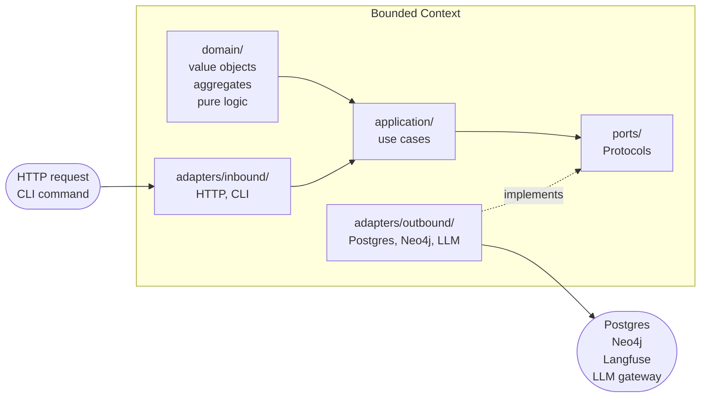
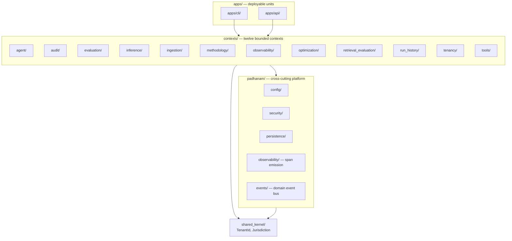
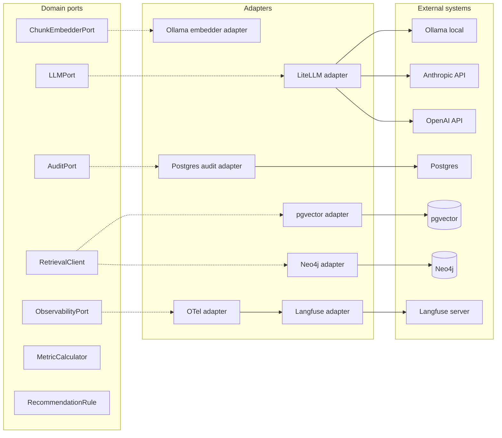

# Padhanam Architecture

This document is the architectural synthesis surface for Padhanam. It organises architectural commitments into a coherent narrative with diagrams, supporting onboarding-time, phase-audit-time, and procurement-grade-touch reading. It does not duplicate binding rules (`charter/principles.md`) or full reasoning (`charter/decisions.md` plus per-phase archives at `docs/archive/decisions/`); it synthesises them.

## Overview

Padhanam is a public demonstration that a senior product leader can direct the end-to-end implementation of an enterprise-grade agentic platform through Claude Code without writing code (see [`charter/bet.md`](bet.md)). The architectural commitments below exist because the proposition is being tested at the level of complexity that real enterprise software requires: multi-tenant, identity-federated, audit-chained, jurisdiction-aware, OTel-instrumented. A demonstration that AI-assisted development can produce a single-tenant prototype answers nothing useful; the architecture's discipline is the substrate of the proposition.

The platform's substrate (Phase 1, packages P1 through P12) supports an agent layer that demonstrates methodology embedding across professional functions. The four-context P11 substrate scaffold (`contexts/retrieval_evaluation/`, `contexts/run_history/`, `contexts/audit/`, `contexts/optimization/`) is the procurement-grade-defensibility surface that closes the bet's success criterion 4: the trace capture layer surfaces optimisation recommendations procurement readers can verify end-to-end with full evidence-citation traceability.

Architectural decisions read like "what enterprise procurement requires for purchase" — literally so, since enterprise procurement is the level at which the proposition is being tested rather than preparation for a sales motion. The architecture commits to abstractions; protocol choices, vendor selections, and operational specifics are configuration above the abstractions. Vendor lock-in is not architectural per the procurement-grade commitment at `charter/principles.md`.

The seven sections below organise architectural commitments thematically:

1. **Architectural patterns** — hexagonal architecture within a context; bounded contexts at the top of the codebase; observability as foundation; binding specifications live in charter.
2. **Tenancy and jurisdiction** — database-per-tenant; jurisdiction as first-class architectural attribute; tenant onboarding as configuration not deployment; customer-specific behaviour as configuration.
3. **Vendor and dependency posture** — vendor flexibility; LLM-provider-agnostic via LiteLLM; hybrid retrieval; OTel as observability portability boundary; audit hash-chain primitive at platform layer.
4. **Domain primitives** — role-first agent identity; methodology as defaults plus envelopes; four-layer constraint stack; recommendation-shaped optimisation output.
5. **The four-context substrate** — retrieval_evaluation, run_history, audit, ingestion as producers; optimization as consumer; HTTP transport with OpenAPI specification.
6. **Cross-document map** — three-document relationship (principles → decisions → architecture); reading modes; this document's place in the charter.

## Architectural patterns

Four architectural patterns anchor the codebase: hexagonal architecture within each bounded context; bounded contexts at the top of the codebase; observability as foundation rather than feature; binding specifications living in charter.

### Hexagonal architecture within a context

Every bounded context follows a hexagonal-layered structure: a `domain/` core carries value objects, aggregates, and pure domain logic with no framework or vendor imports; an `application/` layer carries use cases that orchestrate domain logic and call out through ports; a `ports/` directory exposes Protocol-typed boundaries the application layer depends on; an `adapters/` directory implements the ports against external systems (Postgres, Neo4j, Langfuse, vendor LLM gateways) with `inbound/` for transport-driven adapters (HTTP routes, CLI commands) and `outbound/` for storage-and-service adapters. Import-linter contracts enforce the layering at CI per D16: domain never imports from application or adapters; application never imports from adapters; adapters depend on ports.



The hexagonal pattern lets the domain layer stay framework-free and vendor-free, which is the foundation that makes the vendor-flexibility commitment per D111 mechanical rather than aspirational. Adapter replacement is vendor swap; domain code does not change. See `charter/principles.md` "Hexagonal throughout" (per D4, D16).

### Bounded contexts at the top of the codebase

The codebase organises around bounded contexts at the top level, with cross-cutting platform concerns in `padhanam/`, a strictly bounded `shared_kernel/`, and deployable units in `apps/`. Each context has its own hexagonal layering; contexts communicate via published query APIs for reads and a domain event bus for state changes per D17; direct cross-context imports are forbidden by import-linter per D16. The `shared_kernel/` contains only types that must be referentially equal across contexts (`TenantId`, `Jurisdiction`) and forbids Pydantic imports to prevent framework-version coupling.



Twelve bounded contexts at Phase 1 close: agent, audit, evaluation, inference, ingestion, methodology, observability, optimization, retrieval_evaluation, run_history, tenancy, tools. The split between `contexts/observability/` (analysis-layer domain logic) and `padhanam/observability/` (span emission infrastructure) is structurally honest per D16: cross-cutting plumbing belongs in `padhanam/`, domain logic belongs in `contexts/`. See `charter/principles.md` "Bounded contexts at the top of the codebase" (per D16, D17, D28).

### Observability as foundation

Trace capture starts from the first LLM call. OTel GenAI conventions are the portability boundary per D27; vendor-specific observability code is confined to adapters. Span attributes carry tenant_id, jurisdiction, cost-per-token, and (from D27) trace_id as a join key into the run-history projection. The audit context is bounded (`contexts/audit/`), not cross-cutting plumbing; hash-chained append-only storage records every state change with actor, tenant, jurisdiction, timestamp, action verb, resource, before/after state, and correlation ID per D26. The observability foundation is what makes the optimisation layer's recommendation-shaped output (per D9) procurement-grade-defensible: traces with cost dimension surface "this costs N% more for M% quality at the same task type" recommendations that procurement readers can verify against citations. The "Vendor and dependency posture" section below covers OTel + Langfuse adapter detail; the "The four-context substrate" section below covers the audit context's read surface.

### Binding specifications live in charter

Brand identity (`charter/brand-guidelines.md`, `charter/brand/tokens.css`) and bounded-context architecture (`charter/contexts/*`) are commitments the platform stands behind, not implementation detail. Implementation reads specification; specification does not live in implementation. Per D91. The charter is the methodology's primary artefact surface; the binding-specifications discipline ensures the charter is read-as-truth rather than aspirational-or-decorative content.

## Tenancy and jurisdiction

Four tenancy commitments anchor the platform: database-per-tenant topology; jurisdiction as first-class architectural attribute; tenant onboarding as configuration rather than deployment; customer-specific behaviour as configuration via tools plus bounded extensions.

### Database-per-tenant topology

Tenancy is database-per-tenant per D1: each tenant has its own Postgres data plane, separate from the control plane and from every other tenant's data plane. A control-plane Postgres instance carries the tenant registry, role-revisions, methodology-revisions, tool-revisions, and other platform-managed shared content. Per-tenant Postgres instances carry the tenant's own data (sources, chunks, agents, gold-sets, runs, audit chain). The connection routing layer per D36 resolves the per-tenant data plane from the TenantContext propagated through the call stack.


`TenantContext` is the shared-kernel value object carrying `tenant_id`, `jurisdiction`, and `cost_attribution_id` per D50; it propagates through every layer that touches tenant-scoped data. Tenant isolation is verified by `tests/contract/tenant_isolation/` red-team-shaped tests against every adapter per D24. Per-tenant connection caching at `padhanam/persistence/routing.py` per D36 keeps the topology efficient without weakening isolation. See `charter/principles.md` "Database-per-tenant" (per D1, D32). For the Phase 2 production-deployment revisit on Neo4j topology (currently shared with property-based scoping per D63), see `charter/deferred-decisions.md` under "Production-deployment readiness".

### Jurisdiction as first-class architectural attribute

`Jurisdiction` is a first-class architectural attribute carried in `TenantContext` from P3 onward per D12. Every component that touches customer data (databases, object storage, identity, trace store, LLM endpoints) is built to be regionally partitionable. Phase 1 deploys a single region; the architecture does not assume a single region anywhere in code. The discipline is "by construction, not by policy" — adding it later is a refactor across forty tables and every interface signature; building it in from inception is free at the data-model layer and cheap at the interface layer. See `charter/principles.md` "Jurisdiction is a first-class attribute" (per D12).

### Tenant onboarding as configuration not deployment

Per-tenant decisions (jurisdiction, identity federation, classification policy, model endpoints, retention) live in the tenant registry as configuration per D13. Adding a tenant to an existing regional stack is an idempotent provisioning workflow; adding a region is a separate infrastructure event scoped explicitly when a customer's residency requirement crosses an existing region boundary. The architectural commitment that adding a tenant requires no code changes is what makes the platform sellable to enterprise customers with custom IdP, jurisdiction, and classification requirements. See `charter/principles.md` "Tenant onboarding is configuration" (per D13).

### Customer-specific behaviour as configuration

Tools (external services called by the platform on the tenant's behalf) cover most customer-supplied logic per D14. Bounded extensions exist for residual cases at named interfaces (RetrievalClient, scorer, pre-processor), sandboxed per tenant. The platform is designed so forking is unnecessary per D76; observed forks signal extension surface failure to be addressed upstream. The forking-phrasing refinement at D76 supersedes D14's original "forbidden" wording without rewriting D14 itself, preserving the audit trail per the append-only discipline. See `charter/principles.md` "Customer-specific behaviour is configuration" (per D14, D76).

## Vendor and dependency posture

Vendor flexibility is a procurement-grade commitment per D111: external dependencies — LLM provider, embedding model, database backend, vector store, graph store, audit target, observability target — sit behind ports; vendor swap is configuration or adapter replacement, never domain change. Operationalised at the producer-context level through MetricCalculator and RecommendationRule pluggable domain abstractions in `contexts/optimization/` (Phase 1, per D111); ported domain-layer pluggability is the same principle applied to pluggable evaluation techniques and recommendation rules.



### LLM-provider-agnostic via LiteLLM

LLM access flows through a LiteLLM gateway behind `LLMPort` per D4. The development default is Ollama serving Qwen 2.5 7B per D15 (tool-calling fidelity at the embedding-cost ceiling); production swap is configuration through `padhanam/config/`. No vendor SDKs in domain code; import-linter contracts enforce `no-vendor-sdks-in-domain` at CI. See `charter/principles.md` "LLM-provider-agnostic via LiteLLM" (per D4, D15).

Phase 2 extends the LiteLLM abstraction with latency-tier inference routing per D122. Call sites pass tier hints; the gateway routes per tier configuration in `padhanam/config/inference.py`. See `charter/architecture.md` "Phase 2 architectural primitives" "Latency-tier inference routing" subsection for full specification.

### Four-layer model ontology at the inference port

Per D132. Models are identified across four addressable dimensions at the LiteLLM port: Provider (the underlying inference service — Ollama, Anthropic, OpenAI), Account (provider-specific account identity when multi-account routing applies; trivial at Phase 2-A single-account-per-provider, first-class at Phase 2-B+ customer deployments), Version (the specific model identifier within the provider), and Configuration (per-call parameters — temperature, max_tokens, the latency-tier hint per D122, and the structured-output JSON Schema per D130). The `ModelIdentifier` value object at `shared_kernel/inference.py` carries the four-layer identification. Identification happens *at the port boundary*: `ModelIdentifier` composes at the LiteLLM adapter from the resolved model string, the latency tier, and `InferenceSettings` — the public call signature carries a defaulted `latency_tier` parameter rather than the full value object, because call sites have no Provider/Account knowledge and the Configuration layer overlaps fields already on the request surface (per D132 Finding C). Per-call audit-chain entries and OTel spans capture all four dimensions; observability dashboards filter by them. Provider + Account + Version + Configuration together produce the procurement-grade defensibility surface: an auditor verifying which provider, account, version, and configuration served which operation has a complete identification path.

### Hybrid retrieval via pgvector and Neo4j

Retrieval is hybrid: vector via pgvector (HNSW cosine, nomic-embed-text embeddings per D62), graph via Neo4j (shared instance with property-based tenant scoping per D63), both behind the `RetrievalClient` port per D5. Strategy selection at runtime per D66's agent-runtime-executed-composition pattern; the strategy catalogue ships vector_only, graph_only, and parallel_rrf (the last currently deferred per `charter/deferred-decisions.md`). See `charter/principles.md` "Hybrid retrieval" (per D5).

### OTel as observability portability boundary

Observability uses OpenTelemetry GenAI conventions as the portability boundary per D27. Span attributes carry tenant_id, jurisdiction, cost-per-token, and trace_id. Vendor-specific observability code is confined to adapters; the trace store is self-hosted Langfuse 3 per D7 behind an `ObservabilityPort`. Production swap to a different observability vendor is adapter replacement.

### Hash-chain primitive at the platform layer

The hash-chain primitive (canonical-JSON-sorted-keys plus SHA-256 with chain-link) lives at `padhanam/security/hash_chain.py` per D75 (promoted from `contexts/methodology/` at S24). Multiple contexts reuse it: the audit context (`contexts/audit/`) per D26 for append-only audit-event chains; the methodology context for revision-with-hash-chain; the retrieval_evaluation context per D109 for gold-set revisions; the optimization context per D111 for recommendation evidence-citation tamper-evidence. The cross-context reuse pattern is structurally honest because the hash-chain primitive is general (any append-only-with-content-integrity surface uses the same shape) while the input-shaping per context lives at each context's domain layer.

## Domain primitives

Four domain primitives anchor the platform's product-shaped surfaces: role-first agent identity; methodology as defaults plus envelopes; the four-layer constraint stack; recommendation-shaped optimisation output.

### Role-first agent identity

Roles are the primary identity for agents per D86. The agent's job is the role it occupies. Methodologies are playbooks the role applies (situationally); skills are granular capabilities the agent invokes. The role-first model lets methodologies compose at runtime via lineage rather than at design-time via inheritance — an agent has a single role identity throughout its lifetime, and the methodologies it has adopted are recorded as a lineage that affects its constraint bundle without changing its identity. See `charter/principles.md` "Role-first agent identity" (per D86).

### Methodology as defaults plus envelopes

When an agent adopts a methodology, the methodology is embedded as defaults for tuning surfaces and as envelopes for security, budget, and scope surfaces per D81. Defaults activate at decision points, encode the right thing for the chosen methodology, and yield to user intent at low cost. Envelopes bind hard and are validated at agent write time. The product surface treats user intent as primary for tuning; envelopes are non-overridable by the agent and exist to protect the tenant and the platform. The methodology document is the long form of the operating model; the methodology context (`contexts/methodology/`) is the runtime layer.

Per-field binding-mode discipline at D81 commits three hard-bound fields and six soft-bound fields as platform convention. The override mechanism for methodology-author-driven per-field binding deviation defers to Phase 2 per the deferred-decisions entry on "Per-role binding-mode override".

### Four-layer constraint stack

Per D80, agent runtime constraints stack in four layers, applied in order:


Platform invariants per D82 are the universal floor — non-overridable, applied to every agent invocation regardless of methodology lineage, workflow context, or per-agent overrides. The five Phase 1 close invariants (no financial execution without per-transaction authorization; no outbound communication without per-invocation authorization; no acceptance of legal commitments without explicit user action; no auto-modification or auto-deletion of user-authored content; no transmission of tenant data outside tenant-configured tool paths) protect the tenant and the platform. Each invariant maps to safety dimensions (privacy, integrity, reversibility, transparency, control, auditability) per `charter/principles.md` "User safety".

Methodology layer applies if the agent has methodology lineage; envelopes bind hard, defaults are tuning suggestions. Workflow layer applies if the agent is invoked within a workflow context (Phase 2 per D83). Agent layer is per-instance: the agent's authored constraints (system_prompt, model_selection, retrieval bounds) plus the override-mode space per D87 (augment/replace/tighten per-field).

### Recommendation-shaped optimisation output

Per D9, optimisation output is recommendation-shaped, not chart-shaped. Every dashboard view ties to a recommended action. The principle extends to the agent layer per `charter/principles.md` "Padhanam-as-intelligence-layer": Padhanam produces recommendations, analyses, and drafts; consequential actions on the user's behalf require user-in-the-loop authorization at appropriate granularity per the platform invariants.

The recommendation aggregate at `contexts/optimization/` carries five fields per D108 (category, subject, text, evidence_citations, status); numeric confidence scores stay out on D9 grounds (a single floating-point "confidence" would be chart-shaped). The four Phase 1 recommendation categories are retrieval_strategy, model_choice, prompt_revision, cost_optimization per D108 commitment 5. Evidence citations are a discriminated union with structured CaveatAnnotation per D111; the citation surface lets procurement readers trace prose → rule → citation → producer-context records without ambiguity.

## Phase 2 architectural primitives

Six architectural primitives anchor Phase 2-A and carry forward to Phase 2-B. The primitives surfaced at Step 5 of the Phase 2 design 7-Step arc as cross-sub-problem patterns and committed at Step 6 Pass 1 dispositions. Each primitive commits at Phase 2-A with operational delivery per the package structure at `charter/packages.md` P13-P16; Phase 2-B expansions follow per P17-P20.

### Revision-with-lineage standard interface

Per D114. The Revisable Protocol provides revision-with-lineage semantics for aggregates that mutate state through user-initiated or platform-initiated revisions. Three contexts implement the protocol at Phase 2-A: the portfolio context (per 1.3 state persistence; revisions for status transitions and content edits), the methodology context (per 2.1 methodology adaptation; user-adapted methodology revisions preserve genealogy from parent methodology), and the goal context (per 4.2 goal-state tracking; goal revisions preserve lineage and transfer linked items per the revision-with-lineage discipline). The pattern saturated across 2.1, 4.2, 3.2, 6.5 per Step 5 Pass 2 Work-stream 2 architectural patterns. CI-enforceable conformance via contract tests at `tests/contract/revisable/`. Cross-context reuse pattern structurally honest: the Revisable Protocol is general (any append-only-with-lineage surface uses the same shape) while input-shaping per context lives at each context's domain layer. References D26 (append-only audit chain), D31 (revisions pattern), and the hash-chain primitive at `padhanam/security/hash_chain.py` per D75.

### Conversation flow standard interface

Per D115. The ConversationFlow Protocol provides conversation-shaped surface semantics for user-invoked review and platform-initiated review-or-confirmation flows. Two contexts implement at Phase 2-A: the audit context (per 5.1 audit-conversation; broad audit review, filtered-by-event-class queries, item-specific drill-downs, goal-specific drill-downs, reflection-shaped queries) and the portfolio context (per 4.1 mirror-conversation; user invocation, narrative-response structure, drill-down conversation paths). Across-the-board at Phase 2-A per Step 5 Pass 2 Work-stream 2. Cross-context reuse pattern: the protocol carries the conversation-shaped surface contract; per-context content discipline lives at each context's domain layer (audit-narrative composition is technical-writer discipline with per-event-class templates; mirror-narrative composition is technical-writer discipline with narrative-language overlay). CI-enforceable conformance via contract tests at `tests/contract/conversation_flow/`.

### Three-tier consent-and-awareness framework

Per D116. Three tiers govern platform-initiated action surfacing: Tier 1 real-time review for high-danger classes (financial execution, outbound communication, legal commitments, irreversible operations); Tier 2 surfaced operation with user-controlled digest review cadence (routine reversible actions with audit visibility); Tier 3 silent operation does not exist per D121. Tier-depends-on-initiation refinement: same operation operates at different tiers depending on initiation context, not on operation type. Platform-initiated drops sit at Tier 1 (reversibility-sensitive); user-initiated drops follow the 1.5 commit-and-notify pattern. Native specification at sub-problem 5.4; cross-cuts surfacing mechanics at 3.1, drop-suggestion logic at 3.2, methodology adaptation at 2.1, goal-revision at 4.2, audit-conversation at 5.1, status-veracity at 6.3, correction mechanics at 6.5. The framework operationalises the existing consent-granularity-proportionate-to-danger principle at `charter/principles.md` without replacing it; framework operates as commercial positioning differentiator beyond safety hygiene per the procurement-grade audit-trailed-approval-first defensibility pattern identified in May 2026 competitor research at `charter/competitors.md`. References D82 (platform invariants) and D116.

### Tiered-by-salience

Per D117. Salience classification drives per-action surface depth across six surfaces: surfacing-decision logic at 3.1 (single-most-urgent platform-initiated default; batched narrative for user-invoked); drop-suggestion triggers at 3.2 (salience-weighted trigger evaluation); mirror-response density at 4.1 (configurable depth per user salience preference); audit-narrative density at 5.1 (per-event-class salience-weighted summarisation); status-veracity surface granularity at 6.3 (lower-pressure status options for low-salience items); methodology-applied importance threshold at 2.1 (salience-weighted methodology-recommendation surfacing). High-salience surfaces receive richer treatment; low-salience surfaces receive lighter treatment. Salience classification per surface is rules-driven at Phase 2-A (item-type rules; user-declared preferences; methodology-applied importance signals); learned-pattern-based salience defers to Phase 2-B Cluster B4 per the deferred-decisions entry on pattern-based triggers.

### Two-vector decay model

Per D118. Methodology-applied calibrations stale on two orthogonal vectors. Age vector: time-based decay; each methodology declares stale-after-N-time-units (RICE quarterly cadence; LVT six-month cadence; Kano roughly twelve-month cadence; McKinsey 7-Step faster). Information vector: event-driven decay; each methodology declares "events of type X make my application stale for items I have been applied to if [matching condition]" (RICE: new customer-research events, new effort estimates, new competitor moves; LVT: new initiative, new strategic priority shift, new resource constraint; Kano: new competitor offering changing user baseline expectations; McKinsey 7-Step: new stakeholder input, new evidence at any of the seven steps). Phase 2-A ships age-based freshness operational; information-based gets architectural commitment with Phase 2-B Cluster B3 operational delivery per P19 contents. Staleness produces two suggestion types at the methodology layer: drop suggestion (item no longer engaged; lives at 3.2) or rescore suggestion (methodology rescoring opportunity; lives at 2.1 methodology layer). References Step 5 Pass 1 sub-problem 3.2 finding introducing both vectors.

### Latency-tier inference routing

Per D122. Architectural extension of D4's LiteLLM abstraction pre-existing slot. Phase 2 call sites pass tier hints to the LLM port. Tier classification: real-time-required for user-invoked surfaces plus Tier 1 confirmation dialogs (latency budget under one second; latency-optimised model selection plus routing target); async-tolerant for substrate ingestion analysis, surfacing-decision logic, methodology-applied judgment calculations, freshness checks across both vectors, audit narrative composition, mirror data composition, drop-suggestion generation, goal-to-item linking inference (latency budget seconds-to-minutes; quality-optimised model selection plus higher-context routing target). Tier classification per call site is declared at call site annotation; LiteLLM gateway routes per tier configuration in `padhanam/config/inference.py`. Phase 1 call sites preserve current behaviour with opt-in retrofit. Orthogonal axis to the 5.4 three-tier consent-and-awareness framework at D116; both classifications apply at every platform action. The architecture commits to tier classification at every call site as Phase 2 discipline; tier-specific model selection plus routing configuration evolves with Phase 2-A dogfooding evidence. See also `charter/architecture.md` Vendor and dependency posture section for the LiteLLM gateway architecture this primitive extends.

### Calendar-conversation surface

Per D148/D149 (the calendar substrate) and the ConversationFlow primitive (D115). `contexts/calendar_conversation/` is the third ConversationFlow implementer (after audit-conversation 5.1 and mirror-conversation 4.1), mirroring their hexagonal shape: a domain intent surface (`parse_calendar_intent` over a discriminated calendar-intent union), an application cell consuming the structured-output, meeting-reader, confidence, threshold, and pending-clarification ports, a query builder filtering the Meeting store by intent, and a `CalendarConversationResponse` satisfying the `CitedResponse` Protocol (D138) by citing Meetings via `ArtefactCitation` with the `meeting` discriminator (D148). Resolution-ambiguity (a title reference matching multiple meetings) routes through D134's PendingClarification per D139, identically to the audit-conversation case-reference resolution. The cell cites the live Meeting search-cache row; the immutable citation-time audit-snapshot evidence record (the two-store split, D148) wires at S55b-2, not here.

### Calendar-conversation refresh-before-answer

Per D150. The calendar-conversation cell refreshes the calendar at turn-open — invoking the D149 scoped full pull through `sync_calendar` via an injected refresh port — before querying the Meeting store, within the REAL_TIME_REQUIRED latency-tier budget (D122). Always-refresh (Option A) over staleness-windowed refresh because freshness is a must-have for an attentional tool and the measured refresh floor (340–400 ms steady, 513 ms cold; S55a-fix smoke) is imperceptible against the multi-second LLM cascade at single-personal-calendar volume. On refresh timeout (budget ~2000 ms, clearing the cold floor ~4×) or Nango/Google failure, the cell serves the cached Meeting store with a staleness note appended to the response rather than blocking or failing the turn — mirroring D146's always-produce-output composition discipline. Staleness-windowed and question-type-dependent refresh defer per the two-threshold rule (they optimise a redundant-pull cost that does not exist at 3 events and sub-400 ms); activation at Phase 2-B multi-user scale or when always-refresh latency breaches the tier budget. The refresh port is wired at the apps composition root to the real `NangoProxyCalendarAdapter` + `LiteLLMChunkEmbedder` + `Neo4jGraphRepository` driving `sync_calendar` (the consumer deferred from S55a).

### Webhook dispatch port

Per D133. The Twilio messaging webhook returns 2xx promptly and dispatches the cell run to a background task via the CellDispatch port at `contexts/messaging/application/ports/cell_dispatch.py`. Phase 2-A implementation is `InProcessCellDispatchAdapter` running the cell on the same event loop via `asyncio.create_task`; Phase 2-B+ swaps to `QueueCellDispatchAdapter` at the customer-volume trigger without touching the call site. The port carries structured cell-failure logging at its contract so background-task failure produces an audited trace, closing the bare-`except` gap from the prior synchronous shape. The webhook handler stays simple: verify signature, record inbound intake, dispatch the cell, return 2xx. The cell run completes asynchronously and the outbound reply delivers via the existing Twilio REST API path.

### Gateway as model-resolution point

Per D133. The LiteLLM gateway is the architectural resolution point for tier-to-model routing. Call sites annotate the latency tier per D122 (unchanged); the gateway resolves tier to model from configuration at `padhanam/config/inference.py`. Phase 2-A: static configuration per tier with one default tenant. Phase 2-B+: tenant-scoped overrides. Phase 3+: cross-provider routing policies activate at the Padhanam-provides-LLM business-model trigger covering failover, cost-aware routing within tenant-tier contracts, and rate-limit awareness. The model registry at `padhanam/config/model_registry.py` catalogues available models with provider, version, supported operations, latency category, and cost per call. The registry's metadata is recorded for audit and future policy activation; routing policies that consume it activate at Phase 3+.

### Confidence-aware response composition

Per D134. ConversationFlow implementers consuming LLM-derived intent classification operate on a three-case discipline. Case 1 (high confidence, at or above the high cut-off): proceed with the proposed action; emit the cited confirmation. Case 2 (medium confidence, between medium and high cut-offs): render a shape-aware clarification phrased as a question proposing the specific action; create a PendingClarification; do not write. Case 3 (low confidence or parse failure): render the generic UnclearIntent clarification; do not write. Confidence is produced by the ConfidenceCalculator port at `shared_kernel/confidence_calculator.py` (adapters: self-reported at Phase 2-A; token-probability and multi-sample at future evolutions). Cut-off thresholds are resolved through the ThresholdResolver port at `shared_kernel/confidence_thresholds.py` (adapters: single-pair at Phase 2-A; per-operation-class at Phase 2-B+). Both ports are composition-root configured; the cell consumes confidence and thresholds through the ports without knowing which adapters are wired. The middle case is the load-bearing surface for pattern 2 of the private-assistant-communication-discipline (suggestion-as-question) at the intent-classification gate; without confidence-aware composition pattern 2 cannot bind at the manual entry cell.

### PendingClarification as multi-turn conversation state

Per D134. PendingClarification is a domain entity at `contexts/messaging/domain/pending_clarification.py` carrying the proposed action at medium-confidence classification, persisted with 24-hour expiry (matching the Twilio Sandbox conversation window per D119). Scope is (tenant_id, user_id) with channel-of-origin as metadata per D136 Primitive 3; cross-channel reply resolution becomes possible at multi-channel activation. Invariant: at most one PENDING per (tenant_id, user_id) at a time; new PENDING expires any prior. Lifecycle audit events (create, resolve, expire) chain into the tenant audit per D110. The cell consults PendingClarification at turn-open through a consumer port; D115's ConversationFlow Protocol stays single-turn (multi-turn behaviour emerges from the cell's port-mediated state consultation).

### Domain-decides-content channel-decides-format rendering

Per D135. ConversationFlow implementers produce channel-agnostic response content (citation fields per D131; confidence-state shape per D134; response prose). Channel adapters translate to the channel's affordances at the messaging context. WhatsApp at Phase 2-A renders the D131 Shape 1 citation line and the three-case confidence-state messages as text. Slack at P15 may render inline buttons; email at P15+ has space for structured sections; a future dashboard may carry interactive citations. The channel adapter is the architectural home for citation rendering, confidence-state rendering, and channel-aware affordances per D136. The structural enforcement question (shared-kernel CitedResponse base type) defers to the P14 second-instance trigger when audit-conversation and mirror-conversation ConversationFlow implementers land.

### Multi-channel UX architectural primitives

Per D136. Four primitives commit architecturally at the convergence with implementation deferred to existing activation triggers. User as first-class domain concept with ChannelIdentity as the (channel, channel-address) to User mapping (activates at second-channel trigger). Channel preference for outbound as resolution surface at the messaging context (activates at P14+ outbound-initiation). PendingClarification scoped to user with channel-of-origin as metadata (degenerate at Phase 2-A's single-user single-channel; architecturally correct for multi-channel). ChannelCapabilities descriptor per channel adapter declaring supported message types plus constraints (activates at second-channel trigger when explicit declaration is forced). Phase 2-A operates with degenerate implementations; adding a new channel at P14+ is additive.

### Intent-classification evaluation substrate

Per D137. New bounded context at `contexts/intent_classification_evaluation/` authoring operator-shaped gold sets of (input_phrasing, expected_intent_class) pairs and running model-comparison evaluations against the structured-output port at D130. The substrate answers component-quality questions (does model X classify Padhanam's intent surface reliably) in minutes against a fixed reference set rather than across multi-minute integration smokes. The runner calls the structured-output port directly without the messaging substrate or the cell; the metric calculator computes classification accuracy per class plus per-class recall and precision plus parse-failure counts. Model selection comes from D133's model registry; the four-layer model ontology per D132 records what was evaluated. The prompt and schema the cell uses for intent classification live at `shared_kernel/intent_classification.py` (extracted at S48b); both the cell and the evaluation runner consume the shared primitive so the substrate measures what production runs. A structural test in the contract harness asserts single-source-of-truth (symbol-identity across consumers). The CLI sub-app at `apps/cli/_intent_classification_eval.py` provides operator-facing invocation (`eval start/get/list`). Phase 2-A scope: single repo-fixture gold set at `tests/fixtures/intent_classification/gold_set.yaml`; revision-lifecycle gold-set authoring and cross-run comparison CLI subcommand defer to Phase 2-B+ at named activation triggers per D137 alternatives (c) and (d). The substrate composes with future ConversationFlow implementers' classification surfaces at P14+ (audit-conversation, mirror-conversation) which extend `shared_kernel/intent_classification.py` with sub-surfaces or create their own equivalents per build-at-second-instance discipline.

### ConversationFlow CitedResponse Protocol

Per D138. D131 commits provenance-aware response composition as Padhanam's read-side citation discipline. D138 commits the structural enforcement: a runtime-checkable Protocol at `shared_kernel/conversation_flow.py` (single-file, alongside the existing ConversationFlow Protocol) carrying three citation tuple fields. Every ConversationFlow implementer's response value object satisfies the Protocol structurally; the dispatch port at D136 performs an isinstance check at the channel adapter boundary; the contract harness verifies conformance for every registered implementer. The discipline shifts from convention-altitude (Phase 2-A first instance at S46) to structural enforcement (Phase 2-A second instance at P14). Future ConversationFlow implementers at P15+ inherit the Protocol structurally with no separate adoption work.

The citation surface composes with D135's domain-decides-content channel-decides-format pattern. The Protocol's fields are channel-agnostic citation tuples; the channel adapter renders them per the channel's affordances (WhatsApp's compact Shape-1 citation line; future Slack's rich-block link; future voice's spoken-citation summary). The composition cleanly separates citation truth (at the domain layer) from citation rendering (at the channel layer).

`ArtefactCitation`, a typed value object authored fresh at S51 carrying `artefact_id: UUID` plus `artefact_type: str` discriminator, lives at `shared_kernel/conversation_flow.py` alongside the Protocol. The discriminator surfaces artefact type at the citation surface because artefacts are heterogeneous in `cited_artefacts` at P14 (Case and DataPoint citations both flow through `cited_artefacts`; future artefact types extend the union). The brief's framing-time assumption that ArtefactCitation already existed at the manual entry cell module was pre-write-reconciliation-corrected at S51 framing close (Finding 4); the operator selected the symmetric-with-mirror heterogeneous-citations shape over the queried-entity-only homogeneous shape on architectural-symmetry-between-co-implementers, render-layer-decoupling, and refactor-consolidation grounds. CellResponse at S46 was refactored at S51 commit 2 to carry `cited_artefacts: tuple[ArtefactCitation, ...]` (the field type changed, five cite sites updated, render layer updated, two unit-test assertions updated).

### ConversationFlow resolution-ambiguity routing

Per D139. S50 surfaced the resolution-ambiguity sub-case at the manual entry cell: when a resolver step finds multiple candidate matches (the canonical Phase 2-A example is duplicate-title cases), the implementer routes to D134's shape-aware clarification surface rather than picking deterministically or returning raw candidates. D139 promotes the pattern from implementer-specific (manual entry cell at S50) to cross-cutting (all ConversationFlow implementers).

The pattern composes D134's PendingClarification entity with D131's citation discipline. The clarification carries the candidate list as a structured selection, with each candidate citing its source artefact through `cited_artefacts`. The user selects, and the resolution proceeds against the selected candidate. The interaction shape is the structured-clarification shape D134 commits, not a free-text disambiguation exchange.

The pattern's contract harness conformance scenario verifies every registered ConversationFlow implementer routes ambiguous resolutions through D134's PendingClarification. The scenario fires against test fixtures providing multi-match conditions at each implementer's resolver step. Audit-conversation's case-by-title resolution at S51 and mirror-conversation's artefact-by-title resolution at S52 exercise the pattern as second and third instances respectively.

### Audit-conversation context

The audit-conversation ConversationFlow implementer lives at `contexts/audit_conversation/`. It composes the audit chain query substrate at `contexts/audit/`'s existing `AuditEventReader` port from S36 (verified at S51 pre-write reconciliation Finding 1: the brief committed a new `AuditQueryPort` that duplicated the existing reader's seven filter dimensions plus cursor pagination plus chain-integrity verification; disposition dropped the new port and consumes the S36 substrate directly) with the intent-classification primitive at D137 and the response composition pattern at D131/D135/D138.

Inbound user messages classify into audit query intent value objects (FindByCase, FindByDateRange, FindByActor, FindByEventType, FindByCombination, with UnclearAuditIntent as the fallback for unrecognized queries). The classifier produces the intent; the cell composes the intent into an `AuditEventListFilters` DTO (the existing S36 query-filter value object at `contexts/audit/domain/query_filters.py` covers the dimensions: filter by `resource_type='case'` plus `resource_id=<case_uuid>` for case references; `actor` for actor filter; `action_verbs` for event-type multi-value; `timestamp_range` for date-range filter); the `AuditEventReader.list_audit_events_with_filters` method executes the query against the audit chain Postgres adapter, returning an `AuditEventListPage` with chain-integrity verification attached per D102; the cell composes the page into an `AuditConversationResponse` value object satisfying CitedResponse Protocol. The `cited_audit_events` tuple populates from the returned events' ids directly; this closes the empty-field gap from S46 on the read-side at audit-conversation's natural composition. The `cited_artefacts` tuple populates heterogeneously per the symmetric-with-mirror architectural shape (Finding 4 disposition): when a returned audit event references a Case (`resource_type='case'`), the cell adds `ArtefactCitation(artefact_id=<case_uuid>, artefact_type='case')`; when an event references a DataPoint (`resource_type='data_point'`), the cell adds `ArtefactCitation(artefact_id=<data_point_uuid>, artefact_type='data_point')`. The render layer iterates `cited_artefacts` uniformly with the type self-contained on each citation.

Tenant-scoping is enforced at the existing AuditEventReader port boundary (the port requires `tenant_context: TenantContext | None` per S36 with `AuditQueryRoutingError` raised on destination/tenant_context mismatch); audit-conversation always passes `destination='per_tenant'` plus a populated TenantContext, inheriting the discipline structurally. The existing `tests/contract/tenant_isolation/test_audit_reader_isolation.py` (S36) covers the discipline; audit-conversation needs no new tenant-isolation contract scenario.

### Mirror-conversation context (forward-looking, S52 scope)

The mirror-conversation ConversationFlow implementer lives at `contexts/mirror_conversation/` (S52 build). It composes the portfolio query substrate with the intent-classification primitive at D137 and the response composition pattern at D131/D135/D138.

Mirror-conversation classifies inbound messages into both absolute intents ("show case X", "list all cases") and relative intents ("drill down to revenue", "show parent", "show siblings"). Relative intents resolve against the recent conversation history at the cell layer; the classifier reads the recent N turns as classification context. No new persisted state entity at P14; drill-down navigation is stateless re-classification per turn.

The mirror-conversation response value object carries `cited_intake_records` (populated from the cell's resolved IntakeRecord references) and `cited_artefacts` (populated heterogeneously per the symmetric-with-audit-conversation shape: Case plus DataPoint citations with discriminators). `cited_audit_events` stays empty at mirror-conversation; the audit chain is reachable transitively through each cited IntakeRecord's anchored chain entries per D128's intake-canonical commitment.

### Mirror-conversation drill-down stateless-per-turn

Mirror-conversation drill-down navigation is stateless re-classification per turn against the conversation history. The design choice resists introducing a parallel state machine to PendingClarification at the user-scope at Phase 2-A. PendingClarification is "platform asked, user must answer" state; drill-down is "user navigated, platform tracks position" state; the two have different lifecycles, ownership, and reset semantics. Adding a second user-scoped state surface fragments the state-machine discipline established at the convergence.

The substrate is already in place. The messaging substrate at D129 persists conversation history (the Message entity at channel-scoped storage). The mirror-conversation classifier reads the recent N turns as classification context. Intent value objects include both absolute and relative variants; relative intents resolve at the cell layer against the conversation history.

Risk-shape disposition: if operator dogfooding surfaces brittleness (drill-down misclassification rate exceeding the gold-set threshold; conversation-history-as-classifier-context failing at recurring sub-cases such as long pauses or context-window saturation), then a state entity becomes the right shape. The activation trigger is recorded at `charter/deferred-decisions.md` for forward tracking.

### Meta-classifier dispatch routing

Per D140. The S47 CellDispatch port runs one cell; the webhook hard-codes dispatch to `manual_entry_cell`. With three ConversationFlow implementers at P14 close (manual_entry, audit_conversation, mirror_conversation), inbound-to-cell routing becomes a first-class concern. D140 commits the meta-classifier dispatch substrate: a `MetaClassifier` port at `contexts/messaging/application/ports/meta_classifier.py` plus a `dispatch_inbound` use case at `contexts/messaging/application/dispatch_inbound.py` orchestrating active-pending check, meta-classification, confidence-aware composition routing per D134, and CellDispatch invocation.

The dispatch flow runs five steps. The webhook handler retains signature verification and intake recording. The `dispatch_inbound` use case then executes: active PendingClarification check by `(tenant_id, user_id)` via the existing reader port; if active pending exists, route via CellDispatch to the cell named in the pending's `target_cell` field; if no active pending, call MetaClassifier with the inbound text plus recent conversation history; if confidence is at or above the configured threshold, dispatch to the identified cell; if confidence is below threshold or `StructuredOutputParseFailure` fires, create a meta-classification PendingClarification with `target_cell='dispatch_clarification'` surfacing the candidate cells to the user.

The substrate composes existing primitives. StructuredOutputPort (D130) for the LLM-derived classification call; ConfidenceCalculator and ThresholdResolver ports (D134) for confidence-aware composition; PendingClarification entity and consumer port (D134) for low-confidence routing; CellDispatch port (D133) for background invocation of the identified cell. The MetaClassifier adapter swap at composition root supports test fakes (the deterministic rule-based adapter) without production runtime impact.

### PendingClarification target_cell field

Per D140. The PendingClarification entity gains a `target_cell` field (text column, populated at create-time by the cell creating the pending). The field identifies which ConversationFlow implementer owns the pending. The `dispatch_inbound` use case consults the field at Step 2 of the dispatch flow to route the user's confirming or correcting reply to the correct cell. The field is also populated by the meta-classification PendingClarification created at Step 5 of the dispatch flow (`target_cell='dispatch_clarification'` for the meta-classification routing case, with implementer-side handling at the dispatch layer rather than at a cell).

Alembic migration 0023 (`alembic/tenant/versions/2026_05_27_0023_pending_clarification_target_cell.py`) adds the column. Existing pending_clarifications rows backfill to `manual_entry` (every prior PendingClarification was created by the manual entry cell at S47/S50). The CHECK constraint accepts the four known identifiers: `manual_entry`, `audit_conversation`, `mirror_conversation`, `dispatch_clarification`.

### Message cell_payload field

Per D141. The Message entity gains a `cell_payload` field (jsonb column, nullable, default null). ConversationFlow implementers persist per-implementer payload alongside outbound messages. The payload's shape is implementer-specific; each implementer validates the shape on read. Inbound messages do not populate `cell_payload`. The column supports cross-turn state extraction without parallel state-machine substrate per D141's commitment.

Alembic migration 0024 (`alembic/tenant/versions/2026_05_27_0024_message_cell_payload.py`) adds the column. Existing messages rows have `cell_payload` null; the column's nullability handles the backfill cleanly without explicit data migration. Mirror-conversation is the first user (carrying `current_focus_artefact` for drill-down anchor persistence); audit-conversation and manual_entry do not populate the column.

### Mirror-conversation context

The mirror-conversation ConversationFlow implementer lives at `contexts/mirror_conversation/` (S52 build). It composes the portfolio read-side substrate (via a `MirrorPortfolioReader` consumer port and a cross-context wiring adapter to portfolio context's existing `list_cases` and `get_case_detail` use cases) with the intent-classification primitive at D137 and the response composition pattern at D131/D135/D138.

Inbound user messages classify into six mirror intent value objects split into three absolute variants and three relative variants. Absolute intents (`ShowCase`, `ListCases`, `ShowDataPoint`) resolve their references directly against portfolio state via MirrorPortfolioReader. Relative intents (`DrillDownToChild`, `ShowParent`, `ShowSiblings`) resolve against the conversation's current focus first, then against portfolio state. `UnclearMirrorIntent` is the fallback for classification failures.

The cell runs five steps per turn: read conversation history (the same N turns the meta-classifier reads); classify the inbound intent with conversation history as classifier context; resolve references (absolute against portfolio state; relative against conversation focus then portfolio state); query portfolio state via MirrorPortfolioReader; compose `MirrorConversationResponse` satisfying CitedResponse Protocol with the `current_focus_artefact` extension field.

The response value object's `cited_artefacts` carries heterogeneous Case and DataPoint citations via the ArtefactCitation typed value object's discriminator (committed at D138). The `cited_intake_records` carries the IntakeRecord ID of the inbound message. The `cited_audit_events` stays empty (mirror reads current state; audit chain reachable transitively through cited IntakeRecord per D128). The `current_focus_artefact` extension field anchors the conversation's drill-down navigation for the next turn's relative-intent resolution; it serializes into the outbound message's `cell_payload` per D141 so the next turn extracts it.

### Mirror-conversation drill-down extraction

Mirror-conversation drill-down navigation reads the prior mirror-conversation outbound's `cell_payload.current_focus_artefact` (D141) to anchor relative-intent resolution. When no prior mirror-conversation outbound exists (first mirror turn or first turn after a cross-cell exchange), the cell routes through D139 to D134 clarification with a phrasing indicating no recent context. The same handling applies when the most recent platform response is from a different cell (audit-conversation outbound does not populate `cell_payload` with mirror-shape) or when N-turn conversation history truncates past the prior mirror outbound.

The mechanism is consistent with the stateless-per-turn discipline at the prior sub-section: the cell does not maintain in-memory state between turns; each turn reads conversation history plus the prior outbound's `cell_payload` (additive metadata, not a parallel state machine). Risk-shape disposition unchanged from P14 framing: if operator dogfooding surfaces brittleness, a persisted state entity becomes the right shape per the activation trigger at `charter/deferred-decisions.md`.

### BroadcastFlow Protocol (D142)

D115 commits ConversationFlow as the abstraction for bi-directional user-platform interaction. D142 commits BroadcastFlow as the parallel abstraction for platform-initiated outbound messaging. The two Protocols differ at the entry point — ConversationFlow's `turn` consumes an inbound message; BroadcastFlow's `fire` consumes a TriggerContext — and share the downstream substrate (CitedResponse Protocol from D138; D135 rendering pattern; Message persistence; audit chain integration).

TriggerContext carries a `trigger_type` discriminator plus structured per-type metadata via discriminated union. Phase 2-A trigger types: `DAILY_SCHEDULED`, `THRESHOLD_CROSSED`, `CALENDAR_EVENT`, `EMAIL_RECEIVED`, `MANUAL`. Future trigger types extend the discriminator additively without restructuring.

BroadcastResponse satisfies CitedResponse Protocol from D138. Citation fields populate per BroadcastFlow implementer per the implementer's semantic (daily-briefing cites `cited_intake_records` covering the day's IntakeRecords; threshold-briefing cites the `THRESHOLD_CROSSED` audit event plus the state-change event that fired the evaluation).

The BroadcastFlow registry mechanism mirrors S45's ConversationFlow registry pattern. Each BroadcastFlow implementer registers with a `trigger_type` pattern at composition root; the BroadcastDispatch substrate consults the registry to route triggers deterministically. The contract harness at `tests/contract/broadcast_flow/` globs `test_*_broadcast_flow.py` for registration modules — the conformance scenarios run against every registered implementer's class.

### BroadcastDispatch substrate (D143)

A new port at `contexts/messaging/application/ports/broadcast_dispatch.py` with an in-process adapter at `contexts/messaging/adapters/dispatch/`. Symmetric to S47's CellDispatch port for inbound-triggered cells; the structural difference is deterministic routing on `trigger_type` rather than classifier-driven routing.

Two trigger sources at P15. (1) Scheduled triggers fire via the HTTP trigger endpoint per D145; external scheduler (cron, systemd timer, Kubernetes CronJob per deployment topology) hits the endpoint on schedule. (2) Event-driven triggers fire from the ThresholdEvaluator per Surface 4 of P15 framing; the ThresholdEvaluator is itself a BroadcastFlow implementer that fires `THRESHOLD_CROSSED` triggers via the same HTTP endpoint when state changes match configured rules.

BroadcastDispatch emits a `BROADCAST_INITIATED` audit event before invoking the registered BroadcastFlow implementer. The audit chain entry carries `trigger_id`, `trigger_type`, `tenant_id`, `user_id`, `triggered_at`. The implementer's response cites the `BROADCAST_INITIATED` event for end-to-end chain traversability.

### ChannelResolver Protocol (D144)

D136 Primitive 2's structural activation at Phase 2-A. The Protocol at `contexts/messaging/application/ports/channel_resolver.py` carries a single `resolve_channel` method taking `tenant_id`, `user_id`, and `MessageIntent`; returns `ChannelDestination`. The Phase 2-A adapter is `StaticConfigChannelResolverAdapter` at `contexts/messaging/adapters/channel_resolver/`; it reads MessagingSettings and returns the configured operator default channel (WhatsApp at Phase 2-A).

Two consumers at P15. BroadcastDispatch consults ChannelResolver before invoking the BroadcastFlow implementer; the resolved ChannelDestination informs the channel adapter at send time. Reactive outbound (existing `send_message` use case from S45) refactors to consult ChannelResolver before send.

At second-channel activation, a new `UserScopedChannelResolverAdapter` swaps in at composition root. The User aggregate's `channel_preference` field becomes the data source. ChannelResolver Protocol stays unchanged; only the adapter swaps. Forward-compatible by construction.

The MessageIntent enum at Phase 2-A carries three values: `BROADCAST_DAILY_BRIEFING`, `BROADCAST_THRESHOLD_BRIEFING`, `REACTIVE_RESPONSE`. Future channel-resolution logic may use MessageIntent for routing different message types to different channels.

### HTTP trigger endpoint (D145; architecture committed at S53, code lands at S54)

A new HTTP route at `apps/api/routers/triggers.py` (`POST /api/v1/internal/triggers/fire`) authenticated via internal-only mechanism. The endpoint receives trigger-fire requests from external scheduler (cron, systemd timer, Kubernetes CronJob per deployment topology) and from the ThresholdEvaluator at S57. The endpoint's use case validates `trigger_type`, emits the `BROADCAST_INITIATED` audit event, and invokes BroadcastDispatch.

The endpoint sits at `/api/v1/internal/` prefix with internal-secret middleware. The deployment's external scheduler holds the secret; the operator's WhatsApp surface never reaches the endpoint.

Per local-first standing rule: production swap is deployment configuration (external scheduler choice; secret rotation); the application code is identical across local development and production.

### HTTP trigger endpoint implementation (D145, D147)

D145 commits the architectural shape of the trigger entry point. D147 commits the idempotency mechanism that protects it. The HTTP route at `apps/api/routers/triggers.py` (`POST /api/v1/internal/triggers/fire`) authenticates via internal-secret header middleware (`X-Internal-Secret` validated against MessagingSettings.internal_secret). The endpoint handler delegates to the FireTrigger use case at `contexts/messaging/application/fire_trigger.py`.

The FireTrigger use case sequence: validate authentication (delegated to middleware); parse and validate the trigger payload (trigger_type plus tenant_id plus user_id plus optional metadata); resolve idempotency_key per trigger_type via the idempotency key resolver function at `contexts/messaging/domain/idempotency.py`; attempt INSERT into fired_triggers with `ON CONFLICT DO NOTHING`; if conflict, return 200 OK with structured "already fired" logging and exit; if inserted, emit BROADCAST_INITIATED audit event with the trigger_id; invoke BroadcastDispatch with the constructed TriggerContext; return 200 OK with trigger_id.

The endpoint sits behind the `/api/v1/internal/` prefix. The deployment's external scheduler holds the internal-secret; the operator's WhatsApp surface never reaches the endpoint. Per local-first standing rule, production swap is deployment configuration (the secret rotates at deployment time; the scheduler choice swaps; the application code is identical across environments).

### fired_triggers idempotency substrate (D147)

A new table at messaging substrate carries `(tenant_id, user_id, trigger_type, idempotency_key, fired_at)` tuples. UNIQUE constraint on `(tenant_id, user_id, trigger_type, idempotency_key)` prevents races at database level. The table is tenant-scoped per database-per-tenant standing rule. Alembic 0025 commits the schema at S54.

Idempotency key semantics differ per trigger_type. DAILY_SCHEDULED: date string in operator timezone (one row per tenant+user+day). MANUAL: null (the UNIQUE constraint accommodates multiple null values per Postgres semantics). THRESHOLD_CROSSED at S57: composite of `matched_audit_event_id` plus `rule_id`. The generic idempotency_key column accommodates heterogeneous semantics without per-trigger-type schema variation.

Audit chain timing: BROADCAST_INITIATED fires after successful idempotency check (INSERT succeeded), not at every trigger attempt. The audit trail captures only actual broadcast attempts; skipped duplicates leave no audit noise.

Failure handling between INSERT and dispatch is best-effort delivery at S54 first instance. The fired_triggers row plus the BROADCAST_INITIATED event together record the attempt; rare dispatch failures result in the operator missing that day's briefing; structured logging captures the failure. Two-phase commit semantics defer to the dogfooding-evidence activation trigger.

### BROADCAST_INITIATED audit event class (D147)

A new audit-event shape added via constants and a draft-helper at `contexts/messaging/application/audit_events.py`. Per pre-write reconciliation Finding 1 at S54: no discrete "event class set" exists at `contexts/audit/domain/`; audit events use `action_verb` plus `resource_type` strings, and per-context audit_events.py modules define the constants. The BROADCAST_INITIATED event uses `resource_type=broadcast`, `action_verb=messaging.broadcast.initiated`; the draft helper records `trigger_id`, `trigger_type`, `tenant_id`, `user_id`, `triggered_at`. The audit chain integration follows D110 tamper-evidence discipline. BroadcastFlow implementers' response value objects cite the BROADCAST_INITIATED event via `cited_audit_events` for chain traversability per D131.

### Daily-briefing context (D146)

The daily_briefing bounded context at `contexts/daily_briefing/` carries the first BroadcastFlow implementer. Structure mirrors audit_conversation and mirror_conversation precedents from P14: `domain/` for value objects (DailyBriefingResponse satisfying CitedResponse Protocol; BriefingPeriod value object); `application/ports/` for consumer ports (DailyBriefingReader for the composition reads; DailyBriefingComposer for the LLM summarization call); `application/` for the BroadcastFlow implementer that registers with the BroadcastFlow registry at composition root; `prompts/` for the LLM composer's prompt template.

The implementer's `fire` method composes the response across five steps. (1) Resolve the briefing window from MessagingSettings (default 24 hours) plus operator timezone. (2) Read recent IntakeRecords from the window via DailyBriefingReader.read_intake_records. (3) Read recent audit events from the window via DailyBriefingReader.read_audit_events. (4) Read active Cases via DailyBriefingReader.read_active_cases. (5) Compose the response via the LLM composer with the structured output schema; populate the citation tuples; render the channel-agnostic body; resolve channel via ChannelResolver; persist and send via the messaging send_message use case; return DailyBriefingResponse.

DailyBriefingReader is a consumer port at the daily_briefing context; the wiring adapter at composition root (`apps/api/_daily_briefing_wiring.py`) composes the reads from producer contexts via the cross-context discipline. The adapter delegates: read_intake_records to the intake context's IntakeRepository.list_for_tenant (filtering to the window in-memory per pre-write reconciliation Finding 2); read_audit_events to audit context's AuditEventReader; read_active_cases to portfolio context's list_cases use case.

DailyBriefingResponse extends CitedResponse Protocol with one extension field (`briefing_period: BriefingPeriod`) for the render header. Cell-payload persistence does not activate at first instance.

LLM summarization uses StructuredOutputPort (D130) at REAL_TIME_REQUIRED latency tier (D122). The structured output schema produces prose narrative. The empty-day case is handled by the composer's prompt template adjustment, not by skip logic at the implementer.

### Phase 2 domain vocabulary

Phase 2 commits a domain vocabulary that aligns with the karma prior-art specification. Items here are domain entities or domain concepts that recur across the substrate and need consistent naming.

Origin: karma prior-art product specification §7 Domain Model, transplanted at P13 framing per Decision 6 option (c). The vocabulary alignment ensures Phase 2 charter prose, code identifiers, and audit-trail records use one canonical name for each concept.

- **Case.** A first-class domain entity representing a coherent unit of work or attention. Phase 2-A populates with portfolio items (deals, relationships, projects). The substrate accepts other Case types at later phases without schema break.
- **Data Point.** A first-class domain entity representing a specific assertion or observation attached to a Case. Examples: a goal on a deal, a status on a relationship, a methodology application on a project. Each Data Point carries an authority (who authored) and a certainty (how confident).
- **Assertion.** A versioned statement of a Data Point's value at a moment in time. The Revisable Protocol per D114 produces Assertions when a Data Point revises. Assertions are immutable; revisions append rather than overwrite.
- **Workflow.** A declarative sequence of steps the platform executes on the user's behalf. Each workflow has a methodology origin (P14 methodology library), an actor scope (who is the workflow acting for), and a gate set (which steps require explicit consent).
- **Step.** A discrete unit of work within a Workflow. Steps may be platform-executed (LLM call, data lookup) or user-gated (consent moment).
- **Signal.** A condition that triggers a Workflow to begin or to advance to the next Step. Examples: a calendar event approaches, an email arrives, a goal-state deviates.
- **Gate.** A consent moment where the platform pauses execution and asks the user's permission before proceeding. The three-tier consent-and-awareness framework per D116 classifies Gates by their consent shape (silent acceptable, awareness required, explicit consent required). Gate entity lands at P14.
- **Intake.** A record captured before any execution path begins, representing the entry of work into the system. Intake records are queryable, immutable, and the canonical entry point for the audit trail of any later execution. Intake records land at S44 (P13).
- **Provenance.** The traceability of any artefact back to the inputs and decisions that produced it. Phase 2-A operator dogfooding exercises provenance at the Case-to-Data-Point-to-Assertion chain. Later waves extend provenance across methodology executions and gate decisions.

*Provenance-aware response composition (D131).* Padhanam's responses cite the source artefacts that contributed to them. Every ConversationFlow implementer composing a response uses structured-output (D130) with citation fields linking to IntakeRecords and audit events. The user sees "I made this decision based on [these sources]," not "I made this decision [trust the data]." This is the read-side counterpart to the intake-canonical commitment at the Intake vocabulary entry above; together they make audit-trail integrity end-to-end demonstrable. Phase 2-A commits the posture; the first implementation lands at P14 when the ConversationFlow implementers (audit-conversation, mirror-conversation) land.

## The four-context substrate

The P11 substrate ships a four-context scaffold that closes the bet's success criterion 4: the trace capture layer surfaces optimisation recommendations procurement readers can verify end-to-end with full evidence-citation traceability. Four producer contexts emit evidence; one consumer context (`contexts/optimization/`) consumes the evidence via reader ports and produces rule-derived recommendations with citations.

```mermaid
flowchart LR
    subgraph producers[Producer contexts]
        direction TB
        retrieval_eval[contexts/retrieval_evaluation/<br/>D105, D109, D110<br/>gold sets, evaluation runs,<br/>recall@k, precision@k, MRR]
        run_history[contexts/run_history/<br/>D94, D95, D96, D97<br/>per-tenant runs, chunk citations,<br/>entity citations]
        audit[contexts/audit/<br/>D22, D26, D102<br/>append-only hash-chained<br/>audit events]
        ingestion[contexts/ingestion/<br/>D60-D65<br/>sources, chunks, embeddings,<br/>graph extraction]
    end
    subgraph consumer[Consumer context]
        optimization[contexts/optimization/<br/>D108, D111<br/>OptimizationRun, Recommendation,<br/>RecommendationRule, MetricCalculator,<br/>EvidenceCitation discriminated union]
    end
    subgraph rules[Recommendation rules]
        retrieval_rule[retrieval_strategy_rule<br/>recall@k delta]
        model_rule[model_choice_rule]
        prompt_rule[prompt_revision_rule]
        cost_rule[cost_optimization_rule<br/>cost-per-successful-task]
    end
    subgraph transport[HTTP transport per D112]
        openapi[OpenAPI specification<br/>JWT-resolved tenancy<br/>cursor pagination<br/>discriminated-union DTOs]
        gold_set_routes[/gold-sets, /retrieval-candidates,<br/>/evaluation-runs/]
        run_routes[/runs/]
        audit_routes[/audit, /platform/audit/]
        opt_routes[/optimization-runs,<br/>/recommendations/]
    end
    retrieval_eval -.evidence.-> optimization
    run_history -.evidence.-> optimization
    audit -.evidence.-> optimization
    ingestion -.evidence.-> optimization
    optimization --> rules
    rules --> recommendations[Recommendations<br/>with evidence citations]
    retrieval_eval --> gold_set_routes
    run_history --> run_routes
    audit --> audit_routes
    optimization --> opt_routes
    gold_set_routes --> openapi
    run_routes --> openapi
    audit_routes --> openapi
    opt_routes --> openapi
```

### The four producer contexts

**`contexts/retrieval_evaluation/`** (D105, D109, D110): tenant-authored gold sets with revision-with-hash-chain aggregate; evaluation runs with per-query plus aggregated result records; starter metric set recall@k, precision@k, MRR at k of 1/3/5/10; binary relevance (graded relevance deferred per the deferred-decisions entry); offline-only at P11 (online retrieval evaluation deferred). Procurement-grade defensibility: the runner produces recall@k differentials that distinguish retrieval-quality state across strategies; the all-zero CaveatAnnotation on graph_only flags substrate state transparently when graph extraction is incomplete.

**`contexts/run_history/`** (D94, D95, D96, D97): per-tenant Postgres `runs`, `run_chunk_citations`, and `run_entity_citations` tables with rendering-grade snapshot columns alongside technical references; single-transaction write at invocation completion; consumer-defined `RunHistoryReader` port with `RunRecord`-as-aggregate read DTO; cursor pagination matching the reader layer. The four-filter `RunListFilters` vocabulary covers Phase 2 UX consumption shape.

**`contexts/audit/`** (D22, D26, D102): hash-chained append-only `tenant_audit` tables on every per-tenant Postgres data plane plus a control-plane `tenant_audit` table; two-destination read model with chain integrity verified on read at page granularity reusing `compute_event_hash` and `GENESIS_HASH` primitives; separately authorized HTTP routes (`/audit` under principal-derived tenant context, `/platform/audit` under the platform-operator claim per D103). The audit chain is the procurement-grade tamper-evidence surface.

**`contexts/ingestion/`** (D60-D65): asynchronous ingestion pipeline shape; sources flow through parse → chunk → embed → extract-graph states; markdown and plain text at S19 (PDF, DOCX, HTML defer per D61); chunks carry pgvector embeddings via nomic-embed-text per D62; graph extraction via Qwen 2.5 7B with single `:Entity` node shape per D64; tenant-scoped Neo4j sessions enforced through `TenantScopedNeo4jSession` wrapper per D63.

### The optimization consumer

**`contexts/optimization/`** (D108, D111): the consumer of producer evidence and producer of recommendation output. `OptimizationRun` and `Recommendation` aggregates carry the five-field recommendation shape (category, subject, text, evidence_citations, status); pluggable `RecommendationRule` and `MetricCalculator` Protocol abstractions operationalise the vendor-flexibility principle at consumption-pattern granularity; discriminated `EvidenceCitation` union with structured `CaveatAnnotation` keeps procurement-grade-honesty about substrate gaps; audit-chain absorbs both the engine invocation and the recommendation lifecycle (acknowledge/apply/reject transitions) with five chain-anchoring points per citation.

Four default rules ship at P11 close per D111 commitment 5: `retrieval_strategy_rule` (0.15 absolute recall@3 delta threshold); `model_choice_rule`; `prompt_revision_rule`; `cost_optimization_rule` ($0.10 cost-per-successful-task starter threshold). Starter threshold values are Phase 2-tuning candidates per the deferred-decisions entry on "Optimization-engine cost-per-successful-task threshold tuning" — Phase 1's local Ollama regime puts costs at $0.000246 mean, well below the threshold; production LLM regimes shift the threshold by orders of magnitude.

### HTTP transport surface

Per D112, the HTTP transport surface ships routes for the retrieval_evaluation and optimization producer-context substrates with JWT-resolved tenancy, cursor pagination, Pydantic discriminated-union DTOs, and OpenAPI specification as procurement-grade Phase 2 UX-consumer documentation. Combined with the run-history HTTP routes per D98 (S34), the audit HTTP routes per D103 (S37), and the ingestion-management HTTP routes per D104 (S38), the consumer surface for all four producer contexts plus the optimization consumer context is complete.

A Phase 2 frontend developer reads `/openapi.json` (17 P11 operationIds plus the carryover operations from S34, S37, S38) and integrates against the platform without needing to read source. The two-step gold-set discovery decomposition preserves human-in-the-loop content-fit discipline at the HTTP layer per the S40b precedent; the recommendation lifecycle through HTTP lands equivalently to the CLI exercise; tenant isolation holds with no information leakage (verified by 148 tenant_isolation contract scenarios plus 18 HTTP-layer contract scenarios at Phase 1 close).

### End-to-end procurement-grade traceability

The four-context substrate plus optimization consumer plus HTTP transport produces end-to-end procurement-grade defensibility. A procurement reader can:

1. Read a recommendation's prose at `/recommendations/{id}` via OpenAPI.
2. Trace the prose to its `RecommendationRule` via the `category` discriminator and the citation surface.
3. Trace each `EvidenceCitation` to its producer-context record (an `EvaluationRun` at `/evaluation-runs/{id}`; a `Run` at `/runs/{id}`; an `AuditEvent` at `/audit?run_id=...`; an ingestion `Source` at the ingestion management routes).
4. Verify chain integrity on the audit events via the `/audit` route's embedded page-granularity verifier.
5. Inspect the optimisation engine invocation's audit events to verify the recommendation was produced by the rule it claims.

The verification is end-to-end through the platform's own tooling; no out-of-band assertions are required. This is the bet's success criterion 4 in its substrate form. Phase 2 UX completes the criterion by surfacing the recommendation surface to procurement readers in product form per D93's methodology-as-product positioning.

## Cross-document map

Padhanam's charter system uses three documents for three reading modes:

- **`charter/principles.md`** (read every session) — binding rules with D-entry references. Compact prose at session-open. The principles file is the architect's contract: rules that must hold, parenthetical references back to the load-bearing D-entries that committed them. Compact, scannable, present at every session-open per CLAUDE.md's session-start reading order.
- **`charter/decisions.md`** (consult on demand; archived per-phase to `docs/archive/decisions/phase-N.md`) — full Choice / Reasoning / Alternatives / Kano per D-entry. Cold-path audit-time reading. New D-entries in the active phase land in `charter/decisions.md` until phase close, at which point they archive per the methodology document's per-phase archival pattern. Procurement readers verifying any architectural decision against alternatives land here.
- **`charter/architecture.md`** (read at onboarding, phase audits, procurement-grade-touch moments) — architectural synthesis with diagrams. Warm-path synthesis-time reading (this document). Procurement readers, new contributors, and Phase 2 strategic-mode framing read this document for the coherent architectural picture without needing to consult D-entries one at a time.

The three documents serve different reading audiences and different reading moments. They do not duplicate content; they cross-reference. principles.md restates the load-bearing rules with D-entry pointers; decisions.md owns the reasoning behind each rule; architecture.md narrativises the rules and the reasoning together with diagrams that make the structure visible.

Two further charter documents complete the system:

- **`charter/methodology.md`** — the build methodology (how Padhanam itself is built). Distinct from this document, which covers the architecture (what Padhanam is built as). Methodology covers operator discipline, build process, framing-prompt patterns, refactoring conventions, session shapes, measurement model. This document covers the platform's architecture as the artefact the methodology produces.
- **`charter/product-methodology.md`** — the product methodology layer (what the platform encodes for users at the agent layer). Distinct from this document and from `charter/methodology.md`. Product methodology covers the methodology embeddings the agent layer applies across professional functions (Product Management, Marketing, Learning and Development, Project and Programme Management) per `charter/bet.md`.

See `charter/bet.md` for the strategic intent the architecture serves; `charter/prfaq.md` for the external-voice articulation; and `charter/p12-audit-findings.md` for the Phase 1 close architectural verdict.
