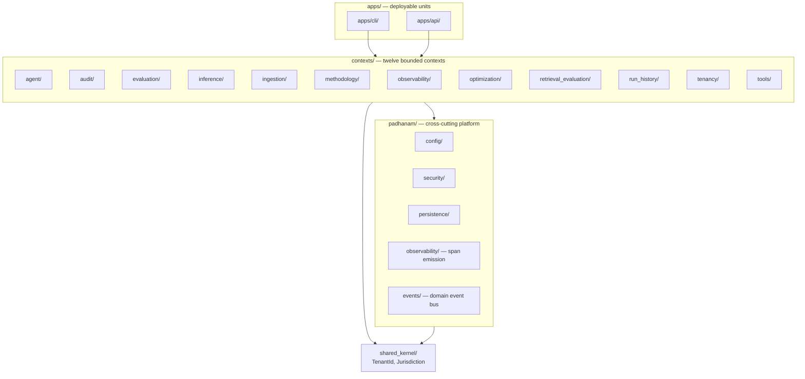
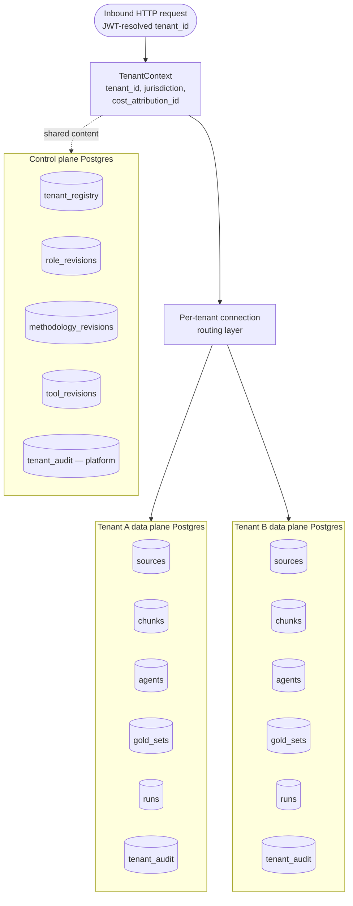
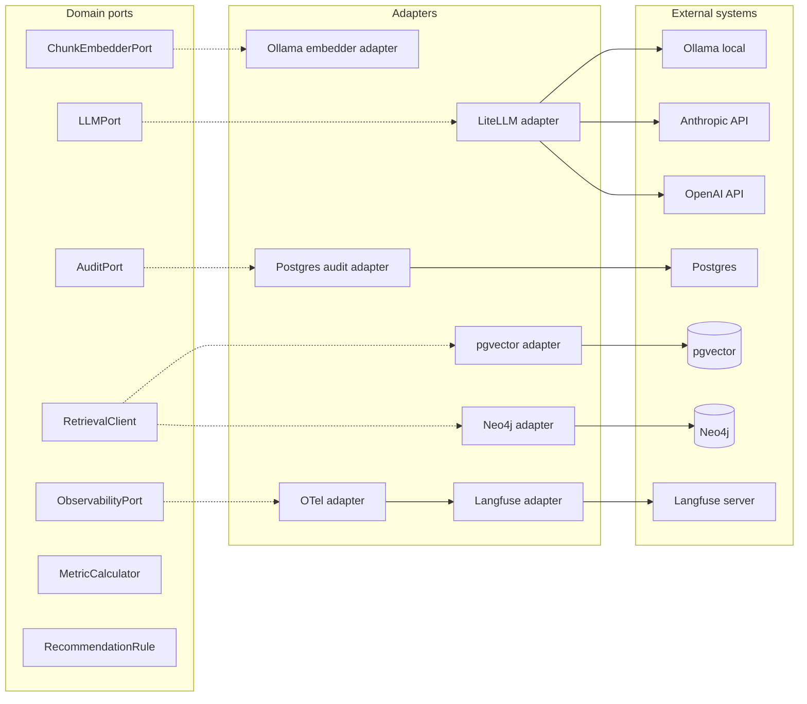
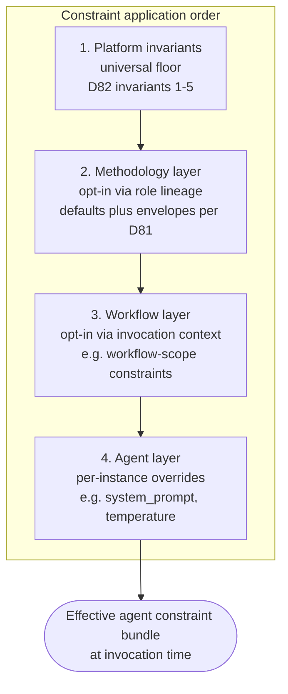

# Padhanam Architecture

This document is the architectural synthesis surface for Padhanam. It organises architectural commitments into a coherent narrative with diagrams, supporting onboarding-time, phase-audit-time, and procurement-grade-touch reading. It does not duplicate binding rules (`charter/principles.md`) or full reasoning (`charter/decisions.md` plus per-phase archives at `docs/archive/decisions/`); it synthesises them.

## Overview

Padhanam is a public demonstration that a senior product leader can direct the end-to-end implementation of an enterprise-grade agentic platform through Claude Code without writing code (see [`charter/bet.md`](bet.md)). The architectural commitments below exist because the proposition is being tested at the level of complexity that real enterprise software requires: multi-tenant, identity-federated, audit-chained, jurisdiction-aware, OTel-instrumented. A demonstration that AI-assisted development can produce a single-tenant prototype answers nothing useful; the architecture's discipline is the substrate of the proposition.

The platform's substrate (Phase 1, packages P1 through P12) supports an agent layer that demonstrates methodology embedding across professional functions. The four-context P11 substrate scaffold (`contexts/retrieval_evaluation/`, `contexts/run_history/`, `contexts/audit/`, `contexts/optimization/`) is the procurement-grade-defensibility surface that closes the bet's success criterion 4: the trace capture layer surfaces optimisation recommendations procurement readers can verify end-to-end with full evidence-citation traceability.

Architectural decisions read like "what enterprise procurement requires for purchase" — literally so, since enterprise procurement is the level at which the proposition is being tested rather than preparation for a sales motion. The architecture commits to abstractions; protocol choices, vendor selections, and operational specifics are configuration above the abstractions. Vendor lock-in is not architectural per the procurement-grade commitment at `charter/principles.md`.

The seven sections below organise architectural commitments thematically:

1. **Architectural patterns** — hexagonal architecture within a context; bounded contexts at the top of the codebase; observability as foundation; binding specifications live in charter.
2. **Tenancy and jurisdiction** — database-per-tenant; jurisdiction as first-class architectural attribute; tenant onboarding as configuration not deployment; customer-specific behaviour as configuration.
3. **Vendor and dependency posture** — vendor flexibility; LLM-provider-agnostic via LiteLLM; hybrid retrieval; OTel as observability portability boundary; audit hash-chain primitive at platform layer.
4. **Domain primitives** — role-first agent identity; methodology as defaults plus envelopes; four-layer constraint stack; recommendation-shaped optimisation output.
5. **The four-context substrate** — retrieval_evaluation, run_history, audit, ingestion as producers; optimization as consumer; HTTP transport with OpenAPI specification.
6. **Cross-document map** — three-document relationship (principles → decisions → architecture); reading modes; this document's place in the charter.

## Architectural patterns

Four architectural patterns anchor the codebase: hexagonal architecture within each bounded context; bounded contexts at the top of the codebase; observability as foundation rather than feature; binding specifications living in charter.

### Hexagonal architecture within a context

Every bounded context follows a hexagonal-layered structure: a `domain/` core carries value objects, aggregates, and pure domain logic with no framework or vendor imports; an `application/` layer carries use cases that orchestrate domain logic and call out through ports; a `ports/` directory exposes Protocol-typed boundaries the application layer depends on; an `adapters/` directory implements the ports against external systems (Postgres, Neo4j, Langfuse, vendor LLM gateways) with `inbound/` for transport-driven adapters (HTTP routes, CLI commands) and `outbound/` for storage-and-service adapters. Import-linter contracts enforce the layering at CI per D16: domain never imports from application or adapters; application never imports from adapters; adapters depend on ports.

The hexagonal pattern lets the domain layer stay framework-free and vendor-free, which is the foundation that makes the vendor-flexibility commitment per D111 mechanical rather than aspirational. Adapter replacement is vendor swap; domain code does not change. See `charter/principles.md` "Hexagonal throughout" (per D4, D16).

### Bounded contexts at the top of the codebase

The codebase organises around bounded contexts at the top level, with cross-cutting platform concerns in `padhanam/`, a strictly bounded `shared_kernel/`, and deployable units in `apps/`. Each context has its own hexagonal layering; contexts communicate via published query APIs for reads and a domain event bus for state changes per D17; direct cross-context imports are forbidden by import-linter per D16. The `shared_kernel/` contains only types that must be referentially equal across contexts (`TenantId`, `Jurisdiction`) and forbids Pydantic imports to prevent framework-version coupling.

Twelve bounded contexts at Phase 1 close: agent, audit, evaluation, inference, ingestion, methodology, observability, optimization, retrieval_evaluation, run_history, tenancy, tools. The split between `contexts/observability/` (analysis-layer domain logic) and `padhanam/observability/` (span emission infrastructure) is structurally honest per D16: cross-cutting plumbing belongs in `padhanam/`, domain logic belongs in `contexts/`. See `charter/principles.md` "Bounded contexts at the top of the codebase" (per D16, D17, D28).

### Observability as foundation

Trace capture starts from the first LLM call. OTel GenAI conventions are the portability boundary per D27; vendor-specific observability code is confined to adapters. Span attributes carry tenant_id, jurisdiction, cost-per-token, and (from D27) trace_id as a join key into the run-history projection. The audit context is bounded (`contexts/audit/`), not cross-cutting plumbing; hash-chained append-only storage records every state change with actor, tenant, jurisdiction, timestamp, action verb, resource, before/after state, and correlation ID per D26. The observability foundation is what makes the optimisation layer's recommendation-shaped output (per D9) procurement-grade-defensible: traces with cost dimension surface "this costs N% more for M% quality at the same task type" recommendations that procurement readers can verify against citations. The "Vendor and dependency posture" section below covers OTel + Langfuse adapter detail; the "The four-context substrate" section below covers the audit context's read surface.

### Binding specifications live in charter

Brand identity (`charter/brand-guidelines.md`, `charter/brand/tokens.css`) and bounded-context architecture (`charter/contexts/*`) are commitments the platform stands behind, not implementation detail. Implementation reads specification; specification does not live in implementation. Per D91. The charter is the methodology's primary artefact surface; the binding-specifications discipline ensures the charter is read-as-truth rather than aspirational-or-decorative content.

## Tenancy and jurisdiction

Four tenancy commitments anchor the platform: database-per-tenant topology; jurisdiction as first-class architectural attribute; tenant onboarding as configuration rather than deployment; customer-specific behaviour as configuration via tools plus bounded extensions.

### Database-per-tenant topology

Tenancy is database-per-tenant per D1: each tenant has its own Postgres data plane, separate from the control plane and from every other tenant's data plane. A control-plane Postgres instance carries the tenant registry, role-revisions, methodology-revisions, tool-revisions, and other platform-managed shared content. Per-tenant Postgres instances carry the tenant's own data (sources, chunks, agents, gold-sets, runs, audit chain). The connection routing layer per D36 resolves the per-tenant data plane from the TenantContext propagated through the call stack.

`TenantContext` is the shared-kernel value object carrying `tenant_id`, `jurisdiction`, and `cost_attribution_id` per D50; it propagates through every layer that touches tenant-scoped data. Tenant isolation is verified by `tests/contract/tenant_isolation/` red-team-shaped tests against every adapter per D24. Per-tenant connection caching at `padhanam/persistence/routing.py` per D36 keeps the topology efficient without weakening isolation. See `charter/principles.md` "Database-per-tenant" (per D1, D32). For the Phase 2 production-deployment revisit on Neo4j topology (currently shared with property-based scoping per D63), see `charter/deferred-decisions.md` under "Production-deployment readiness".

### Jurisdiction as first-class architectural attribute

`Jurisdiction` is a first-class architectural attribute carried in `TenantContext` from P3 onward per D12. Every component that touches customer data (databases, object storage, identity, trace store, LLM endpoints) is built to be regionally partitionable. Phase 1 deploys a single region; the architecture does not assume a single region anywhere in code. The discipline is "by construction, not by policy" — adding it later is a refactor across forty tables and every interface signature; building it in from inception is free at the data-model layer and cheap at the interface layer. See `charter/principles.md` "Jurisdiction is a first-class attribute" (per D12).

### Tenant onboarding as configuration not deployment

Per-tenant decisions (jurisdiction, identity federation, classification policy, model endpoints, retention) live in the tenant registry as configuration per D13. Adding a tenant to an existing regional stack is an idempotent provisioning workflow; adding a region is a separate infrastructure event scoped explicitly when a customer's residency requirement crosses an existing region boundary. The architectural commitment that adding a tenant requires no code changes is what makes the platform sellable to enterprise customers with custom IdP, jurisdiction, and classification requirements. See `charter/principles.md` "Tenant onboarding is configuration" (per D13).

### Customer-specific behaviour as configuration

Tools (external services called by the platform on the tenant's behalf) cover most customer-supplied logic per D14. Bounded extensions exist for residual cases at named interfaces (RetrievalClient, scorer, pre-processor), sandboxed per tenant. The platform is designed so forking is unnecessary per D76; observed forks signal extension surface failure to be addressed upstream. The forking-phrasing refinement at D76 supersedes D14's original "forbidden" wording without rewriting D14 itself, preserving the audit trail per the append-only discipline. See `charter/principles.md` "Customer-specific behaviour is configuration" (per D14, D76).

## Vendor and dependency posture

Vendor flexibility is a procurement-grade commitment per D111: external dependencies — LLM provider, embedding model, database backend, vector store, graph store, audit target, observability target — sit behind ports; vendor swap is configuration or adapter replacement, never domain change. Operationalised at the producer-context level through MetricCalculator and RecommendationRule pluggable domain abstractions in `contexts/optimization/` (Phase 1, per D111); ported domain-layer pluggability is the same principle applied to pluggable evaluation techniques and recommendation rules.

### LLM-provider-agnostic via LiteLLM

LLM access flows through a LiteLLM gateway behind `LLMPort` per D4. The development default is Ollama serving Qwen 2.5 7B per D15 (tool-calling fidelity at the embedding-cost ceiling); production swap is configuration through `padhanam/config/`. No vendor SDKs in domain code; import-linter contracts enforce `no-vendor-sdks-in-domain` at CI. See `charter/principles.md` "LLM-provider-agnostic via LiteLLM" (per D4, D15).

### Hybrid retrieval via pgvector and Neo4j

Retrieval is hybrid: vector via pgvector (HNSW cosine, nomic-embed-text embeddings per D62), graph via Neo4j (shared instance with property-based tenant scoping per D63), both behind the `RetrievalClient` port per D5. Strategy selection at runtime per D66's agent-runtime-executed-composition pattern; the strategy catalogue ships vector_only, graph_only, and parallel_rrf (the last currently deferred per `charter/deferred-decisions.md`). See `charter/principles.md` "Hybrid retrieval" (per D5).

### OTel as observability portability boundary

Observability uses OpenTelemetry GenAI conventions as the portability boundary per D27. Span attributes carry tenant_id, jurisdiction, cost-per-token, and trace_id. Vendor-specific observability code is confined to adapters; the trace store is self-hosted Langfuse 3 per D7 behind an `ObservabilityPort`. Production swap to a different observability vendor is adapter replacement.

### Hash-chain primitive at the platform layer

The hash-chain primitive (canonical-JSON-sorted-keys plus SHA-256 with chain-link) lives at `padhanam/security/hash_chain.py` per D75 (promoted from `contexts/methodology/` at S24). Multiple contexts reuse it: the audit context (`contexts/audit/`) per D26 for append-only audit-event chains; the methodology context for revision-with-hash-chain; the retrieval_evaluation context per D109 for gold-set revisions; the optimization context per D111 for recommendation evidence-citation tamper-evidence. The cross-context reuse pattern is structurally honest because the hash-chain primitive is general (any append-only-with-content-integrity surface uses the same shape) while the input-shaping per context lives at each context's domain layer.

## Domain primitives

Four domain primitives anchor the platform's product-shaped surfaces: role-first agent identity; methodology as defaults plus envelopes; the four-layer constraint stack; recommendation-shaped optimisation output.

### Role-first agent identity

Roles are the primary identity for agents per D86. The agent's job is the role it occupies. Methodologies are playbooks the role applies (situationally); skills are granular capabilities the agent invokes. The role-first model lets methodologies compose at runtime via lineage rather than at design-time via inheritance — an agent has a single role identity throughout its lifetime, and the methodologies it has adopted are recorded as a lineage that affects its constraint bundle without changing its identity. See `charter/principles.md` "Role-first agent identity" (per D86).

### Methodology as defaults plus envelopes

When an agent adopts a methodology, the methodology is embedded as defaults for tuning surfaces and as envelopes for security, budget, and scope surfaces per D81. Defaults activate at decision points, encode the right thing for the chosen methodology, and yield to user intent at low cost. Envelopes bind hard and are validated at agent write time. The product surface treats user intent as primary for tuning; envelopes are non-overridable by the agent and exist to protect the tenant and the platform. The methodology document is the long form of the operating model; the methodology context (`contexts/methodology/`) is the runtime layer.

Per-field binding-mode discipline at D81 commits three hard-bound fields and six soft-bound fields as platform convention. The override mechanism for methodology-author-driven per-field binding deviation defers to Phase 2 per the deferred-decisions entry on "Per-role binding-mode override".

### Four-layer constraint stack

Per D80, agent runtime constraints stack in four layers, applied in order:

Platform invariants per D82 are the universal floor — non-overridable, applied to every agent invocation regardless of methodology lineage, workflow context, or per-agent overrides. The five Phase 1 close invariants (no financial execution without per-transaction authorization; no outbound communication without per-invocation authorization; no acceptance of legal commitments without explicit user action; no auto-modification or auto-deletion of user-authored content; no transmission of tenant data outside tenant-configured tool paths) protect the tenant and the platform. Each invariant maps to safety dimensions (privacy, integrity, reversibility, transparency, control, auditability) per `charter/principles.md` "User safety".

Methodology layer applies if the agent has methodology lineage; envelopes bind hard, defaults are tuning suggestions. Workflow layer applies if the agent is invoked within a workflow context (Phase 2 per D83). Agent layer is per-instance: the agent's authored constraints (system_prompt, model_selection, retrieval bounds) plus the override-mode space per D87 (augment/replace/tighten per-field).

### Recommendation-shaped optimisation output

Per D9, optimisation output is recommendation-shaped, not chart-shaped. Every dashboard view ties to a recommended action. The principle extends to the agent layer per `charter/principles.md` "Padhanam-as-intelligence-layer": Padhanam produces recommendations, analyses, and drafts; consequential actions on the user's behalf require user-in-the-loop authorization at appropriate granularity per the platform invariants.

The recommendation aggregate at `contexts/optimization/` carries five fields per D108 (category, subject, text, evidence_citations, status); numeric confidence scores stay out on D9 grounds (a single floating-point "confidence" would be chart-shaped). The four Phase 1 recommendation categories are retrieval_strategy, model_choice, prompt_revision, cost_optimization per D108 commitment 5. Evidence citations are a discriminated union with structured CaveatAnnotation per D111; the citation surface lets procurement readers trace prose → rule → citation → producer-context records without ambiguity.

## The four-context substrate

[Pending in commit 5]

## Cross-document map

Padhanam's charter system uses three documents for three reading modes:

- **`charter/principles.md`** (read every session) — binding rules with D-entry references. Compact prose at session-open. The principles file is the architect's contract: rules that must hold, parenthetical references back to the load-bearing D-entries that committed them. Compact, scannable, present at every session-open per CLAUDE.md's session-start reading order.
- **`charter/decisions.md`** (consult on demand; archived per-phase to `docs/archive/decisions/phase-N.md`) — full Choice / Reasoning / Alternatives / Kano per D-entry. Cold-path audit-time reading. New D-entries in the active phase land in `charter/decisions.md` until phase close, at which point they archive per the methodology document's per-phase archival pattern. Procurement readers verifying any architectural decision against alternatives land here.
- **`charter/architecture.md`** (read at onboarding, phase audits, procurement-grade-touch moments) — architectural synthesis with diagrams. Warm-path synthesis-time reading (this document). Procurement readers, new contributors, and Phase 2 strategic-mode framing read this document for the coherent architectural picture without needing to consult D-entries one at a time.

The three documents serve different reading audiences and different reading moments. They do not duplicate content; they cross-reference. principles.md restates the load-bearing rules with D-entry pointers; decisions.md owns the reasoning behind each rule; architecture.md narrativises the rules and the reasoning together with diagrams that make the structure visible.

Two further charter documents complete the system:

- **`charter/methodology.md`** — the build methodology (how Padhanam itself is built). Distinct from this document, which covers the architecture (what Padhanam is built as). Methodology covers operator discipline, build process, framing-prompt patterns, refactoring conventions, session shapes, measurement model. This document covers the platform's architecture as the artefact the methodology produces.
- **`charter/product-methodology.md`** — the product methodology layer (what the platform encodes for users at the agent layer). Distinct from this document and from `charter/methodology.md`. Product methodology covers the methodology embeddings the agent layer applies across professional functions (Product Management, Marketing, Learning and Development, Project and Programme Management) per `charter/bet.md`.

See `charter/bet.md` for the strategic intent the architecture serves; `charter/prfaq.md` for the external-voice articulation; and `charter/p12-audit-findings.md` for the Phase 1 close architectural verdict.
