# Phase 2 design — McKinsey 7-Step arc

Strategic-mode arc applying the McKinsey 7-Step problem-solving methodology to Phase 2's strategic shape. Charter-grade placement per the arc-opening conversation's Decision 1: binding specification; Step 3's prioritised bets become Phase 2 LVT structure when the v6 roadmap entry lands per D44. Refreshes at phase audits per D45.

Blank-sheet discipline applies within the bet's success criteria per the arc-opening conversation's Decision 2. The bet's core claims (procurement-grade architecture, methodology-as-product, learning sprint demonstration) hold. Phase 2-specific commitments (D93 framing, three-wave sequencing, the mass-market-UX commitment in `log/captures.md`) are open to re-derivation through the arc.

Posture 1.5: structural dogfooding of the McKinsey 7-Step methodology template authored at S26b per D85, structured per D81's multi-role aggregate v2 shape with the override-mode space committed at D87. The arc reads the role specifications and holds the discipline manually; the methodology aggregate is not invoked through the agent runtime at this arc's posture.

## Step 1: Define the problem

### Problem statement

Busy professionals working twelve-plus hour days carry a portfolio of work and personal goals that need calibrated, variable pacing. Each item benefits from a different pace: urgent items move fast, patient items hold steady, some items should be dropped. The user's effectiveness depends on calibrating pace correctly across the portfolio and acting on those calibrations consistently over time. Under twelve-plus-hour-day load, the calibration breaks down. Items slip out of view. Items needing urgency get under-attended. Items needing patience get neglected because nothing surfaces them. Items that should be dropped continue to consume attention because they made noise. What is missing is not visibility or notifications, both of which the user already gets too much of. What is missing is judgment applied to the portfolio at the right moments: decisions the user can act on, drops the user can confirm, and pacing the user can trust.

### Context: the user's current substitutes

The user has already attempted to solve this with the substrates available. Calendar, AI chat assistants, note-taking apps, light EA support, and self-built structured trackers operating with daily check-ins, item logging by category, and scheduled reminders. Each substrate solves a slice. None integrates the slices. Each demands the user perform the integration in their own head, which is precisely where the twelve-hour-day load creates the breakdown. The work is not to replace these substrates with another individual tool. The work is to bring them together into something that supports the user with integrated judgment they cannot sustain unaided.

### Context: the CoS analogue and the population gap

People senior enough to employ a Personal Assistant, Executive and Personal Assistant, Private Assistant, or Chief of Staff have a partial answer. A human who holds the integrated portfolio, applies judgment, nudges items along at appropriate pace, flags what is slipping, surfaces what to drop, and plays back return on time invested against the user's stated goals. The population carrying the same load shape without this support is much larger. They absorb the load on their personal life, on the quality of their work, or on both. The shape of the problem does not differ between the CoS-supported and CoS-unsupported populations. Only the judgment layer differs.

### Dogfooding-evidence record

The bet's procurement-grade-methodology-embedding claim turns on whether the methodologies Padhanam authors on its control plane actually do work for users at real problems. This conversation is the first structural test of that claim against the McKinsey 7-Step ProblemFramer role authored at S26b per D85, structured per D81's multi-role aggregate v2 shape with the override-mode space committed at D87. Posture 1.5: structural dogfooding of the McKinsey 7-Step methodology template without agent runtime dependency. The conversation read the role's specification and held the discipline manually; it did not invoke an agent against the input.

The ProblemFramer role's function-focused system_prompt commits the role to "receive a raw problem statement or topic from the user; produce a sharpened problem statement with explicit scope (what is in and out), context (situation), complication (what makes this hard or urgent), and success criteria (what good looks like)." This shape did load-bearing work in the conversation. The problem statement above carries scope (busy professionals, twelve-plus hour days, work-life portfolio), situation (current substrates and CoS analogue), complication (calibration breakdown under load), and success criteria (verifiable at Phase 2 close per the success-measurement deliverable archived in the Step 1 conversational record). The McKinsey override layering SCQ (Situation, Complication, Question) added light discipline: the complication-shaped framing of consequence-of-persistence is SCQ-shaped output rather than scope-and-context-shaped. The role's "you do not analyse the problem yourself; you frame it" discipline held cleanly. Sub-problems surfaced naturally during conversation but the assistant resisted disaggregating them, holding them for Step 2 instead.

The conversation prompt named five ProblemFramer discipline sub-prompts: Who has the problem, What is the problem, What gets worse if the problem persists, How would success be measured, What is the problem NOT. Of these, only "What is the problem" maps directly to the template's authored discipline. The other four extend beyond what the role's system_prompt encodes. "Who has the problem" forced specificity on the user definition that the template's scope-as-what-is-in-and-out wording does not require. "What is the problem NOT" forced solution-assumption removal, which is not in the template. The user-perspective framing the conversation prompt embeds was not in the template either. The operator's general knowledge of McKinsey framing plus the conversation prompt's expanded discipline filled the gaps.

The McKinsey 7-Step ProblemFramer role as authored has narrower discipline scope than the full ProblemFramer work this conversation needed. Two responses are honest: either expand the role's system_prompt to encode the five-sub-prompt discipline explicitly, or land it via the recommended-skills-per-role surface deferred to Phase 2 per the brief at briefs/p8/mckinsey-7-step.md. The first response is more durable; the second is structurally cleaner if skills become the methodology-extension surface in Phase 2. The choice is a Phase 2 strategic-mode question, not a Step 1 deliverable. Logging it as a Phase 2 workitem candidate.

The methodology authoring earns its place at structural level. The role definition was readable, the discipline transferable, and the output is a problem statement that survives the self-challenges. This is the minimum bar for procurement-grade methodology embedding, not the maximum. Behavioural dogfooding (an actual ProblemFramer agent running against the input, producing the same problem statement) remains untested. Phase 2's UX surface for methodology adoption, plus the agent runtime exercising the McKinsey 7-Step workflow end-to-end, would close the higher bar. Until then, the bet's methodology-embedding claim has structural evidence but not agent-runtime evidence.

### Initial disaggregation (carry-forward to Step 2)

Sub-problem candidates that surfaced naturally during Step 1 but were held for Step 2's MECE disaggregation: The judgment layer (methodology-applied decisions, drops, pacing recommendations across the portfolio). The mirror function (on-demand return-on-time-invested playback against stated goals). The whisperer function (surfacing items at the right moment for the right item with appropriate judgment, not as bulk notification noise). Portfolio view persistence (state management across sessions; integrating substrate data into a single picture). User-authored methodology surface (enabling the user to bring their own methodologies, the four-functions-plus-user-authored expansion). Personal-domain integration (treating personal items with the same lifecycle dignity as professional items). Substrate integration (bringing calendar, email, notes, existing tracker data, light EA support together rather than replacing them).

Step 2 takes these and produces a MECE-decomposed issue tree, per the McKinsey 7-Step Disaggregator role's discipline. The candidates above are not yet MECE; several overlap (mirror and whisperer both touch judgment layer; substrate integration enables portfolio view persistence). The Disaggregator's work is to cut these into clean, non-overlapping branches with collectively-exhaustive coverage.

### Open questions for Steps 2 and 3

For Step 2 (Disaggregation). How to cut the substrate-integration sub-problem cleanly. Calendar, email, notes, and existing trackers are different categories with different access patterns, privacy properties, and ownership. A single "substrate integration" branch may collapse meaningful differences. Step 2 decides whether to split by substrate type or by integration function.

For Step 3 (Prioritisation). Whether the dogfooding instance (operator only) frames prioritisation, or whether the Phase 2 work also targets the broader busy-professional population at a level that affects which sub-problems are top-quartile. Operator-only dogfooding suggests a narrower sub-problem set with deeper coverage; broader-population targeting suggests wider coverage with shallower per-sub-problem depth. The strategic choice has implications for Phase 2 packaging.

### Step 1 close

Step 1 closes with the problem statement converging through five ProblemFramer sub-prompts (Who has the problem, What is the problem, What gets worse if the problem persists, How would success be measured, What is the problem NOT). The problem statement above survives the self-challenges applied at each prompt. Step 2 (Disaggregation) opens with the initial disaggregation candidates plus the two open questions named above.

## Step 2: Disaggregate

Step 2 applied the McKinsey 7-Step Disaggregator role's discipline to Step 1's sharpened problem statement. The role's function-focused system_prompt commits the role to "decompose problems into structured component trees... receive a sharpened problem from the ProblemFramer; produce a structured decomposition where each branch represents a distinct sub-problem and branches together are collectively exhaustive." The McKinsey override layered "Apply MECE (Mutually Exclusive, Collectively Exhaustive) decomposition; produce an issue tree." Posture 1.5 dogfooding continued from Step 1: the conversation read the role's specification and held the discipline manually without invoking the agent runtime.

Two structural insights emerged during the disaggregation conversation that the Disaggregator role's authored system_prompt does not encode. First, the user-faking-it problem (saying yes when meaning no; status veracity; ambivalence under load) surfaced a sub-problem the initial five-branch shape did not accommodate; the tree gained Branch 6 (Signal fidelity and methodology-fit) to host the platform-to-user signal-verification work distinct from Branch 5 (user-to-platform trust). Second, the rhythm-and-key-change framing introduced a four-stage temporal lifecycle (find rhythm, settle in, watch for key change, adapt) that elevated to cross-cutting discipline applying at every branch, not just at methodology-fit. The Disaggregator role's MECE override produces snapshot tree shape; the temporal lifecycle adds dynamic-state shape that overlays the snapshot.

### Issue tree

**Branch 1: Portfolio existence as a unified picture.**

- 1.1 Substrate connection. How items move from where they live (calendar, email, notes, trackers, head) into the platform's portfolio. Substrate type axis and integration function axis both held per Step 1.
- 1.2 Item identity reconciliation. The same item surfacing across substrates must consolidate to one portfolio entity rather than counted multiple times.
- 1.3 State persistence. The integrated portfolio survives across sessions; the user does not rebuild context each time.
- 1.4 Personal-versus-professional treatment. Personal items receive the same lifecycle dignity as professional items rather than being triaged out by default.
- 1.5 User-authored items. Items the user types directly into the platform; different ownership and lifecycle from substrate-derived items.

**Branch 2: Pace calibration for each item.**

- 2.1 Methodology library. The set of methodologies available for application. Attribution; authoring quality; the primitives-versus-templates discipline.
- 2.2 Methodology-to-item binding. Which methodology applies to which item at which moment; per-item, per-methodology mappings.
- 2.3 Pace inference per item. Given item plus methodology, what pace does the methodology imply (urgency, importance, dependencies, energy, value-of-effort).
- 2.4 User-authored methodology surface. The user authors and adapts methodologies; the authorship interface; methodology validation.
- 2.5 Calibration override mechanics. When the platform's calibration is wrong; per-item, per-methodology, global override paths.

**Branch 3: Action at the right moment.**

- 3.1 Surfacing mechanics. When and how the platform brings items to user attention; channels, frequency, urgency calibration of surfacing itself.
- 3.2 Drop-decision support. Platform-suggested drops; user-initiated drops; the conversation around dropping.
- 3.3 Defer mechanics. Deferral with reason, trigger, or review prompt; deferred state visibility.
- 3.4 Delegation support. Items handed to other people or systems; delegated-state tracking; follow-up surface.
- 3.5 Consent granularity for platform actions. Per D82's intelligence-layer commitment; per-action versus per-class versus standing-consent-with-review.

**Branch 4: Feedback on whether calibration is working.**

- 4.1 Mirror surface. On-demand retrospective on time spent versus value produced; format, depth, time-range, drill-down.
- 4.2 Goal-state tracking. User-stated goals over time; goal authorship; goal revision; goal-to-item linking.
- 4.3 Value-versus-time accounting. Aggregating time spent against value produced; value defined per methodology per item.
- 4.4 Pattern surfacing. Hot and cold spots across time; recurring stalls; types of items that consistently drop.
- 4.5 Feedback-to-platform. User shapes what feedback they receive; mirror customisation; pattern-surfacing preferences.

**Branch 5: Trust substrate for offloading.**

- 5.1 Audit visibility. What the platform did, when, why, with what inputs; user-readable; tied to the Phase 1 audit substrate.
- 5.2 Source attribution. Recommendations cite the user-authored content, methodology, or prior decisions that informed them.
- 5.3 Cost transparency. Per-action cost (LLM, computational, attention); aggregate cost over time.
- 5.4 Intelligence-layer guardrails. D82 commitments visible at user surface; no autonomous action on consequential matters; explicit consent; reversibility.
- 5.5 Trust history. Trust-building moments; trust-break events; trust recovery; visible to the user.

**Branch 6: Signal fidelity and methodology-fit.**

- 6.1 Signal verification. When the platform verifies a user signal versus accepts at face value; verification mechanics with low user friction.
- 6.2 Compliance-signal detection. Yes-when-they-mean-no; agreement under fatigue or social pattern; detection without being a nag.
- 6.3 Status veracity. Item marked done that may not actually be done; lower-pressure status options like stalled, uncertain, partial.
- 6.4 Methodology-fit lifecycle. The four-stage lifecycle applied to methodology specifically: cold-start fit, rhythm maintenance, drift and key-change detection, transition support.
- 6.5 Correction mechanics. User revises a past signal without friction; preserves history; does not punish the user for being human under load.

### Cross-cutting disciplines

Two disciplines apply at every sub-branch:

**Detection.** Each sub-branch needs internal feedback on whether the sub-branch is working: observed-behaviour-versus-stated-intent at every interface where the platform consumes user signal or produces user-facing output.

**Find rhythm, settle in, watch, adapt.** The four-stage temporal lifecycle. Each sub-branch behaves differently at each stage. Conservative defaults at find-rhythm; minimal intervention at settle-in; continuous background watch; supportive transition at adapt; then return to find-rhythm for the new state.

### Self-challenge

The tree holds MECE at sub-branch level. Each branch's five sub-branches are mutually exclusive (distinct work units; no overlap within the branch). Cross-branch overlap testing identified the closest pairs as 4.5 (feedback-to-platform) and 6.5 (correction mechanics); 1.5 (user-authored items) and 2.4 (user-authored methodology); these are distinct work units despite sharing user-authorship vocabulary.

Items deliberately not in the tree: agent runtime substrate; mass-market UX as design constraint; user onboarding as a Phase 2 deliverable concern. Solution territory remains excluded by the Disaggregator role's discipline. The bet's case-study reader audience is also absent because Phase 2's user is the busy professional running a Private Assistant per Step 1.

Thirty sub-problems at this granularity is workable for impact-tractability scoring at Step 3.

### Dogfooding-evidence record

The McKinsey 7-Step Disaggregator role authored at S26b per D85 carries a function-focused system_prompt committing the role to producing MECE issue trees. The McKinsey override added MECE plus issue-tree shape. Posture 1.5 structural dogfooding without agent runtime continued from Step 1.

What the template informed. The "you do not solve sub-problems; you structure them" discipline held cleanly. The conversation resisted moving into prioritisation language even when the operator's framing suggested implications (key-change as a transition state; the seven framework examples). The MECE override gave the explicit structural test that the conversation applied at every branch addition. Branch 6 was added because Branch 5 as user-trust did not accommodate platform-to-user signal fidelity; the operator's three questions surfaced the structural gap and the discipline produced the addition. The issue-tree shape held: hierarchical, two-level decomposition, thirty terminal sub-problems.

Where the template's scope did not cover the work. Two extensions surfaced during the conversation that the McKinsey 7-Step Disaggregator role does not encode. First, the rhythm-and-key-change framing introduced a temporal lifecycle as cross-cutting discipline; the McKinsey override's MECE produces snapshot tree shape, not temporal-mode shape. The operator's framing combined with the template's MECE produced a richer disaggregation than either alone. Second, the substrate-integration cut question called for holding orthogonal dimensions at sub-branch level rather than collapsing to one; the template's MECE override does not specify how to handle orthogonal dimensions within a sub-problem.

What this surfaces for Phase 2 methodology work. The Disaggregator role would benefit from a temporal-lifecycle discipline addition. Issue trees that ignore temporal dynamics produce static decomposition where the underlying problem has stage-dependent behaviour; the Disaggregator's output is then materially weaker than the problem deserves. Two candidate landing surfaces: addition to the Disaggregator role's system_prompt encoding "consider whether the problem has temporal-state structure and apply lifecycle discipline as cross-cutting overlay where it does," or a Phase 2 skills-per-role surface (deferred per the brief at briefs/p8/mckinsey-7-step.md) that bundles temporal-lifecycle and orthogonal-dimension-handling as Disaggregator skills.

What this tells us about the bet's claim. The methodology authoring continues to earn its place at structural level. The Disaggregator role was extensible to accommodate operator insights (rhythm/key-change, faking-it problem, methodology adaptation) without breaking; the role's structural discipline did not prevent the conversation from going where the problem required. The extensibility itself is signal worth recording. Agent-runtime evidence remains untested at Step 2; Phase 2 UX surface for methodology adoption plus agent runtime exercising the Disaggregator end-to-end would close the higher bar.

### Carry-forward to Step 3

Four open questions land at Step 3 (Prioritisation):

1. Dogfooding-only versus broader-population framing. From Step 1's carry-forward, now sharper. Step 3's prioritiser ranks sub-problems by impact and tractability; the population scope materially changes impact. Operator-only dogfooding narrows impact assessment to one user; broader-population widens it. The Phase 2 deliverable strategy depends on this choice.

2. Substrate-type × integration-function matrix at sub-branch 1.1. Both axes carry forward per Step 2. The Prioritiser decides which cells (calendar-read, email-write, notes-observe, etc.) land top-quartile. The substrate axis differences (privacy, ownership, access patterns) and the function axis differences (consent class, technical complexity) both inform impact-tractability scoring.

3. Dependency ordering across branches. Branch 2 (calibration) depends on Branch 1 (portfolio existing). Branch 3 (action) depends on Branch 2. Branch 4 (feedback) depends on Branches 1-3. Branch 6 (signal fidelity) depends on user signal sources that exist when other branches operate. The Prioritiser must respect dependency or face buildable-but-unusable sub-deliverables. Branch 5 (trust) is foundational and partially independent.

4. Lifecycle-stage prioritisation. The four-stage discipline applies at every branch. Step 3 must decide whether Phase 2 ships find-rhythm-plus-settle-in stages across all branches first (with watch and adapt later), or ships full-lifecycle support for fewer branches first. Different commercial test conditions for each choice.

### Step 2 close

Step 2 closes with the issue tree at six branches × five sub-branches, plus two cross-cutting disciplines (detection and the four-stage temporal lifecycle). The tree survived MECE self-challenge at sub-branch level. The Disaggregator role's discipline produced a usable tree that accommodated operator-driven structural insights without breaking. Step 3 (Prioritisation) opens at Claude.ai with the four open questions above as inputs plus the full thirty-sub-problem set as the impact-tractability scoring surface.

## Step 3: Prioritise

Step 3 applied the McKinsey 7-Step Prioritiser role's discipline to the issue tree produced at Step 2. The role's function-focused system_prompt commits the role to "score each branch on impact (how much resolving this moves the overall problem) and tractability (how feasible resolving this is in available time and resources); produce a ranked list with the top branches flagged as priorities." The McKinsey override layered "Use impact-tractability matrix; flag the top quartile as priorities." Posture 1.5 dogfooding continued from Steps 1 and 2. The conversation read the role's specification and held the discipline manually without invoking the agent runtime.

Three pre-conversation decisions framed the scoring approach. Decision 1 (population scope for impact): operator as first instance of broader busy-professional population, balancing operator dogfooding evidence with broader-population generalisation. Decision 2 (scoring dimensions): pure impact-tractability per the McKinsey template, holding RICE for Phase 2 LVT placement when packages get derived. Decision 3 (cross-cutting disciplines): distribute detection and the four-stage temporal lifecycle into per-sub-problem rationale rather than score them as separate items.

Two operator pushbacks during scoring sharpened the prioritised list. Sub-problem 3.4 (Delegation) scored low at first read because the scope was narrow (delegation to external humans only); the operator's reframe broadened scope to include delegation to the platform's AI agents alongside delegation to humans, lifting the score from 4 to 7. Sub-problem 5.5 (Trust history) scored lowest at first read; the operator's pushback recognised the meta-signal value (engagement evidence, trust-break learning, onboarding effectiveness) without disputing the late-stage timing, lifting the score from 5 to 6. Both pushbacks accommodated within the Prioritiser role's authored discipline without breaking.

Two scope expansions in the substrate-type matrix at sub-problem 1.1 emerged from operator review. Documents (Google Drive, OneDrive, Dropbox, Notion, local disk) and messaging (WhatsApp, iMessage, Slack, Telegram) joined calendar, email, notes, manual entry, and existing trackers as substrate types. The matrix at 1.1's sub-decomposition is now seven substrate types times four integration functions (read, observe, write, acknowledge) producing twenty-eight cells for Step 4 to sequence. Messaging additionally functions as a primary delivery interface for sub-problem 3.1's surfacing mechanics, carrying forward to Step 4 as a design constraint.

### Prioritised list

Scores reported as Impact / Tractability = Total. One-line rationale per sub-problem. Scores reflect the three pre-conversation decisions and the two operator-driven revisions noted above.

**Tier 1 (score 10): top quartile core**

- **1.3 State persistence** — 5 / 5 = 10. Portfolio-resets-each-session is exactly the Step 1 breakdown mode; database-per-tenant substrate already supports persistent state.

**Tier 2 (score 9): top quartile**

- **1.1 Substrate connection** — 5 / 4 = 9. Foundational for portfolio existence across seven substrate types; P6 ingestion substrate in place; calendar, email, and messaging MCP integrations tractable per deferred-decisions entries.
- **2.1 Methodology library** — 4 / 5 = 9. Differentiates platform from generic productivity tools; LVT, RICE, Kano, McKinsey 7-Step already authored on control plane; growth maintains primitives-versus-templates discipline.
- **3.1 Surfacing mechanics** — 5 / 4 = 9. The whisperer function lives here; messaging-first delivery as primary channel for busy-professional users; substrate-aware surfacing tractable.
- **5.1 Audit visibility** — 4 / 5 = 9. Phase 1 P10 audit substrate exists; surfacing to user is UI work; foundational for trust per D82.

**Tier 3 (score 8): top quartile inclusive cut**

- **1.5 User-authored items** — 3 / 5 = 8. CRUD-shaped input; user-authored items tend to be high-importance.
- **3.2 Drop-decision support** — 4 / 4 = 8. Where calibration becomes action; items-that-should-be-dropped is a load-bearing failure mode.
- **4.1 Mirror surface** — 5 / 3 = 8. Named in Step 1's success-measurement deliverable; depends on 4.2 and 4.3.
- **4.2 Goal-state tracking** — 4 / 4 = 8. Foundational for mirror; goals as items is tractable extension of portfolio state.
- **5.4 Intelligence-layer guardrails** — 4 / 4 = 8. D82 platform invariants exist; surfacing at decision points is structurally cheap.
- **6.3 Status veracity** — 4 / 4 = 8. Lower-pressure status options structurally simple; impact on portfolio accuracy high.

**Tier 4 (score 7): substantive but not top quartile**

- **1.4 Personal-versus-professional treatment** — 4 / 3 = 7. Design challenge more than technical.
- **2.2 Methodology-to-item binding** — 4 / 3 = 7. Critical for calibration; binding mechanics non-trivial under revision and load.
- **2.3 Pace inference per item** — 5 / 2 = 7. Rules-driven inference tractable; learned models out of Phase 2 envelope.
- **2.4 User-authored methodology surface** — 4 / 3 = 7. Bet's methodology-as-product depends on this; authorship UX non-trivial.
- **2.5 Calibration override mechanics** — 3 / 4 = 7. Override important but secondary to initial calibration quality.
- **3.3 Defer mechanics** — 3 / 4 = 7. Defer is a degenerate case of pacing; substrate exists.
- **3.4 Delegation (AI plus human)** — 4 / 3 = 7. Both delegation flavours (to platform agents; to other humans) in scope; AI delegation underpins Branch 3; human-delegation tracking is moderate complexity.
- **3.5 Consent granularity for platform actions** — 4 / 3 = 7. D82 intelligence-layer commitment requires it; mechanics nontrivial.
- **4.5 Feedback-to-platform** — 3 / 4 = 7. Preference management substrate.
- **5.2 Source attribution** — 3 / 4 = 7. P11 recommendation-with-citation substrate exists; UI extension.
- **5.3 Cost transparency** — 3 / 4 = 7. P4 cost-capture substrate exists; less critical at personal-use stage.
- **6.4 Methodology-fit lifecycle** — 5 / 2 = 7. Rhythm-and-key-change framing load-bearing for methodology-as-product claim; detection mechanics complex.
- **6.5 Correction mechanics** — 3 / 4 = 7. Low-friction correction; depends on audit substrate.

**Tier 5 (score 6)**

- **4.3 Value-versus-time accounting** — 4 / 2 = 6. Time-tracking tractable; defining value per item per methodology is hard.
- **4.4 Pattern surfacing** — 3 / 3 = 6. Useful but late-stage; needs accumulated run-history.
- **5.5 Trust history** — 3 / 3 = 6. Late-stage refinement; meta-signal value (engagement evidence; trust-break learning; onboarding effectiveness) informs other branches' improvement loops.
- **6.1 Signal verification** — 3 / 3 = 6. Important for accuracy; secondary to having signals at all.

**Tier 6 (score 5)**

- **1.2 Item identity reconciliation** — 3 / 2 = 5. Crude duplicates tolerable initially; entity resolution across heterogeneous substrates is a known hard problem.
- **6.2 Compliance-signal detection** — 3 / 2 = 5. Requires accumulated signal data; cannot bootstrap.

### Top quartile flagged

Top quartile of 30 sub-problems is 7-8 items. The score distribution produces a clean cut at five items (Tiers 1 plus 2; score ≥ 9). Extending the inclusive reading to eleven items (Tiers 1 through 3; score ≥ 8) captures the substantive priority set without diluting focus. Step 4's workplan operates on the eleven-item inclusive set as the planning surface, with the five-item core treated as the load-bearing priority.

**Top quartile, strict cut (5 items):** 1.3 State persistence, 1.1 Substrate connection, 2.1 Methodology library, 3.1 Surfacing mechanics, 5.1 Audit visibility.

**Top quartile, inclusive cut (11 items, adds Tier 3):** 1.5 User-authored items, 3.2 Drop-decision support, 4.1 Mirror surface, 4.2 Goal-state tracking, 5.4 Intelligence-layer guardrails, 6.3 Status veracity.

### Self-challenge

**Dependency awareness.** The top tier concentrates in Branch 1 foundational items (1.1, 1.3, 1.5), Branch 2 library entry-point (2.1), Branch 3 action surface (3.1, 3.2), Branch 4 feedback substrate (4.1, 4.2), Branch 5 trust foundation (5.1, 5.4), and Branch 6 status-veracity (6.3). This is consistent with the dependency ordering from Step 2: Branch 2 depends on Branch 1; Branches 3-4 depend on Branches 1-2; Branch 6 depends on signal sources from others. The ranking respects dependency naturally. Step 4 sequences within this priority set respecting both score order and dependency order.

**Operator-as-first-instance framing held throughout.** Sub-problems with high operator-specific impact and lower broader-population generalisation scored lower than sub-problems that serve both. 6.4 (Methodology-fit lifecycle) scored impact 5 because the rhythm-and-key-change framing is load-bearing for the broader-population test condition; for pure operator-only the impact would be lower.

**Rules-versus-learned tractability framing held.** Sub-problems 2.3 (Pace inference) and 6.4 (Methodology-fit lifecycle) scored tractability 2 because learned-model approaches are out of Phase 2's resource envelope; rules-driven approaches keep them tractable at the lower end. Step 4 commits to rules-driven approaches at workplan time.

**Items with disputed scoring noted explicitly.** 3.4 (Delegation) and 5.5 (Trust history) were revised mid-conversation per operator pushback; the rationale captures the scope clarification (3.4) and meta-signal recognition (5.5) so the audit trail surfaces the iteration cleanly.

### Dogfooding-evidence record

The McKinsey 7-Step Prioritiser role authored at S26b per D85 carries a function-focused system_prompt committing the role to impact-tractability scoring with top-quartile flagging. The McKinsey override added the impact-tractability matrix and top-quartile threshold. Posture 1.5 structural dogfooding without agent runtime continued from Steps 1 and 2. This is the third instance of the structural-dogfooding pattern across three distinct roles (ProblemFramer at Step 1, Disaggregator at Step 2, Prioritiser at Step 3).

What the template informed. The "score each branch on impact and tractability; produce a ranked list with the top branches flagged as priorities" discipline held cleanly. The conversation produced 1-5 scores across both dimensions for thirty sub-problems with one-line rationale per item, ranked in score order, with the top-quartile cut explicitly framed. The "you do not solve sub-problems; you order them" discipline held; the conversation resisted moving into solution architecture even when scoring rationale touched implementation considerations. The matrix shape per the McKinsey override produced clean tier clustering at scores 10, 9, 8, 7, 6, 5; the top quartile cut emerged from the tier structure rather than from arbitrary numeric threshold.

Where the template's scope did not cover the work. Five extensions surfaced during the conversation that the McKinsey 7-Step Prioritiser role's system_prompt does not encode. First, scoring-dimension choice (impact-tractability versus impact-tractability-plus-confidence versus full RICE) required an operator decision; the role's authored discipline picks one (impact-tractability) without surfacing the alternative dimensions the conversation actually has access to. Second, population-scope choice (operator-only versus broader-population versus operator-as-first-instance) required an operator decision; the role does not surface that impact scoring varies with population framing. Third, cross-cutting discipline treatment (score separately versus distribute into rationale) required an operator decision; the role does not specify how to handle cross-cutting issues within the matrix. Fourth, dependency-aware scoring across the issue tree is implicit in the conversation but not explicit in the role; tractability scores naturally lower for sub-problems with unmet dependencies, but the role's discipline does not name this. Fifth, mid-scoring revision through operator pushback (sub-problems 3.4 and 5.5) is methodologically normal but not named in the role's discipline; the role describes scoring as if it were a single pass.

What this surfaces for Phase 2 methodology work. The Prioritiser role's authored discipline is narrower than the prioritisation work this conversation needed, consistent with the pattern observed at ProblemFramer (Step 1) and Disaggregator (Step 2). The three roles together produce a coherent procurement-grade-evidence pattern: the methodology aggregate's authored content is structurally sound and extensible, but each role's authored discipline scope is narrower than the substantive discipline the conversation applies. Phase 2 methodology work has two distinct workitem candidates: short-term, expand the role system_prompts to encode the discipline-extensions explicitly (population scope, scoring dimensions, cross-cutting treatment, dependency awareness, revision mechanics); long-term, layer skills per role per the Phase 2 deferred surface, with each role gaining methodology-specific skills that encode the extensions cleanly.

What this tells us about the bet's claim. The methodology-template-extensibility-without-breaking pattern reaches three instances across three distinct roles at this Step 3 close. The bet's procurement-grade methodology-embedding claim now has substantial structural-level evidence; the pattern's consistency across roles strengthens the case that the methodology aggregate as authored on the control plane is genuinely extensible by operators and agents alike, not just operationally workable in one case. Agent-runtime evidence remains untested through all three Steps. Phase 2 UX surface for methodology adoption plus agent runtime exercising the Prioritiser end-to-end would close the higher bar; until then, three-instance structural evidence is the procurement-grade artifact.

### Carry-forward to Step 4 (Planner)

Five open questions land at Step 4:

1. **Workplan granularity.** Step 4 produces a workplan for the top quartile (strict cut: 5 items; inclusive cut: 11 items). Granularity per item: per-sub-problem versus per-priority-cluster. The strict-versus-inclusive cut choice affects this; smaller set permits per-sub-problem depth, larger set may need clustering.

2. **Substrate-type × integration-function matrix sequencing at 1.1.** The twenty-eight cells require workplan sequencing. Calendar-read and email-read might be Phase 2-A; messaging-write might wait for stronger consent substrate; document-observe might depend on additional substrate work. Step 4's workplan ranks the cells within sub-problem 1.1.

3. **Dependency versus priority within the workplan.** State persistence (1.3) and substrate connection (1.1) are top priority AND foundational; calibration and feedback sit on top of them. Step 4 sequences within the prioritised set respecting both score order and dependency order; the two ordering principles may conflict and the workplan resolves the conflict.

4. **Lifecycle-stage prioritisation strategy.** From Step 2's carry-forward, sharper now. The four-stage discipline (find rhythm, settle in, watch, adapt) applies at every prioritised sub-problem. Step 4 decides whether Phase 2 ships find-rhythm-plus-settle-in stages across all priority items first (with watch and adapt later), or full-lifecycle support for fewer items first. Different commercial test conditions.

5. **Messaging-first delivery design constraint and meta-signal observability.** Carryforward design commitments: workplan items in Branch 3 default to messaging-first delivery; trust-history (5.5) sequences as observability work informing other branches' iteration cadence rather than as standalone feature work.

### Step 3 close

Step 3 closes with thirty sub-problems scored on impact and tractability, top quartile flagged at both strict (5 items) and inclusive (11 items) cuts, dogfooding-evidence record at third-instance evidence of the methodology-template-extensibility-without-breaking pattern, and five open questions carrying forward to Step 4. The Prioritiser role's discipline produced a usable prioritisation that respected dependency, accommodated operator pushback, and held the structural test condition (operator-as-first-instance of broader busy-professional population) throughout. Step 4 (Plan) opens at Claude.ai with the top quartile as the workplan surface plus the five open questions as planning inputs. The Step 4 pre-conversation brief authors at `briefs/phase-2/design-7step-step-4.md` before the Claude.ai conversation opens, continuing the briefs/ discipline restoration test from Step 3.

## Step 4: Plan

Step 4 applied the McKinsey 7-Step Planner role's discipline to the inclusive top quartile (eleven sub-problems) from Step 3. The role's function-focused system_prompt commits the role to "produce workplans for prioritised sub-problems... for each priority branch, specify the analyses to be run, the data needed, the owners, the deliverables, and the deadlines. You do not run analyses; you plan them." The McKinsey override layered "Workplan structure: hypothesis, analyses, data needed, owner, deadline, deliverable." Posture 1.5 dogfooding continued from Steps 1, 2, and 3.

Five pre-conversation decisions framed the workplan approach. Decision 1 (top quartile cut): inclusive eleven-item cut over strict five-item cut, to cover both foundational layer and user-facing surface in Phase 2 deliverable. Decision 2 (workplan granularity): per-sub-problem rather than per-cluster, preserving Step 2 MECE structure and Step 3 scoring rationale. Decision 3 (sequencing): score-first within dependency constraints, permitting surface-layer items to start once foundational dependencies have minimum-viable substrate. Decision 4 (lifecycle-stage prioritisation): find-rhythm-plus-settle-in across all priority items first, with watch and adapt stages deferring to Phase 3 or later. Decision 5 (owner framing): role-function distribution tagging preserving the role-distribution audit substrate.

Three operator-initiated scope additions during workplan construction expanded multiple entries. The multi-device sync architectural commitment at 1.3 (state synchronisation across same user's multiple devices, with Phase 2-A single-device implementation plus architectural commitment, Phase 2-B or Phase 3 multi-device implementation). The work-apps expansion at 1.1 (CRM, expense management, project management, ticketing as eighth substrate type, raising the matrix from twenty-eight to thirty-two cells). The methodology library expansion at 2.1 across three updates: audit-trail-lineage for methodology adaptation; minimum-viable matching at find-rhythm-plus-settle-in (item-type rules, user-declared preferences at setup, domain inference); effect-first surface with name as secondary, comprehension-at-acceptance discipline, and lightweight-recommendation versus deep-methodology-application bifurcation.

Two design constraints surfaced from competitor research input mid-conversation. The senior-leader ICP refinement (sharpening the Step 1 broader busy-professional framing to senior leaders at established firms augmenting human EA/CoS plus founders at early-stage tier, with vertical-wedge candidates in financial services, legal, healthcare for Phase 2-B or Phase 3 sequencing) reframes every workplan entry's user definition without rewriting the entries themselves. The voice substrate and voice delivery channel addition (voice as ninth substrate type at 1.1, raising matrix to thirty-six cells; voice as secondary delivery channel at 3.1 with Phase 2-A messaging-first staying primary and Phase 2-B adding voice based on operator dogfooding evidence).

Two structural insights emerged that connect across multiple workplan entries. The three-tier consent-and-awareness framework at 5.4 (Tier 1 real-time review for high-danger classes; Tier 2 surfaced operation with user-controlled digest review cadence; Tier 3 silent operation does not exist) replaces blanket-override patterns with awareness-cadence configuration. The framework operates as commercial positioning differentiator beyond safety hygiene, aligned with the procurement-grade audit-trailed-approval-first defensibility pattern the May 2026 competitor research identifies for the senior-leader ICP. The framework's three-tier shape connects to the four-stage temporal lifecycle from Step 2: find-rhythm operates at Tier 1; settle-in migrates routine classes to Tier 2; watch surfaces via digest; adapt triggers temporary Tier 1 escalation at pattern deviation.

### Workplan entries

#### Branch 1: Portfolio existence

##### 1.3 State persistence

**Hypothesis.** A persistent portfolio state surface, built on Phase 1's database-per-tenant substrate per D32, eliminates the portfolio-resets-each-session failure mode AND supports state synchronisation across the same user's multiple devices. Phase 2-A implements single-device persistence; multi-device sync architecturally committed from the start so the design does not need refactoring when multi-device dogfooding need surfaces. Implementation of full multi-device sync defers to Phase 2-B or Phase 3 based on dogfooding evidence.

**Analyses to be run.** Specify the portfolio aggregate at `contexts/portfolio/` with append-only state-mutation discipline per D26 and D31. Specify multi-device sync architecture as a first-class commitment: backend-of-record at per-tenant Postgres; eventual consistency for reads acceptable for most cases; last-write-wins for most writes; conflict-resolution discipline named explicitly for high-frequency edit cases (deferred to Phase 2-B implementation). Specify device-identity mechanics: how the platform recognises which device the same user is on; how authentication state propagates across devices. Implement the aggregate with hexagonal layout. Phase 2-A implements single-device write-through; multi-device read consistency arrives in Phase 2-B.

**Data needed.** Existing per-tenant Postgres schema substrate from Phase 1. D75 agent aggregate shape as structural precedent. D26 append-only commitments. D31 revisions pattern. D32 database-per-tenant routing. Operator's actual device inventory (phone, laptop, tablet, work computer) for the dogfooding test. Browser-based authentication carryover from `charter/current-package.md` becomes prerequisite for multi-device because session management across devices requires real session handling.

**Owner.** Architect (aggregate specification, append-only design choice, multi-device sync architecture) plus engineer (implementation, contract tests) plus operator dogfooding (multi-session and multi-device continuity validation).

**Deadline.** Phase 2-A foundational. First in dependency order at Branch 1; nothing downstream operationalises without persistent state. Multi-device implementation defers to Phase 2-B.

**Deliverable.** Phase 2-A: single-device portfolio state persisting in per-tenant Postgres with multi-device sync architecturally committed (schema, port shape, conflict-resolution discipline named even if not implemented). Phase 2-B: multi-device read consistency operational; operator dogfooding instance verifies portfolio state matches across at least two devices.

##### 1.1 Substrate connection

**Hypothesis.** Substrate connection across nine substrate types (calendar, email, documents, notes, messaging, manual entry, existing trackers, work applications, voice) at four integration functions (read, observe, write, acknowledge) produces an integrated portfolio the user does not have to mentally integrate. The thirty-six matrix cells sequence per workplan into Phase 2-A versus deferred cells; operator dogfooding informs which cells land first within the broader busy-professional plus senior-leader ICP framing.

**Analyses to be run.** Specify the SubstrateConnection port at `contexts/portfolio/ports/`. Specify Phase 2-A cell prioritisation. Recommended Phase 2-A starting cells: manual entry (write only, no external dependency), calendar-read (D77's calendar tool service deferred-decisions entry activates), email-read (D77's email tool service deferred-decisions entry activates). Implement the prioritised cells with adapters per D14 configuration-plus-tools-plus-bounded-extensions customer-deployment model. Work-app cells (CRM, expense management, project management, ticketing, ERP, support tools) and voice cells (voice memo capture, voice transcription from existing voice substrates, voice as input modality) defer to Phase 2-B or Phase 3 given the integration-pattern diversity within those substrate types. Validate against operator's actual substrate inventory.

**Data needed.** Substrate-tool service specifications per the calendar tool service and email tool service deferred-decisions entries. D14 customer-deployment model. D78 personal-use deployment Phase C activation per current-package.md carryover. Operator-specific substrate inventory (which calendars, which email accounts, which document stores, which messaging apps, which work apps, which voice substrates) for the dogfooding test. Senior-leader ICP framing per the Step 4 mid-conversation refinement: work-app cells likely more important earlier for senior leaders than for general busy professionals.

**Owner.** Architect (port and matrix-cell-prioritisation design) plus engineer (Phase 2-A adapter implementation) plus operator dogfooding (cell-prioritisation input, validation).

**Deadline.** Phase 2-A for foundational cells (manual entry plus calendar-read plus email-read minimum). Phase 2-B for messaging-read, work-app cells (at least one based on operator dogfooding evidence about which work-app categories matter most), voice cells based on dogfooding evidence about voice value.

**Deliverable.** SubstrateConnection port at `contexts/portfolio/ports/`. Phase 2-A adapter implementations covering at least three substrate cells. Per-cell tenant-isolation contract tests per D24. Operator dogfooding instance has at least three substrates connected with portfolio updating from each. Phase 2-B delivery extends to at least one work-app cell and at least one messaging-cell.

##### 1.5 User-authored items

**Hypothesis.** Direct user authorship via messaging-first delivery per Step 3's design constraint captures high-importance items the user thinks of explicitly. User-authored items plus substrate-derived items produce a more complete portfolio than either source alone; the user-authored stream typically carries the highest-judgment items the substrates miss.

**Analyses to be run.** Specify the add-item UX flow: user sends a message via the platform's messaging interface; platform parses the message into a portfolio item; platform confirms with the user before commit. Specify item-shape: required fields (description, source-marker as user-authored), optional fields (methodology binding deferred to 2.2 which is Tier 4 not in this workplan), defaults. Implement the surface, accessible through the messaging delivery channel per Step 3 carryforward. Distinguish user-authored items from substrate-derived items in portfolio views.

**Data needed.** Portfolio aggregate from 1.3. Messaging-channel substrate cell from 1.1 (Phase 2-A or early Phase 2-B; the cell needs read for incoming user messages and acknowledge for confirmation). D75 agent aggregate shape as item-shape precedent.

**Owner.** PM (UX flow design) plus engineer (implementation) plus operator dogfooding (validation).

**Deadline.** Phase 2-A late or Phase 2-B early. Depends on 1.3 (state persistence) and 1.1 (messaging cell). Sequencing per Decision 3 places this after 1.3 lands and after messaging cell of 1.1 lands.

**Deliverable.** Add-item surface accessible via messaging interface. User-authored items distinguishable in portfolio view from substrate-derived items. Operator dogfooding instance has at least twenty user-authored items across at least one week.

#### Branch 2: Pace calibration

##### 2.1 Methodology library

**Hypothesis.** A maintained methodology library accessible via messaging-first delivery, attributed to source, holding the primitives-versus-templates discipline, operating with effect-first surface where the user encounters what the methodology does rather than its name, plus minimum-viable matching at find-rhythm-plus-settle-in stages (item-type rules; user-declared preferences at setup; domain inference where declared), plus adaptation with audit-trail lineage produces calibration value the user cannot get from generic productivity tools. Library grows through platform-authored additions, user-authored additions (defer per sub-problem 2.4), external-source imports, and user adaptations of existing methodologies.

**Analyses to be run.** Specify the methodology-discovery flow accessible via messaging interface. Specify the methodology-content surface: each methodology has its content readable; effect statement primary; name secondary; deeper content tertiary. Specify the activation flow at minimum-viable depth (full per-item binding defers to sub-problem 2.2, Tier 4). Specify the matching mechanism at find-rhythm-plus-settle-in stages: rules-based item-type-to-methodology mapping; user-declared-preference capture at setup; domain inference path. Specify the recommendation-with-confirmation conversation flow (recommendation arrives via messaging interface from 3.1; user confirms, rejects, or modifies). Specify the adaptation flow: user adapts an existing methodology; platform creates a revision-shaped lineage entry; parent methodology stays unchanged; audit trail captures the adaptation event for surfacing through sub-problem 5.1. Specify the comprehension-surface discipline at acceptance moments: effect statement (primary), name (secondary, visible in audit trail), content (tertiary, accessible on demand). Specify the bifurcation between lightweight recommendations (no explicit acceptance) and deep methodology application (explicit acceptance with comprehension surface). Specify the acceptance audit-trail: what the user accepted, when, with what understanding-surface they saw. Implement the surface and content paths.

**Data needed.** Existing control-plane methodology aggregates (LVT, RICE, Kano, McKinsey 7-Step) authored at S26b per D85. D86 role-first model commitments. D81 methodology aggregate v2 shape. The primitives-versus-templates throughline from `log/captures.md`. `charter/product-methodology.md` four professional functions framework. Rules-based item-type signal definitions; user-declared-preference data structure; methodology revision schema per D81 plus D31 for adaptation lineage; D26 append-only audit chain. Methodology-effect content authoring (each platform-authored methodology gains an effect statement and acceptance-moment framing in addition to its existing content): for LVT, RICE, Kano, McKinsey 7-Step authored at S26b, author the effect statements as Phase 2-A content work, distinct from the methodology aggregate's existing system_prompts.

**Owner.** PM (discovery, activation, matching, adaptation UX flows) plus technical writer (methodology-content surface; primitives-focus framing; adaptation-conversation clarity; effect-statement authoring per methodology requires content discipline that surfaces what the methodology does without jargon or methodology insider language) plus architect (matching rules; adaptation lineage schema; integration with D81 methodology aggregate v2 revision discipline) plus operator dogfooding (validation).

**Deadline.** Phase 2-A foundational. Library availability is what differentiates the platform from generic productivity tools.

**Deliverable.** Methodology library accessible via messaging interface. Operator dogfooding instance has at least three methodologies (LVT, RICE, McKinsey 7-Step) browsable, readable, and selectable. Primitives-versus-templates framing visible at the discovery surface. Effect-first surface operational for at least three methodologies. Comprehension-surface discipline observable at every deep-methodology-application acceptance moment in operator dogfooding. Acceptance audit-trail captures comprehension-surface state at acceptance. Item-type rule recommendations firing when user adds items. User-declared preferences captured at setup. Domain inference active where declared. Adaptation flow operational with audit-trail lineage. Operator dogfooding instance has at least three methodology adaptations captured with lineage visible via sub-problem 5.1 audit surface.

#### Branch 3: Action at the right moment

##### 3.1 Surfacing mechanics

**Hypothesis.** Messaging-first surfacing of portfolio items at the right moments produces the whisperer function from Step 1. Items receive attention when they need it; bulk-notification overload does not happen. Restraint is the work: surfacing fires sparingly and contextually rather than constantly. The find-rhythm stage starts with conservative defaults; settle-in stage adapts to the user's actual response patterns; watch and adapt stages defer per Decision 4's broad-coverage-shallower-depth commitment. Voice as secondary delivery channel adds at Phase 2-B based on operator dogfooding evidence about voice value.

**Analyses to be run.** Specify the surfacing-decision logic: when does an item surface? Triggers at Phase 2-A include rules-driven signals (due date approaching; calibration suggests urgency; user-stated interest; substrate-change events). The decision logic operates on the portfolio aggregate plus methodology-applied judgment from the activated methodology per 2.1. Specify the messaging-first delivery adapter: operator's primary messaging channel as Phase 2-A test; OAuth-based integration with appropriate consent for outgoing platform-initiated messages. Specify user-configurable surfacing preferences at minimum-viable depth (frequency cap; quiet hours; per-channel preference). Implement the adapter at `contexts/portfolio/adapters/outbound/messaging/`. Phase 2-B adds voice as secondary delivery channel: platform-initiated voice notes for higher-priority surfacing moments; voice-input for user response without text-typing. Validate against operator dogfooding across at least one week of real use.

**Data needed.** Portfolio aggregate from sub-problem 1.3. Messaging-cell substrate connection from sub-problem 1.1. Methodology library from 2.1 (surfacing logic references methodology-applied judgment). D82 platform invariant 2 (no outbound communication to third parties without explicit per-invocation authorisation; messaging-out has standing consent at user configuration plus per-message review for sensitive cases). Operator's primary messaging channel inventory.

**Owner.** Architect (surfacing-decision logic; messaging-channel choice; consent mechanics) plus engineer (adapter implementation) plus PM (user-configurable preference surface design) plus operator dogfooding (validation).

**Deadline.** Phase 2-A messaging-first delivery. Phase 2-B voice secondary delivery channel based on dogfooding evidence.

**Deliverable.** Messaging adapter operational against at least one messaging channel. Item-surfacing logic operational at find-rhythm-plus-settle-in stages. User-configurable preferences at minimum-viable depth. Operator dogfooding instance receives surfacing messages at appropriate moments across at least one week of real use, with at least 80 percent of surfaced items receiving operator response. Phase 2-B delivery adds voice as secondary channel with operator dogfooding evidence about voice value.

##### 3.2 Drop-decision support

**Hypothesis.** Explicit drop-decision support — where the platform suggests drops and the user confirms or rejects, plus user-initiated drops with audit-trail visibility — solves the items-that-should-be-dropped-but-continue-consuming-attention failure mode from Step 1. Drops happen intentionally and visibly rather than by attrition. D82 intelligence-layer commitment holds: no auto-drop without user confirmation.

**Analyses to be run.** Specify the drop-suggestion logic. Phase 2-A triggers at find-rhythm-plus-settle-in stages: item stalled for N days (configurable per user); item conflicts with user's stated priorities (per goal-state tracking sub-problem 4.2); item's age exceeds methodology-defined freshness threshold. Specify the drop-conversation flow: drop-suggestion fires through the surfacing channel from 3.1; user confirms, rejects, or modifies. Specify drop audit-trail: drops captured with reasoning per D26 append-only chain; drop visible in portfolio history; user can review past drops on demand. Implement the drop-suggestion logic at portfolio aggregate read paths and the drop-conversation flow at the messaging adapter from 3.1. Validate against operator dogfooding.

**Data needed.** Portfolio aggregate from sub-problem 1.3. Surfacing mechanism from sub-problem 3.1. D26 append-only audit chain commitments. D82 intelligence-layer commitment. Phase 1 P10 audit substrate.

**Owner.** Architect (drop-suggestion logic; audit-trail integration with P10 substrate) plus engineer (implementation) plus PM (drop-conversation flow design; user-side conversation clarity) plus operator dogfooding (validation).

**Deadline.** Phase 2-A late or Phase 2-B early. Depends on 3.1 operational; depends on 1.3.

**Deliverable.** Drop-suggestion logic operational at find-rhythm-plus-settle-in stages. Drop-conversation flow through messaging interface. Drop audit-trail readable via portfolio history surface. Operator dogfooding instance has at least five intentional drops captured with full audit trail across at least one week of real use.

#### Branch 4: Feedback on calibration

##### 4.1 Mirror surface

**Hypothesis.** An on-demand mirror surface accessible via messaging interface produces the "see how I am spending time relative to my goals" capability from Step 1's success-measurement deliverable. The user invokes the mirror; receives a coherent narrative reflecting time-spent against methodology-applied value across the portfolio, anchored on goal-state from 4.2. At Phase 2-A find-rhythm-plus-settle-in stages the mirror operates at baseline depth: last-week default range, drill-down by goal or methodology or item-type, narrative shape rather than dashboard shape per the messaging-first delivery commitment.

**Analyses to be run.** Specify the mirror data model: which aggregates feed the mirror; how portfolio state from 1.3, goal-state from 4.2, item-lifecycle events from audit chain, and methodology-applied-value calculations compose into a coherent picture. Specify the mirror conversation flow: user invocation, narrative-response structure, drill-down conversation paths. Specify mirror depth at find-rhythm-plus-settle-in: last-week default; configurable range; basic drill-down. Full pattern surfacing and value-versus-time accounting (sub-problems 4.4 and 4.3, deferred) carry the deeper retrospective work; mirror surface at Phase 2-A operates above their minimum-viable substrate. Implement the mirror generation service and conversation flow. Validate against operator dogfooding.

**Data needed.** Portfolio state from 1.3. Goal-state from 4.2. Item-lifecycle events from audit chain. Methodology-applied-value definitions per methodology (tied to effect-first framing from 2.1; each methodology declares what value means within its frame).

**Owner.** Architect (data model; conversation flow; minimum-viable value calculation) plus engineer (mirror service implementation) plus PM (narrative shape; mirror UX) plus technical writer (narrative-language discipline) plus operator dogfooding (validation).

**Deadline.** Phase 2-A late or Phase 2-B early. Depends on 4.2 (goal-state) and 1.3 (state persistence); 1.1 minimum-viable substrate connection.

**Deliverable.** Mirror surface accessible via messaging interface. Operator dogfooding generates at least seven mirror views across one week of real use. Narrative reflects actual time-and-value patterns from portfolio activity. Mirror evidence trail accessible via 5.1 audit visibility.

##### 4.2 Goal-state tracking

**Hypothesis.** Explicit goal-state tracking captures user-stated goals, supports their revision over time per the rhythm-and-key-change framing from Step 2, and links portfolio items to goals so the user can see (via 4.1 mirror) how their time-spend aligns with intent. Without goal-state, the mirror has nothing to reflect against; without goal-state, the calibration breakdown failure mode from Step 1 (items-that-should-be-dropped) cannot be detected because the platform does not know what counts as alignment.

**Analyses to be run.** Specify the goal entity in the portfolio aggregate: goals as items with a goal-type marker (D86 role-first naming applied), lifecycle distinguishing goal items from regular items. Specify goal-to-item linking: user explicit linking at item-creation; platform inference at item-type-to-goal-similarity for lightweight recommendations; user confirms or rejects. Specify goal-revision discipline: revisions captured in audit trail per D26 and D31; parent goal stays unchanged; revised goal carries lineage to parent (mirrors the methodology-adaptation discipline from 2.1). Implement goal authorship, linking, and revision via messaging interface. Validate against operator dogfooding.

**Data needed.** Portfolio aggregate from 1.3. D86 role-first model for goal-as-item structuring. D31 revisions pattern for goal evolution. D26 append-only audit chain. The methodology-adaptation discipline from 2.1 (mirror-shaped revision pattern).

**Owner.** Architect (goal entity design; linking discipline; revision pattern alignment with methodology-adaptation discipline from 2.1) plus engineer (implementation) plus PM (authorship and linking UX; revision conversation flow) plus operator dogfooding (validation).

**Deadline.** Phase 2-A. Foundational for 4.1 mirror surface.

**Deliverable.** Goal authorship operational via messaging interface. Goal-to-item linking operational at minimum-viable depth. Goal revision operational with audit-trail lineage. Operator dogfooding instance has at least three active goals with linked items across one week; at least one goal revised with lineage visible via 5.1 audit surface.

#### Branch 5: Trust substrate

##### 5.1 Audit visibility

**Hypothesis.** A user-readable audit surface, built on Phase 1's P10 audit substrate per D102, makes platform behaviour legible to the user. Audit visibility is foundational for trust per D82's intelligence-layer commitment and per Step 1's CoS-analogue framing. At Phase 2-A find-rhythm-plus-settle-in stages the audit surface presents platform actions, decisions, recommendations, and methodology adaptations in human-readable narrative form rather than raw event-log form.

**Analyses to be run.** Specify the audit-read surface above the P10 audit chain substrate. The hash-linked append-only chain carries the event stream; the user-readable surface presents events as narrative with filtering and drill-down. Specify what events surface at Phase 2-A: methodology applications, methodology adaptations (from 2.1), recommendations (from 3.1 surfacing decisions), drops (from 3.2), goal revisions (from 4.2), consent decisions (from 5.4 including the three-tier digest events). Specify the audit-conversation flow. Specify multi-device audit coherence per the 1.3 expansion. Implement the audit-read adapter at the audit context and the audit-conversation flow via the messaging adapter from 3.1. Validate against operator dogfooding.

**Data needed.** Phase 1 P10 audit substrate per D102. D26 append-only audit chain commitments. Methodology revision events from 2.1 adaptation work. Surfacing-decision events from 3.1. Drop events from 3.2. Goal-revision events from 4.2. Consent events from 5.4 including Tier 2 digest surfacing. Multi-device sync architecture from 1.3.

**Owner.** Architect (audit-read surface design; conversation flow; multi-device coherence approach) plus engineer (implementation) plus PM (event narrative shape; filtering UX) plus technical writer (audit-language clarity discipline) plus operator dogfooding (validation).

**Deadline.** Phase 2-A. Trust substrate is foundational.

**Deliverable.** Audit-read surface accessible via messaging interface. At least six event types surfaced. Operator dogfooding requests audit views at least daily across one week of real use. Multi-device audit coherence operational at Phase 2-B once 1.3 multi-device sync lands.

##### 5.4 Intelligence-layer guardrails

**Hypothesis.** D82 intelligence-layer guardrails must be visible at the user surface AND the platform must operate without true fire-and-forget at any tier. Every action is visible somewhere; the user controls cadence of awareness, not whether awareness occurs. Three tiers structure the consent-and-awareness model: Tier 1 (real-time review required at action moment) for financial execution, high-consequence outbound communication, legal commitments, irreversible modifications; Tier 2 (surfaced operation with digest review at user-configured cadence) for routine reversible operations including recurring communications to configured contacts; Tier 3 (silent operation) does not exist. Action classification at the tool registry determines tier; classifications are auditable per D82 evolution discipline; reclassification requires user-initiated configuration with audit trail. The framework operates as commercial positioning differentiator beyond safety hygiene, aligned with the procurement-grade audit-trailed-approval-first defensibility pattern the May 2026 competitor research identifies for the senior-leader ICP.

**Analyses to be run.** Specify the three-tier consent-and-awareness framework. Specify action-classification at tool registry: each action class declares its tier with rationale; Tier 1 default for outbound communication, financial, legal, irreversible; Tier 2 default for routine reversible operations. Specify the digest surface accessible via messaging interface: configurable cadence (daily morning, end-of-day, weekly, on-demand); reversibility per action where supported; cross-reference to 5.1 audit substrate. Specify the user-configurable cadence surface. Specify the find-rhythm-to-settle-in transition: action classes start at Tier 1 friction; platform proposes migration to Tier 2 after observed pattern; user opts in consciously. Specify the key-change escalation: pattern deviation triggers temporary Tier 1 review until new pattern stabilises.

**Data needed.** D82 platform invariants. `charter/principles.md` User safety section. Action-classification framework at tool registry (Phase 1 tool registry needs the classification metadata at minimum-viable depth for Phase 2-A). 5.1 audit visibility substrate. 3.1 messaging adapter for digest delivery. The four-stage temporal lifecycle from Step 2.

**Owner.** Architect (action-classification framework; reclassification mechanism; integration with tool registry; three-tier discipline) plus engineer (implementation) plus PM (consent configuration UX; batch-review surface design; cadence configuration UX) plus technical writer (comprehension-language at consent moments) plus operator dogfooding (validation).

**Deadline.** Phase 2-A. Trust contract operational from day one; the platform does not operate at the user surface without guardrails visible.

**Deliverable.** Three-tier consent-and-awareness framework operational. At least three action classes classified across all three tiers (one each at Tier 1 and Tier 2; Tier 3 explicitly absent). Digest surface accessible via messaging interface with at least two cadence options (daily and weekly). Operator dogfooding tests each tier; configures digest cadence; reverses at least one Tier 2 action from digest review; observes Tier 1 friction for outbound communication actions. The find-rhythm-to-settle-in migration discipline operational for at least one action class during the dogfooding period.

#### Branch 6: Signal fidelity and methodology-fit

##### 6.3 Status veracity

**Hypothesis.** A richer status taxonomy beyond binary done-or-not-done — stalled, uncertain, partial, deferred, dropped, active, blocked — reduces the user-faking-it problem from Step 2's Branch 6 framing. Users record their actual relationship to items rather than declaring false binary states under load. The platform's portfolio accuracy improves; the mirror surface from 4.1 reflects real time-and-value patterns rather than fictional ones. Senior-leader ICP framing strengthens the case: senior leaders deal with high-stakes items where binary status is especially misleading.

**Analyses to be run.** Specify the status taxonomy at Phase 2-A find-rhythm-plus-settle-in: active, stalled, uncertain, partial, deferred, blocked, dropped, done. Specify status-transition discipline: user-initiated, platform-suggested, platform-inferred with user confirmation per the three-tier framework from 5.4. Specify status display across portfolio surfaces: mirror from 4.1 shows time-by-status; audit from 5.1 shows status changes as events; surfacing from 3.1 considers status when deciding what to surface. Specify the status-conversation flow via messaging interface. Implement the taxonomy and transitions at the portfolio aggregate. Validate against operator dogfooding.

**Data needed.** Portfolio aggregate from 1.3. Surfacing mechanism from 3.1. Drop audit trail from 3.2. Mirror surface from 4.1. Audit substrate from 5.1. The three-tier consent-and-awareness framework from 5.4.

**Owner.** Architect (status taxonomy; transition discipline; integration with portfolio aggregate; status-display semantics) plus engineer (implementation) plus PM (status conversation UX) plus technical writer (status-language clarity discipline) plus operator dogfooding (validation).

**Deadline.** Phase 2-A. Foundational for portfolio accuracy.

**Deliverable.** Status taxonomy operational with at least eight first-class states across the portfolio. Status-conversation flow accessible via messaging interface. Status changes surface in 5.1 audit. Mirror from 4.1 displays time-by-status. Operator dogfooding instance has at least five distinct status states used across portfolio items in one week of real use.

### Dogfooding-evidence record

The McKinsey 7-Step Planner role authored at S26b per D85 carries a function-focused system_prompt committing the role to "produce workplans for prioritised sub-problems... for each priority branch, specify the analyses to be run, the data needed, the owners, the deliverables, and the deadlines." The McKinsey override added "Workplan structure: hypothesis, analyses, data needed, owner, deadline, deliverable." Posture 1.5 structural dogfooding without agent runtime continued from Steps 1, 2, and 3. This is the fourth instance of the structural-dogfooding pattern across four distinct roles (ProblemFramer at Step 1, Disaggregator at Step 2, Prioritiser at Step 3, Planner at Step 4).

What the template informed. The six-field workplan structure held cleanly across eleven workplan entries spanning all six branches. The "you do not run analyses; you plan them" discipline held; the conversation resisted moving into solution architecture even when workplan entries touched implementation framing. Each entry's hypothesis connected upward to bet success criteria or Step 1 success-measurement deliverables; each entry's deliverable specified concrete outcome rather than abstract capability; each entry's owner field surfaced role-function distribution per Decision 5's role-function tagging commitment. The six fields produced clean workplan entries that downstream Step 5 (Analyse) can operate on.

Where the template's scope did not cover the work. Six substantive extensions surfaced during the conversation that the McKinsey 7-Step Planner role does not encode. First, iterative scope additions during workplan construction (multi-device sync at 1.3; work apps as eighth substrate type at 1.1; methodology audit trail at 2.1; methodology matching at 2.1; comprehension surface at 2.1; three-tier consent-and-awareness at 5.4) required mid-conversation revision of workplan entries already drafted. The Planner role's discipline describes workplan construction as if it were a single pass; the actual planning work involves multiple revision cycles as operator framing sharpens. Second, user-segment refinement mid-Step-4 (senior-leader ICP commitment from competitor research input) reframed every workplan entry's user definition without rewriting the entries themselves. The Planner role does not specify how to handle user-definition refinements that affect the workplan retrospectively. Third, cross-branch dependencies surfaced through workplan construction (Branch 2 depends on Branch 1; multi-device commitment at 1.3 affects 5.1 audit visibility; three-tier framework at 5.4 affects 3.4 delegation; methodology-adaptation discipline at 2.1 parallels goal-revision at 4.2 parallels correction-mechanics at 6.5). The Planner role does not specify dependency-tracking mechanics within or across workplan entries. Fourth, lifecycle-stage prioritisation (find-rhythm-plus-settle-in per Decision 4) affected every workplan entry's hypothesis and deliverable framing. The Planner role's discipline does not reference temporal-state framing; the four-stage temporal lifecycle from Step 2 had to be carried through manually. Fifth, design constraints surfacing mid-workplan (messaging-first delivery from Step 3 carryforward; voice as ninth substrate type from competitor research; "won't know until real users" measurement requirement from operator framing) constrained workplan entry construction in ways the Planner role does not name. Sixth, the operator-pushback revision mechanic that surfaced first at Step 3 continued at Step 4 with substantial scope expansions; the pattern is structurally normal but not encoded in the role's authored discipline.

What this surfaces for Phase 2 methodology work. The pattern observed at ProblemFramer, Disaggregator, and Prioritiser repeats at Planner: the authored role discipline is narrower than the substantive planning work; extensions sit in operator pushbacks, conversation iteration, and design-constraint integration. The methodology-extension Phase 2 workitem is now four-instance evidenced across all four sequential roles. The candidate at one-instance was hypothetical; at two-instance it became evidenced; at three-instance it gained substantive weight; at four-instance it is observed pattern rather than candidate. Phase 2 methodology work has clear shape: short-term role-system-prompt expansion encoding the discipline extensions (iterative-revision mechanics; cross-step-revision-handling; dependency-tracking; temporal-state framing; design-constraint integration; user-segment refinement handling); long-term skills-per-role surface per the Phase 2 deferred commitment at `briefs/p8/mckinsey-7-step.md`.

What this tells us about the bet's claim. The methodology-template-extensibility-without-breaking pattern holds across four distinct sequential roles spanning the McKinsey 7-Step's analytical arc (problem framing through workplan construction). This is substantial procurement-grade evidence at structural level. The pattern's consistency across roles strengthens the case that the methodology aggregate as authored on the control plane is genuinely extensible by operators and agents alike. The four-instance evidence base, taken together, represents perhaps the strongest single piece of evidence for the bet's procurement-grade methodology-embedding claim accumulated to date. Agent-runtime evidence remains untested across all four Steps. Phase 2 UX surface for methodology adoption plus agent runtime exercising the full McKinsey 7-Step end-to-end would close the higher bar; until then, four-instance structural evidence is the bet's procurement-grade artifact.

### Carry-forward to Step 5 (Analyse)

Five open questions land at Step 5:

1. **Senior-leader ICP commitment landing surface.** Where does the senior-leader ICP refinement land in the charter? Candidate landing surfaces: Step 5 analysis output as a charter-grade commitment; a new charter file at `charter/phase-2-user-segment.md`; an update to `charter/product-methodology.md` at the v2 update queued for Phase 2 strategic-mode opening. The commitment is the Phase 2-A user-segment foundation; Step 5 produces the landing recommendation with rationale.

2. **Measurement substrate for "won't know until real users."** The operator's framing at Step 4 surfaced the requirement that every Phase 2-A deliverable needs measurement substrate built in (not bolted on) so real-user evidence at Phase 2-B refines find-rhythm-stage assumptions. Step 5 analyses what measurement substrate each of the eleven priority sub-problems requires; this is a substantive Step 5 deliverable that affects every workplan entry. Sub-problems 4.4 Pattern surfacing, 4.5 Feedback-to-platform, 6.1 Signal verification, 6.2 Compliance-signal detection (all Tier 4, 5, 6; not in workplan) become activation candidates at the moment measurement-substrate output surfaces them.

3. **Architectural pattern surfacing.** Three patterns emerged during workplan construction that may warrant explicit charter commitment as Phase 2-A architectural primitives. (a) Revision-with-lineage pattern shared across 2.1 methodology adaptation, 4.2 goal revision, and 6.5 correction mechanics (Tier 4). (b) Conversation flow pattern shared across 5.1 audit-conversation and 4.1 mirror-conversation. (c) Three-tier consent-and-awareness framework at 5.4 as procurement-grade positioning differentiator beyond just safety hygiene. Step 5 surfaces; Step 6 (Synthesise) commits or defers.

4. **Phase 2-A versus Phase 2-B sequencing of priority items.** The workplan entries split between Phase 2-A foundational and Phase 2-B refinement. Step 5 or Step 6 lands the sequencing as Phase 2 package structure that maps to LVT placement per D44 cadence.

5. **Phase 2-B workitem cluster.** Multiple workitems sit in Phase 2-B candidate territory: voice substrate (1.1 ninth type), voice delivery channel (3.1 secondary), work-app cells (1.1), multi-device sync implementation (1.3), per-class consent refinement (3.5 Tier 4), methodology-fit lifecycle full implementation (6.4 Tier 4), action-classification framework reclassification mechanism (5.4 expansion), user-authored methodology surface (2.4 Tier 4), Disaggregator and Planner role system_prompt extensions per the four-instance methodology-extension pattern. Step 5 analyses clustering; Step 6 sequences.

### Step 4 close

Step 4 closes with eleven workplan entries spanning the inclusive top quartile from Step 3, six fields per entry per the McKinsey Planner role's authored structure, four-stage temporal lifecycle (find rhythm, settle in, watch, adapt) applied as overlay discipline across entries with Phase 2-A targeting find-rhythm-plus-settle-in coverage per Decision 4, senior-leader ICP refinement integrated mid-conversation from competitor research input, three-tier consent-and-awareness framework at 5.4 reframed as commercial positioning differentiator beyond safety hygiene, voice as ninth substrate type and secondary delivery channel added at 1.1 and 3.1 respectively, competitor catalog at twenty-two named entries committed as charter reference with end-of-Phase-3 analysis deferred, dogfooding-evidence record at fourth-instance structural evidence of the methodology-template-extensibility-without-breaking pattern, and five open questions carrying forward to Step 5. The Planner role's discipline produced workplan entries that respected dependency, accommodated multiple operator pushbacks and scope additions, integrated mid-conversation user-segment refinement, and held the structural test condition throughout. Step 5 (Analyse) opens at Claude.ai with the eleven workplan entries plus five open questions as inputs; the Step 5 pre-conversation brief authors at `briefs/phase-2/design-7step-step-5.md` before the Claude.ai conversation opens, continuing briefs/ discipline.

## Step 5: Analyse

Strategic-mode conversation applying Step 5 of the McKinsey 7-Step Framework to the workplan produced at Step 4. The conversation operated at Posture 1.5 (structural dogfooding without agent runtime), continuing the pattern established at Steps 1 through 4. The McKinsey 7-Step Analyst role's function-focused system_prompt committed the role to "execute analyses per a workplan; conduct the specified analyses; gather and structure the data needed; produce findings backed by evidence; pass findings to the Synthesiser role." The McKinsey override layered "Findings include data, source citations, confidence level." The conversation read the role's specification and held the discipline manually.

Pass 1 produced per-sub-problem analyses for the eleven priority sub-problems from the Step 4 workplan. Each analysis covers the design-architectural analyses runnable at Posture 1.5 (build-execution and validation analyses defer to Phase 2 build sessions), produces findings with evidence trails, surfaces measurement substrate per the find-rhythm-stage discipline, and notes Phase 2-A versus Phase 2-B sequencing observations plus Phase 2-B clustering candidates.

Pass 2 covered cross-cutting work: architectural patterns surfaced through Pass 1; Phase 2-A versus Phase 2-B sequencing analysis; Phase 2-B workitem clustering analysis. Pass 3 close delivered the dogfooding-evidence record and the carry-forward to Step 6 (Synthesise).

### Decision 1: Senior-leader ICP commitment landing surface

The Step 4 mid-conversation refinement integrated senior-leader ICP framing into every workplan entry's user definition. The Step 5 brief carried forward the landing-surface question. Resolution: new charter file at `charter/phase-2-user-segment.md`. This option holds the senior-leader segment commitment cleanly while accommodating Phase 3 vertical-wedge sequencing analysis (financial services, legal, healthcare from competitor research; product-leadership-vertical from operator domain) as it activates. The standalone file becomes the authoritative reference for subsequent phases; Step 5 analysis references it; future refinements update it as normal charter evolution.

The ICP definition refined during Step 5: senior leaders at established firms augmenting human EA/CoS, plus founders at early-stage tier or scale-ups up to and including Series B. The expanded founders bucket (covering Series A and Series B scale-ups in addition to early-stage) ensures the platform serves both established-firm senior leaders heavily reliant on Microsoft enterprise tools and founder-led firms tilting toward Google Workspace.

### Pass 1: Per-sub-problem analyses

#### Branch 1, Sub-problem 1.3: State persistence

Three analyses runnable at design-architectural altitude (portfolio aggregate specification; multi-device sync architecture; device-identity mechanics). One analysis (hexagonal aggregate implementation) is build-execution and defers per Posture 1.5.

**Analysis A: Portfolio aggregate at `contexts/portfolio/`.** The portfolio aggregate is structurally a near-replica of the agent aggregate at D75. Aggregate root identified by Portfolio ID plus tenant ID, item entities as children, revisions captured per D31, mutations append to the hash-chained audit log per D26, exposed via hexagonal ports. Item-state changes do not overwrite; each change creates a revision with lineage to its parent. Revision granularity is per-user-action (multi-field edit in a single message produces one revision). This produces an item-lifecycle history that the 5.1 audit visibility surface reads from directly.

**Analysis B: Multi-device sync architecture.** Backend-of-record at per-tenant Postgres per D32 makes the tenant database authoritative; devices are clients. Eventual consistency for reads tolerated because portfolio reads accept sub-second lag at the user surface. Conflict resolution: the platform surfaces conflicts to the user; user decides (keep version A, keep version B, or merge). No auto-resolution via last-write-wins. This shifts the architectural posture from auto-resolution to user-in-the-loop resolution, aligning with D82 intelligence-layer commitment and the consent-granularity principle. Full implementation of conflict-resolution mechanism defers to Phase 2-B; Phase 2-A names the cases (status changes from two devices; concurrent methodology revisions; concurrent goal-state revisions).

**Analysis C: Device-identity mechanics.** Device-identity sits at the identity context (not portfolio context) for clean separation of concerns. Each device receives a device ID at first authentication; the device ID associates with the user account and propagates per session via standard OAuth refresh-token rotation. The platform tracks distinct identities per device including multiple laptops and multiple phones per user (work-laptop versus personal-laptop, not just laptop-versus-phone). Token storage uses device-local secure storage. Revocation operates per device from a settings surface. Device deauthorisation pattern: revoke the device's refresh token; the access token expires within TTL (15 minutes proposed); cached portfolio state on the device becomes stale but does not disappear.

**Pattern flag: revision-with-lineage.** First instance of the pattern shared with 2.1, 4.2, 3.2, and 6.3.

**Measurement substrate.** Portfolio-read events (item, timestamp, device, latency); portfolio-write events (item, change type, timestamp, device, conflict flag); cross-session continuity events. Thresholds: continuity rate below 99 percent indicates portfolio-resets-each-session failure mode reappearing; conflict rate above 1 percent of writes triggers Phase 2-B conflict-resolution implementation; stale-read latency persistently above operator tolerance triggers eventual-consistency revision.

**Phase 2-A scope.** Strictly foundational; nothing downstream operationalises without persistent state. Multi-device sync full implementation defers to Phase 2-B with architectural commitment at Phase 2-A.

#### Branch 1, Sub-problem 1.1: Substrate connection

Four analyses runnable at design-architectural altitude (port specification; matrix cells meaningfulness; Phase 2-A cell prioritisation; senior-leader ICP implications). One analysis (cell implementation) is build-execution and defers per Posture 1.5.

**Analysis A: SubstrateConnection port at `contexts/portfolio/ports/`.** The port decomposes by integration function rather than by substrate type. Four function-shaped interfaces emerge: `SubstrateReader`, `SubstrateObserver`, `SubstrateWriter`, `SubstrateAcknowledger`. Each adapter implements one or more of these for a specific substrate type via multiple-interface inheritance for type safety at registration time. The platform can discover at startup what each adapter declares: "calendar adapter does read and observe; email adapter does read, observe, and acknowledge; manual-entry adapter does write only."

**Analysis B: Matrix cells meaningfulness.** The thirty-six cells (nine substrate types times four integration functions) are not fully populated. Manual entry × observe does not exist; voice × write is degenerate at Phase 2-A. Approximately twenty-five of thirty-six cells are meaningful. Empty cells documented in the port specification so adapter authors do not implement degenerate interfaces.

**Analysis C: Phase 2-A cell prioritisation.** The substrate inventory from operator dogfooding spans both Google Apps and MS365 ecosystems, three messaging providers, and four work-apps available for testing. Phase 2-A core cells:

- Manual entry (write): 1 cell
- Calendar-read: 2 cells (Google Calendar, MS365 Calendar)
- Email-read: 2 cells (Gmail, Outlook)
- Messaging-write: 2 cells (Slack first, WhatsApp second)
- Messaging-observe-status: 2 cells (Slack, WhatsApp)
- Messaging-observe-incoming: 2 cells (Slack, WhatsApp)

Eleven Phase 2-A cells total. The messaging trio (write, observe-status, observe-incoming) co-deploys because the same underlying adapter connection supports all three. The three-signal chain (delivered, read, actioned) captures meaningfully because each event carries device-identity from the start per the 1.3 device-context decision.

Dual-provider parity at calendar and email is required because senior-leader ICP framing tilts established-firm senior leaders to Microsoft (Graphic Design Institute, VanArsdel, Coho Winery, Southridge Video environments) while founders-bucket tilts to Google (early-stage and Series A/B startup default).

Signal messaging out of scope for outbound platform-initiated messaging at both Phase 2-A and Phase 2-B given API constraints. Inbound user-forwarded items from Signal defers to a later mechanism not committed at Phase 2.

WhatsApp Business API template approval is calendar-time prerequisite that does not compress. Phase 2-A planning treats WhatsApp template registration with Meta as work starting when WhatsApp messaging-write enters the build list.

**Analysis D: Senior-leader ICP framing implications.** Work-app cells (CRM, expense management, project management, ticketing, ERP, support tools) are more central for senior leaders at established firms. The expanded ICP across early-stage founders, Series A/B scale-ups, and established-firm senior leaders tilts work-app priority differently per segment. The operator's substrate inventory (HubSpot, Trello, Monday.com, Notion) provides test instances but not real-use data because these are not the operator's actual work tools. Phase 2-A work-app integration validates mechanics only; real-use validation defers to Phase 2-B first-customer engagement.

**Pattern flag: function-first port decomposition.** Consistent with prior P6 ingestion-substrate patterns.

**Measurement substrate.** Substrate-event capture; substrate-to-portfolio item creation rate; per-substrate latency; per-substrate failure rate; OAuth refresh failure rate per substrate. Thresholds: per-substrate health rate below 95 percent signals adapter-quality issues; OAuth refresh failure rate above 1 percent signals token-management problems.

**Phase 2-A scope.** Foundational for the eleven cells. Document cells, work-app cells (HubSpot, Trello, Monday.com first; expense/ticketing/ERP/support tools later), voice cells defer to Phase 2-B.

#### Branch 1, Sub-problem 1.5: User-authored items

Three analyses runnable at design-architectural altitude. One analysis (surface implementation) is build-execution and defers per Posture 1.5.

**Analysis A: Add-item UX flow via messaging interface.** User sends a message via the platform's messaging interface (Slack first, WhatsApp second per 1.1). The platform parses the message into a candidate portfolio item, confirms with the user where appropriate, and persists per the portfolio aggregate from 1.3. The parsing operates on three layers: action verb extraction (add, remind, drop, defer, mark-as-status); item description capture (semantic content); optional metadata (time references, people mentions, urgency markers). The parsing is LLM-driven per D80's four-layer constraint stack placing language understanding in the methodology layer's natural surface.

Confirmation friction level: smart-confirm but NOT silently. Low-confidence items get explicit yes/no confirmation. High-confidence items commit AND notify the user immediately ("added: follow up with Graphic Design Institute, due next week"). The platform never operates invisibly on user data even when confidence is high. Audit trail per 5.1 provides reversal; immediate notification provides awareness. This refinement aligns with the no-silent-operation principle that generalises across 1.5 (parsing and committing) and 5.4 (platform actions through tools).

**Analysis B: Item shape.** Required fields: description, source-marker as user-authored. Source-marker distinguishes user-authored items from substrate-derived items in portfolio views. Two further Phase 2-A fields: created-at timestamp as event-time (not commit-time) to preserve user-intent ordering; source-device-ID per the 1.3 device-context decision.

Status field at item creation: parsing extracts status from natural language when explicit ("I'm stalled on this," "this is dropped"); defaults to active otherwise. User can modify the status after the fact; the audit chain captures the correction event per the revision-with-lineage pattern. Methodology binding deferred to sub-problem 2.2 (Tier 4, not in workplan); the item shape at Phase 2-A does not commit to methodology binding fields.

**Analysis C: User-authored versus substrate-derived distinction in portfolio views.** Source-marker field provides distinction at data level. Visual marker per item (user-authored indicator versus substrate-origin indicator) is the always-on cue. Filterable view (user-authored only, substrate-derived only, all sources) is the on-demand drill-down. Both patterns co-exist cleanly.

The portfolio view is messaging-first per 3.1 design constraint. "Portfolio view" at Phase 2-A is a conversation-shaped surface: user invokes, platform responds with narrative listing items grouped sensibly (by source, by status, by goal-state), user drills down conversationally.

**Pattern flag: no-silent-operation principle.** Generalises across 1.5 and 5.4. Charter-grade principle candidate worth surfacing at Step 6 (Synthesise) for explicit commitment.

**Measurement substrate.** Parsing-confidence score per item; confirmation-versus-silent-commit rate; user-correction rate after notified commit; per-device authoring rate. Thresholds: parsing-confidence below 70 percent on more than 20 percent of items signals parser needs methodology-layer prompt refinement; notified-commit reversal rate above 5 percent signals smart-confirm threshold too aggressive.

**Phase 2-A scope.** Late Phase 2-A or early Phase 2-B. Depends on 1.3 operational and 1.1 messaging cells operational (specifically Slack messaging-observe-incoming).

#### Branch 2, Sub-problem 2.1: Methodology library

Nine analyses runnable at design-architectural altitude grouped into four logical clusters. One analysis (surface and content paths implementation) is build-execution and defers per Posture 1.5.

**Cluster A: Discovery and content surface.** The methodology library at Phase 2-A contains LVT, RICE, Kano, McKinsey 7-Step (the four authored at S26b per D85). Each carries four artefacts: content (the playbook), effect statement (what the methodology does in plain language), name (the proper name), source attribution.

The discovery flow operates via messaging interface from 3.1. User invokes ("what methodologies do you have," "help me prioritise this backlog"). Platform responds with effect-first surface: names are secondary; the user picks based on what the methodology does, not what it is called.

The content surface principle is three-tiered by salience. Effect statement primary (visible at every discovery and acceptance moment). Name secondary (mentioned in passing, captured in audit trail). Deeper content tertiary (accessible on demand).

Effect statements are plain language one-to-two-sentence descriptions per methodology. Examples: RICE — "Helps you order ideas or features by scoring each one on how many people it reaches, how much it impacts them, how confident you are in your estimates, and how much effort it takes." LVT — "Helps you connect day-to-day work to your top-level goals so you can see whether your effort is going where your strategy says it should." Kano — "Helps you classify features into must-haves, performance features, and delighters so you know what to build first." McKinsey 7-Step — "Helps you tackle complex problems by breaking them into seven disciplined steps from framing to communicating."

Effect statement authoring discipline: plain language with no methodology insider terms; accurately describes what the methodology does, not what its name means; discoverable through natural-language matching; one to two sentences. Phase 2-A deliverable: one-paragraph authoring guideline plus four effect statements for LVT, RICE, Kano, McKinsey 7-Step authored to that guideline. Technical writer plus PM ownership.

**Cluster B: Activation and matching.** Three matching signals at find-rhythm-plus-settle-in: rules-based item-type-to-methodology mapping; user-declared preferences captured at setup; domain inference where declared.

The activation flow at minimum-viable depth: user encounters an item or invokes a frame; platform suggests a methodology; user accepts, rejects, or modifies; if accepted, methodology applies to the item or frame. Full per-item binding defers to sub-problem 2.2 (Tier 4, not in this workplan).

Bifurcation between lightweight and deep application: lightweight recommendations apply pace-tagging, surfacing logic, or timing suggestions (commit-and-notify per 1.5; no explicit acceptance; audit-trail for reversal). Deep methodology application fundamentally changes how the user approaches a goal or item (explicit acceptance required with comprehension surface). Methodology authors classify each output type as lightweight or deep at the methodology level.

**Cluster C: Adaptation with audit-trail lineage.** The adaptation flow is the second instance of the revision-with-lineage pattern within Phase 2-A scope. User invokes adaptation via messaging. Platform parses adaptation intent. Platform creates a new revision-shaped entry per D31. Parent methodology stays unchanged. Audit trail captures the adaptation event per D26 for 5.1 surfacing.

Phase 2-A scope is parameter modification within methodology's existing schema. Identity-fork model: when user-driven adaptation crosses into structural restructure (adding new fields, removing dimensions, changing the methodology's shape), the artefact stops being the methodology by name. It forks to user-authored status; attribution transfers from platform to user. The user-authored methodology surface (sub-problem 2.4, Tier 4, deferred) is the surface where this identity-fork happens. 2.4's activation trigger becomes concrete: when adaptation crosses the structural threshold, the methodology forks to user-authored and requires 2.4 surface to be operational.

This produces an elegant ownership and attribution model. Platform-authored methodologies stay attributable to their original source. User adaptations within parameter bounds are attributed to the platform methodology with user's customisation noted. User-authored methodologies (created from scratch or forked from platform methodology beyond parameter bounds) are attributed to the user. The lineage chain captures the fork point with clarity. Procurement-grade defensibility for the senior-leader ICP: the platform does not pretend user work is its own; the audit chain captures the fork point.

Structural threshold for fork: schema-based threshold is mechanically detectable. If the user changes the methodology's schema (adds a field, removes a required field, changes a field's type), it forks to user-authored. Parameter changes within existing schema stay as adaptations. Phase 2-B 2.4 work decides the final threshold definition.

**Cluster D: Comprehension surface and acceptance audit.** The comprehension-surface discipline at acceptance moments mirrors the discovery-surface discipline from Cluster A: information tiered by salience at the moment of decision. Effect statement primary; name secondary; content tertiary.

Applies only at deep-methodology-application acceptance moments. Lightweight recommendations follow the 1.5 commit-and-notify pattern.

Acceptance audit-trail captures: what the user accepted (methodology ID, version, adaptation); when (timestamp, device per 1.3); with what understanding-surface they saw (effect statement as it stood at that moment, captured for audit reconstruction). The audit can answer "did the user understand what they accepted" rather than merely "did the user click accept."

**Phase 2-A authoring artefacts per methodology.** The methodology authoring discipline now produces multiple artefacts per methodology: effect statement; age threshold (two-vector decay); information triggers list (two-vector decay); value calculation (for 4.1 mirror, per-methodology); audit-narrative templates (for 5.1 audit visibility, per event class involving the methodology). Sixteen-plus authoring outputs across the four Phase 2-A methodologies. Technical writer plus PM authoring discipline ownership.

**Pattern flag: tiered-by-salience.** Candidate fourth pattern. Information surface organisation at discovery and comprehension surfaces. Different shape from three-tier consent-and-awareness (which is action-tier; this is information-tier).

**Measurement substrate.** Methodology discovery events; methodology activation events; recommendation accept-versus-reject-versus-modify events; adaptation events; comprehension-surface viewed events. Thresholds: recommendation acceptance rate below 30 percent signals matching logic needs refinement; adaptation rate above 50 percent signals platform-authored methodologies not landing well as-is; comprehension-surface expansion rate above 60 percent signals effect statements not carrying enough information.

**Phase 2-A scope.** Foundational. Library availability differentiates the platform from generic productivity tools.

#### Branch 3, Sub-problem 3.1: Surfacing mechanics

Four analyses runnable at design-architectural altitude. Two analyses (adapter implementation; validation) defer per Posture 1.5.

**Analysis A: Surfacing-decision logic.** Three trigger types at Phase 2-A, all rules-driven. Time-based triggers (due date approaching, scheduled reminder, quiet-hours-end). Event-based triggers (substrate changes, methodology-applied recalculation). State-based triggers (calibration suggests urgency, user-stated interest, item stalled).

Restraint is the architectural work. The platform must refuse to surface as often as it surfaces. Decision logic evaluates suppression conditions: quiet hours active; frequency cap reached; already surfaced recently unless state changed; methodology-applied importance threshold not met; per-item-type preference says do not surface.

Two distinct conversation shapes for two invocation types. Platform-initiated surfacing defaults to single most-urgent: when the platform decides to fire, it picks the highest-urgency item and surfaces only that. Others defer to their next acceptable moment. User-invoked review surfaces a batched narrative: when user asks for a portfolio view, platform produces a structured response covering multiple items grouped by priority or by source.

**Analysis B: Messaging delivery adapter.** Slack first, WhatsApp second per 1.1. Both in Phase 2-A. The adapter targets the user themselves only via the user's own messaging channels. Outbound to third parties (delegation territory at 3.4, not in workplan) crosses into D82 invariant 2 and requires per-invocation authorisation; that flow is separate.

Slack workspace integration is well-trodden (Slack app install, standing consent). WhatsApp Business API integration requires Meta Business Verification, message template registration in advance (Meta approves each template), routing through approved templates. Phase 2-A planning treats WhatsApp template registration as calendar-time prerequisite starting when WhatsApp messaging-write enters the build list.

**Analysis C: User-configurable surfacing preferences.** Phase 2-A minimum-viable preferences expand from the workplan's three to four:

- Frequency cap (no more than N messages per day, configurable per channel)
- Quiet hours (configurable per day-of-week)
- Per-channel preference (Slack for work-context, WhatsApp for personal-context, or other split)
- Per-item-type preference (which substrate-derived item types do not need surfacing because user sees them natively elsewhere)

Configuration surface is conversational per Step 3 messaging-first commitment, with settings panel accessible on demand as backup for explicit configuration.

**Analysis D: Voice as secondary delivery channel architectural commitment.** Phase 2-A commits to the architectural shape that supports voice without refactoring at Phase 2-B. The SubstrateWriter port shape from 1.1 is provider-neutral. Two voice patterns distinct: platform-initiated voice note via TTS (SubstrateWriter for voice); voice-input for user response (SubstrateObserver for incoming-messaging with voice modality). Phase 2-B sequencing decision deferred to operator dogfooding evidence about voice value.

**Pattern flags: conversation flow** (platform-initiated and user-invoked shapes); **three-tier consent-and-awareness** (first explicit reference outside 5.4; Tier 2 standing-consent-at-configuration); **tiered-by-salience** (action-tier).

**Measurement substrate.** Surfacing-decision events; surfacing-delivery events; user-response events through three-signal chain; preference-configuration events. Thresholds: surfacing rate above 10 per day signals bulk-notification failure mode emerging; response rate below 50 percent signals timing/relevance issues; surfacing rate below 1 per day signals over-suppression (whisperer never surfaces is also failure).

**Phase 2-A scope.** Foundational. The user-facing manifestation of the platform's whisperer function from Step 1.

#### Branch 3, Sub-problem 3.2: Drop-decision support

Three analyses runnable at design-architectural altitude. Two analyses (logic implementation; validation) defer per Posture 1.5.

**Analysis A: Drop-suggestion logic.** Three triggers at Phase 2-A: item stalled for N days (configurable per user; default 14-30 days); item conflicts with user's stated priorities (via goal-state tracking from 4.2); item's age exceeds methodology-defined freshness threshold.

Drop semantics: drop is a status transition to "dropped" (one of eight first-class statuses per 6.3), not a deletion. The item stays in portfolio history; exits the active portfolio view; accessible through audit (5.1) or user-invoked review with dropped-included filter. Aligns with D82 invariant 4 (no auto-modification or auto-deletion of user-authored content).

Methodology-defined freshness threshold uses two vectors per methodology:

- **Age vector.** Time-based decay. Each methodology declares "this kind of score or judgment stales after roughly N time units." RICE scores stale at quarterly cadence. LVT structures stale at six-month cadence. Kano classifications stale at roughly twelve months. McKinsey 7-Step problem framings stale faster.
- **Information vector.** Event-driven decay. New substrate events relevant to the methodology-applied item may render the prior application stale. Each methodology declares "events of type X make my application stale for items I've been applied to if [matching condition]." For RICE: new customer-research events, new effort estimates, new competitor moves. For LVT: new initiative, new strategic priority shift, new resource constraint. For Kano: new competitor offering changing user baseline expectations. For McKinsey 7-Step: new stakeholder input, new evidence at any of the seven steps.

Phase 2-A ships age-based freshness operational; information-based gets architectural commitment with Phase 2-B operational delivery. The Phase 2-A methodology authoring discipline now includes both freshness vectors per methodology.

Staleness produces two suggestion types: drop suggestion (item no longer engaged) or rescore suggestion ("Item X's RICE score is from January and new customer evidence arrived. Should I help you rescore it given [specific new information]?"). Drop suggestions live at 3.2; rescore suggestions sit at the methodology layer (2.1).

**Analysis B: Drop-conversation flow.** Platform: "Item X has been stalled for 21 days. Should I drop it from your portfolio?" User options: confirm (status transitions to dropped); reject (suppress drop suggestion for next N days, configurable, default 14); modify (richer response like "not now, check again in two weeks" transitioning to defer rather than drop, or "change status to stalled," or "I'm waiting on X" transitioning to blocked).

Tier of friction: drop suggestions at Tier 1 (real-time review required) for platform-initiated because reversibility-sensitive. User-initiated drops follow 1.5 commit-and-notify pattern. Same operation (drop) operates at different tiers depending on initiation context, not on operation type. This refines the three-tier framework's scope: governs platform-initiated actions; user-initiated actions follow no-silent-operation separately.

**Analysis C: Drop audit-trail.** Drops captured with reasoning per D26 append-only chain. Each drop event captures: item ID; initiator (platform-suggested-then-user-confirmed, or user-initiated); reasoning (platform's trigger reason plus user's confirmation, or user-initiated reason); timestamp; device context per 1.3/1.1; linked methodology if methodology-suggested or methodology-freshness-triggered.

Drop-suggestions that the user rejected are also audited. Repeated drop-suggestions on items the user keeps rejecting produces a meaningful self-reflection signal. Two reading patterns: platform drop logic too aggressive (false positives), or user hoarding items that should drop. The 5.1 audit surfaces this pattern.

**Pattern flags: conversation flow** (drop-suggestion shape); **revision-with-lineage** (drop equals status change equals revision; third instance); **three-tier consent-and-awareness** (tier-depends-on-initiation refinement); **two-vector decay model** (candidate fifth pattern; first explicit instance with both vectors).

**Measurement substrate.** Drop-suggestion events; drop-confirmation events; user-initiated drop events; drop-suggestion-suppression events. Thresholds: drop-suggestion acceptance rate below 30 percent signals trigger logic too aggressive; user-initiated drop rate higher than platform-suggested signals platform missing opportunities; time-from-suggestion-to-confirmation longer than several days signals friction.

**Phase 2-A scope.** Late Phase 2-A. Depends on 3.1, 1.3, 4.2, 6.3, 5.1 all operational.

#### Branch 4, Sub-problem 4.1: Mirror surface

Four analyses runnable at design-architectural altitude. Two analyses (service implementation; validation) defer per Posture 1.5.

**Analysis A: Mirror data model.** The mirror composes from four aggregates: portfolio state from 1.3; goal-state from 4.2; item-lifecycle events from audit chain per D26; methodology-applied-value calculations per methodology.

Methodology-applied value as content authoring is a third authoring artefact per methodology, joining effect statement and freshness vectors. Each methodology declares its value calculation: RICE-applied items have RICE-score-times-effort-spent; LVT-applied items have initiative-attribution-times-time-spent; Kano-applied items have category-weighted-time-spent; McKinsey 7-Step-applied items have which-of-the-seven-steps-time-allocated.

Per-methodology value units at Phase 2-A (not normalised). The mirror narrates each methodology's items separately. No cross-methodology normalisation. Phase 2-B could explore normalisation if per-methodology surface produces friction.

**Analysis B: Mirror conversation flow.** User-invoked via messaging interface ("show me my last week"; "what did I do for goal X"; "how am I tracking against my Q3 commitments"). Platform responds with narrative-shape response, not dashboard. Response structure: opening summary line; per-goal narrative paragraph; cross-cutting observations; drill-down invitation.

Default invocation scope: last-week default at Phase 2-A foundational per workplan, with configurable default added at Phase 2-B alongside other preference refinements.

**Analysis C: Mirror depth at find-rhythm-plus-settle-in.** Phase 2-A mirror depth: last-week default range, configurable range; basic drill-down by goal, methodology, item-type, status, source; per-methodology value narrative.

Full pattern surfacing (4.4, Tier 4, deferred) and value-versus-time accounting (4.3, Tier 4, deferred) carry deeper retrospective work. Phase 2-A mirror operates above their minimum-viable substrate.

Response length: 5-10 paragraphs total for default last-week response. Drill-down responses similar length. Platform chunks if response exceeds this rather than producing a wall of text. Technical writer narrative-length discipline at 4.1 alongside narrative authoring at 5.1.

**Analysis D: Boundary between mirror and deferred deeper retrospectives.** Phase 2-A mirror is descriptive: tells the user what happened, organised against goals, with methodology-applied value attached. 4.4 Pattern surfacing (deferred): identifies recurring patterns across longer time horizons. 4.3 Value-versus-time accounting (deferred): deeper value analysis requiring richer value semantics. Phase 2-A produces the substrate; deferred retrospectives operate on it.

**Pattern flags: conversation flow** (mirror invocation followed by drill-down is the cleanest instance); **tiered-by-salience** (response structure tiered: opening primary, per-goal secondary, observations tertiary).

**Measurement substrate.** Mirror-invocation events; mirror-response events; drill-down events; time-between-mirror-invocations. Thresholds: mirror invocation rate below 1 per day signals mirror not landing as habitual reflective surface; drill-down rate below 30 percent signals opening narrative producing closure rather than provoking reflection.

**Phase 2-A scope.** Late Phase 2-A or early Phase 2-B. Depends on 4.2, 1.3, 1.1 minimum-viable, 2.1 (including methodology-applied value calculation as Phase 2-A authoring work).

#### Branch 4, Sub-problem 4.2: Goal-state tracking

Three analyses runnable at design-architectural altitude. Implementation defers per Posture 1.5. Validation defers per Posture 1.5.

**Analysis A: Goal entity in portfolio aggregate.** Goals as items with goal-type marker per D86 role-first naming. Reuses portfolio infrastructure (revision pattern from 1.3; audit chain per D26; status taxonomy from 6.3; methodology binding from 2.1). Lifecycle similarity to items. Mirror query at 4.1 simplifies because goals and items share the same aggregate.

Goal entity carries item-shared fields (description, status, source-marker, created-at, device-context, methodology-binding) plus goal-specific fields (goal-statement; success-criteria; time-horizon; parent-goal-link optional).

Phase 2-A scope: flat goal list with optional parent-link captured but minimally used. Hierarchy adds complexity (cascading status, propagation rules, multi-level rollup) not needed at find-rhythm stage. LVT methodology when applied creates internal structure within methodology-applied state, not in goal-aggregate state. The two are orthogonal: hierarchy is a methodology concern, not a goal-entity concern.

**Analysis B: Goal-to-item linking.** Three linking patterns: user-explicit at item-creation; platform inference for lightweight recommendations (commit-and-notify per 1.5); user confirms or rejects.

Many-to-many between items and goals. Real items often serve multiple goals. Multi-goal linking from day one.

Each link carries metadata: how created (user-explicit, platform-inferred, user-corrected); confidence if platform-inferred; timestamp; device context per 1.3.

Goal-revision link transfer: links transfer to the revised goal automatically. The revision-with-lineage pattern means revised goal is genealogically continuous with parent. Audit narrative surfaces: "revised goal X; 7 items previously linked to parent now linked to revision; review if any should disconnect."

**Analysis C: Goal-revision discipline.** Fourth instance of revision-with-lineage pattern (after 1.3 portfolio items, 2.1 methodology adaptation, 3.2 drop status transitions). User invokes revision via messaging. Platform parses revision intent. Platform creates revision-shaped entry per D31. Parent goal stays unchanged. Audit trail captures revision event per D26 for 5.1 surfacing. Linked items transfer per Analysis B.

Two kinds of goal mutations: status transitions (active to achieved, active to abandoned) versus substantive revisions (different goal-statement, different success-criteria, different time-horizon). Both produce revisions; the difference is in what changed. Audit narrative authoring discipline at 5.1 handles the distinction.

Goal revision is itself a substrate event triggering information-based staleness for methodology-applied items linked to the revised goal. The two-vector decay model holds: goal revisions are information triggers each methodology declares.

**Pattern flags: revision-with-lineage** (fourth instance); **conversation flow** (goal authorship, linking confirmation, revision flows); **two-vector decay model** (goals decay on both vectors; goal revision as information-trigger for methodology-applied freshness).

**Measurement substrate.** Goal-creation events; goal-revision events with revision-type marker; goal-to-item linking events with linking-pattern marker; goal-mirror invocation events. Thresholds: active-goal-count below 2 signals platform not capturing goal substrate; active-goal-count above 20 signals goal-hoarding; goal-revision rate above 1 per goal per quarter signals goal-statement quality issues; platform-inferred linking acceptance rate below 60 percent signals inference logic needs refinement.

**Phase 2-A scope.** Foundational. 4.1 mirror depends on it. 3.2 drop-suggestion goal-conflict trigger depends on it.

#### Branch 5, Sub-problem 5.1: Audit visibility

Four analyses runnable at design-architectural altitude. Two analyses (adapter implementation; validation) defer per Posture 1.5.

**Analysis A: Audit-read surface above P10 substrate.** P10's audit substrate at `contexts/audit/` per D102 provides the foundation: hash-chained append-only event stream, two-destination model, chain integrity verified on read at page granularity, HTTP transport with separately authorised routes. The 5.1 audit-read surface sits above P10; it does NOT modify the audit chain (D26 append-only); it reads and produces user-readable narrative.

Two transformations: event filtering (not all chain events surface to user; internal hash verification, configuration-read, low-level state checks live in the chain but do not surface unless explicitly queried); narrative composition (events are atomic; the read surface composes related events into narrative sentences). Narrative composition is content-discipline work, technical writer ownership, per-event-class templates.

**Analysis B: What events surface at Phase 2-A.** Twelve event classes (workplan's six plus five from Pass 1 design refinements plus one from 5.4 central-storage refinement):

1. Methodology applications (from 2.1)
2. Methodology adaptations (from 2.1)
3. Recommendations (from 3.1 surfacing decisions)
4. Drops (from 3.2)
5. Goal revisions (from 4.2)
6. Consent decisions (from 5.4)
7. User-authored item commits (from 1.5; smart-confirm-not-silently commits visible)
8. Drop-suggestions rejected (from 3.2 self-reflection capability)
9. Goal-to-item linking events (from 4.2)
10. Methodology-freshness triggers (from 3.2 and 2.1, both vectors)
11. Multi-device events (from 1.3 expansion)
12. Digest sent events (from 5.4 central-storage refinement; meta-events referencing Tier 2 events)

**Analysis C: Audit-conversation flow.** User invokes audit via messaging. Conversation shapes: broad audit review ("What did the platform do this week?"); filtered by event class ("Show me drops"); item-specific drill-down ("When did I action item X?"); goal-specific drill-down ("What changed about goal Y?"); reflection-shaped invocation ("What did the platform suggest that I rejected?").

Mirror-versus-audit boundary: mirror evaluates the user against their goals; audit records what the platform did. Different lenses on overlapping substrate. Platform routes "how am I doing" to mirror, "what happened" to audit. Opening line names the lens explicitly.

**Analysis D: Multi-device audit coherence.** Single-source-of-truth at per-tenant Postgres per D32. Devices read from the same chain; chain is unified by construction. Phase 2-A audit-read surface operates on the unified chain.

The 1.1 device-context enhancement (every messaging event carries device-identity) makes audit narrative meaningfully multi-device at Phase 2-A even before multi-device sync implementation lands. Narrative: "delivered 09:14 to phone, read 09:31 on phone, actioned 10:42 from laptop."

Phase 2-B work when multi-device sync lands: conflict-event surfacing in audit narrative; device-deauthorisation event audit narration.

**Pattern flags: conversation flow** (audit-conversation joins mirror, surfacing, methodology library, drop-decision, status; five sub-problems exhibit the pattern); **tiered-by-salience** (audit narrative tiered: most-significant primary, routine secondary, raw event-log tertiary); **three-tier consent-and-awareness** (5.1 is the surface making 5.4 framework operationally meaningful).

**Measurement substrate.** Audit-invocation events; audit-filter events; audit-narrative-engagement events; cross-surface invocations. Audit-read events emit to separate observability stream per D27 OTel (not into D26 audit chain to avoid recursion). Thresholds: audit-invocation rate below daily signals audit not landing as habitual trust substrate; drill-down rate below 40 percent signals opening narrative producing closure; rejected-suggestions invocation rate above 20 percent signals genuine reflective use of the surface.

**Phase 2-A scope.** Foundational. Trust substrate. Depends on P10 audit substrate (Phase 1, operational) and events from 1.5, 2.1, 3.1, 3.2, 4.2, 5.4 firing.

#### Branch 5, Sub-problem 5.4: Intelligence-layer guardrails

Six analyses all runnable at design-architectural altitude. Implementation and validation defer per Posture 1.5.

**Analysis A: Three-tier framework specification.**

Tier 1 (real-time review required at action moment): for reversibility-sensitive or high-consequence operations. Cases: financial execution per D82 invariant 1; outbound communication to third parties per D82 invariant 2; legal commitments per D82 invariant 3; irreversible modifications; platform-initiated drop suggestions per 3.2; deep methodology application acceptance per 2.1; substrate writes affecting user's external substrates.

Tier 2 (surfaced operation with digest review at user-configured cadence): for routine reversible operations under standing consent. Cases: outbound messaging to user themselves via configured channels (Slack, WhatsApp); lightweight recommendations from 2.1; smart-confirm-not-silently commits per 1.5; methodology-applied judgments producing lightweight outputs.

Tier 3 (silent operation): does not exist. Invariant principle.

Tier-depends-on-initiation refinement: framework governs platform-initiated actions specifically. User-initiated actions follow 1.5 no-silent-operation principle separately. Framework scope: platform-initiated only.

**Analysis B: Action classification at tool registry.** Each action class declares its tier with rationale. Platform-authored defaults at tool registration time with user override discipline. User reclassification surface available but expected to be rarely used.

Phase 2-A action class classifications listed in detail covering ten classes (outbound messaging to user themselves Tier 2; outbound to third parties Tier 1; financial Tier 1; legal Tier 1; substrate reads not classified under framework; substrate writes Tier 1; drop suggestions Tier 1; lightweight methodology recommendations Tier 2; deep methodology application Tier 1; user-authored item parse high-confidence Tier 2; user-authored item parse low-confidence Tier 1).

**Analysis C: Digest surface.** Aggregates Tier 2 events for user review at user-configured cadence. Accessible via messaging interface.

Phase 2-A digest content: lightweight recommendations made and committed; smart-confirm-not-silently commits made; outbound messages sent on user's behalf at Tier 2; methodology-applied judgments produced (lightweight cases). Each digest entry includes action class, target, timestamp, device context, reversibility status, link to 5.1 audit for detail.

Configurable cadence: daily morning; end-of-day; weekly; on-demand.

Reversibility per action: reversal affordance where applicable; reversing a Tier 2 action is itself Tier 1.

Digest content centrally stored in audit context as materialized view over audit events; channel delivery via per-channel preference from 3.1. The digest record holds metadata (digest ID, cadence type, delivery channel, recipient device, timestamp), event reference set (audit chain event IDs aggregated), delivered narrative text (captured for reproducibility even if narrative templates evolve).

Digest within audit context (not new bounded context) preserves bounded-context discipline. 5.1 audit-read surface surfaces digest history. 3.1 messaging adapter consumes from audit context.

**Analysis D: User-configurable cadence surface.** Conversational configuration per 3.1's commitment. Phase 2-A: four cadence options uniformly applied; per-action-class cadence defers to Phase 2-B.

**Analysis E: Find-rhythm-to-settle-in transition.** Action classes start at Tier 1 friction. Platform observes user pattern. After observed pattern stabilises, platform proposes migration to Tier 2. User opts in consciously through Tier 1 friction (migration is itself Tier 1).

Combined threshold: 10 consistent approvals AND 4 weeks elapsed at Phase 2-A starting defaults. Calibrated via dogfooding.

Migration proposal supports modify option for finer-grained classifications ("only for reminders to my team, not to external contacts" produces Tier 2 if recipient in stated set; Tier 1 otherwise).

**Analysis F: Key-change escalation.** Rules-based deviation detection at Phase 2-A: new entity in scope (outbound to new contact reverts that entity to Tier 1); frequency deviation beyond 2 standard deviations (reverts to Tier 1 until new pattern stabilises); recent reversal within 14 days (returns action class to Tier 1 for the period).

Audit captures escalation event with underlying signal.

**Pattern flag: three-tier consent-and-awareness framework** — this is its native specification site. Phase 2-A architectural primitive committed.

**Measurement substrate.** Action-classification events; Tier 1 review events; Tier 2 commit events with digest aggregation; migration-proposal events; migration-acceptance events; key-change escalation events; user-reversal events. Thresholds: Tier-1-to-Tier-2 migration rate below 20 percent of eligible action classes signals trust substrate not accumulating; Tier 1 user-rejection rate above 30 percent signals classifier needs refinement; Tier 2 reversal rate above 5 percent signals migration premature; key-change escalation frequency above 1 per week per user signals detection too sensitive.

**Phase 2-A scope.** Foundational. Trust contract operational from day one. The platform does not operate at the user surface without guardrails visible.

#### Branch 6, Sub-problem 6.3: Status veracity

Four analyses runnable at design-architectural altitude. Implementation and validation defer per Posture 1.5.

**Analysis A: Status taxonomy.** Eight first-class states with state-specific qualifying fields where context matters:

- Active. Default state on creation; currently engaged.
- Partial. Engaged with progress made but not done; carries progress description.
- Stalled. Not moved in some time; no explicit decision; passive pause.
- Uncertain. User unsure whether item should be in portfolio; carries open question.
- Deferred. Explicit user decision to come back later; carries return-trigger.
- Blocked. Cannot proceed because of external dependency; carries blocker info.
- Dropped. Status transition not deletion per 3.2; carries reasoning.
- Done. Complete; final state for items completing cleanly.

Watching and delegated excluded from Phase 2-A status taxonomy. Watching captured as active-with-low-engagement via surfacing logic. Delegated belongs at 3.4 (Tier 4, not in workplan) because of delegation-specific semantics.

**Analysis B: Status-transition discipline.** Three transition initiation types governed by the 5.4 framework: user-initiated (outside framework scope; follows 1.5 no-silent-operation); platform-suggested (Tier 1 because reversibility-sensitive); platform-inferred from substrate signals (Tier 1 with user confirmation).

Each status transition creates a revision per the 1.3 revision-with-lineage pattern. Fifth instance of the pattern within Phase 2 scope (after portfolio items, methodology adaptation, goal revisions, drop decisions). Pattern at saturation evidence.

Transition graph specified in detail covering 20-plus allowed transitions across the eight states.

**Analysis C: Status display across portfolio surfaces.** Mirror at 4.1 shows time-by-status distribution as first-class mirror dimension. Audit at 5.1 surfaces status transitions as first-class events. Surfacing at 3.1 considers status when deciding what to surface; per-status surfacing personalities:

- Active. Primary surfacing rotation.
- Stalled. Review-mode surfacing at lower frequency.
- Uncertain. Decision-mode surfacing at periodic intervals until decision.
- Blocked. Dependency-check surfacing when blocker condition might be resolvable.
- Deferred. Return-trigger surfacing precisely at return moment.
- Partial. Continuation surfacing at lower frequency than active.
- Dropped and Done. No surfacing (terminal states).

Whisperer function is status-aware. Different states warrant different surfacing personalities.

**Analysis D: Status-conversation flow.** User-initiated invocations (direct transition; qualified transition; filtered query; direct query). Platform-initiated invocations (status suggestion; inferred transition with confirmation). Modify option supports alternative transitions ("yes but mark partial not done").

**Pattern flags: revision-with-lineage** (fifth instance; saturation); **conversation flow** (sixth substantive instance; across-the-board); **three-tier consent-and-awareness** (platform-suggested transitions Tier 1); **tiered-by-salience** (status display tiered: active primary, intermediate secondary, terminal tertiary).

**Measurement substrate.** Status-transition events; status-distribution events at periodic intervals; platform-suggestion-versus-user-acceptance rate per status; per-status surfacing engagement. Thresholds: status distribution overweighted toward active (above 80 percent) signals user-faking-it failure mode persists; platform-suggestion acceptance rate per status below 50 percent signals suggestion logic needs refinement per state; items lingering in uncertain state for more than 30 days signal user not engaging with decision.

**Phase 2-A scope.** Foundational. Portfolio aggregate needs status taxonomy from day one.

### Pass 2: Architectural patterns surfaced

Five patterns identified through Pass 1: three named in the Step 5 brief plus two candidates that emerged. Each is evaluated for commit-or-defer decision at Step 6 (Synthesise).

#### Pattern (a): Revision-with-lineage

**Evidence.** Five instances within Phase 2-A workplan: portfolio item revisions at 1.3; methodology adaptation at 2.1; drop decisions at 3.2 (status transitions); goal revisions at 4.2; status transitions at 6.3. Plus one deferred instance at 6.5 correction mechanics (Tier 4). Saturation evidence.

**Pattern shape.** Parent artefact stays unchanged in audit chain per D26. Revised artefact is a new entity carrying lineage reference to parent. Revision captures timestamp, initiator, change-type, reasoning where the state-specific qualifying field captures it. D31 revisions pattern provides the substrate; D26 audit chain captures the event; 5.1 audit visibility surfaces lineage narratively.

**Recommendation.** Commit as Phase 2-A architectural primitive. Pattern is load-bearing. Encodes principle connecting D26 append-only, D31 revisions, D82 reversibility dimension, 5.1 trust substrate. Substrate already exists; commitment makes explicit what cross-context consistency requires.

**Where to commit.** New D-entry first ("Revision-with-lineage as Phase 2-A architectural primitive"). Architecture.md may absorb at Phase 2 close.

**Open question for Step 6.** Standard `Revisable` port shape versus descriptive discipline. My read: descriptive at Phase 2-A; potential formalisation at Phase 2-B.

#### Pattern (b): Conversation flow

**Evidence.** Nine sub-problems exhibit instances: 1.5 parse-then-confirm-or-notify; 2.1 discovery, activation, recommendation, adaptation; 3.1 platform-initiated and user-invoked shapes; 3.2 drop-suggestion conversation; 4.1 mirror invocation followed by drill-down; 4.2 goal authorship, linking, revision; 5.1 audit-conversation flow; 5.4 cadence configuration, migration proposal, escalation review; 6.3 status-conversation flow. Across-the-board saturation evidence.

**Pattern shape.** User invokes via messaging interface per Step 3 messaging-first commitment. Platform produces narrative-shape response, not dashboard-shape. User confirms, rejects, or modifies. Modify option supports rich alternative responses, not just yes-or-no. Drill-down available conversationally for narrative responses. Audit captures conversation events per D26.

Two sub-shapes: user-invoked (mirror, audit-review, query, configuration) and platform-initiated (surfacing, drop-suggestion, status-suggestion, migration-proposal). Both share fundamental shape; operate at different tiers under 5.4 framework.

**Recommendation.** Commit as Phase 2-A architectural primitive. Pattern is universal across user-facing surfaces. Encodes Step 3's messaging-first commitment plus conversational discipline aligned with senior-leader ICP.

**Where to commit.** D-entry plus architecture.md absorption at Phase 2 close.

**Open question for Step 6.** Standard conversation-state-machine versus discipline. My read: discipline at Phase 2-A; potential platform-level abstraction at Phase 2-B.

#### Pattern (c): Three-tier consent-and-awareness framework

**Evidence.** 5.4 is the native specification site. Six other sub-problems explicitly reference: 1.5 commit-and-notify versus explicit-confirm; 2.1 lightweight versus deep; 3.1 outbound messaging at Tier 2; 3.2 platform-initiated drops at Tier 1; 5.1 audit visibility makes framework operationally meaningful; 6.3 status transition suggestions at Tier 1. Seven instances total. Substantial evidence.

**Pattern shape.** Tier 1 (real-time review at action moment); Tier 2 (surfaced operation with digest at user-configured cadence); Tier 3 (silent operation, does not exist; invariant principle).

Components: action classification at tool registry with platform-authored defaults plus user override; digest surface stored centrally in audit context with channel delivery; find-rhythm-to-settle-in migration at combined threshold (Phase 2-A starting 10 approvals AND 4 weeks); key-change escalation via rules-based deviation detection; tier-depends-on-initiation refinement.

**Recommendation.** Commit as Phase 2-A architectural primitive. Framework makes D82 operationally complete. Invariants name what cannot be done; framework names operational discipline ensuring invariants upheld. Bet's procurement-grade audit-trailed-approval-first defensibility lives here.

**Where to commit.** Section in `charter/principles.md` User safety subsection. Plus D-entry for the framework specification.

**Open question for Step 6.** Naming. "Three-tier consent-and-awareness framework" is wordy. Worth deliberate naming pass.

#### Candidate pattern (d): Tiered-by-salience

**Evidence.** Six sub-problems exhibit: 2.1 discovery and comprehension surfaces (effect/name/content); 3.1 surfacing-decision logic; 4.1 mirror response structure; 5.1 audit narrative; 5.4 digest surface; 6.3 status display. Strong accumulating evidence.

**Pattern shape.** Information or action organised into salience tiers at user-facing moments. Primary: what matters most at moment of attention or decision; visible without explicit invocation. Secondary: useful context; visible if engagement extends. Tertiary: full detail; accessible on demand.

Distinct from pattern (c): three-tier consent-and-awareness is about action urgency; tiered-by-salience is about information depth. Different organising principles, both tiered, separate.

**Recommendation.** Commit at Phase 2-A but as design discipline rather than infrastructure. Encodes commitment to information design across surfaces.

**Where to commit.** Section in `charter/principles.md` Engineering practice or design-discipline subsection.

**Open question for Step 6.** Naming. "Tiered-by-salience" is descriptive but inelegant.

#### Candidate pattern (e): Two-vector decay model

**Evidence.** Three sub-problems exhibit: 3.2 methodology-freshness with both age and information vectors; 2.1 methodology authoring includes both vectors; 4.2 goals decay on both vectors and goal revision as information-trigger. Operator-articulated during conversation.

**Pattern shape.** Platform-held analytical artefacts have lifecycle with intrinsic (time-based) and extrinsic (event-based) decay vectors. Each artefact type declares both vectors: age threshold; information triggers list. Either vector firing produces staleness signal. Signal routes to drop-suggestion, rescore-suggestion, or revision-prompt depending on context.

**Recommendation.** Carry forward to Step 6 with commit-or-defer decision. Weakest-evidenced of five patterns (three instances versus five-to-nine for others). Operator articulation strengthens conceptual clarity even at lower instance count. Phase 2-A methodology authoring discipline already depends on the pattern. My read: commit. Step 6 judgment.

**Where to commit if committed.** D-entry naming the two-vector decay model. Reference in methodology authoring discipline (2.1) and goal-state lifecycle (4.2).

#### Cross-cuts and pattern interactions

Pattern interactions matter for Step 6 commit-or-defer decision; patterns reinforce each other.

Revision-with-lineage plus two-vector decay model: decay fires staleness signal; user invokes revision; revision creates lineage entry. Trigger plus mechanism.

Conversation flow plus three-tier consent-and-awareness: every platform-initiated conversation operates at Tier 1 or Tier 2; user-initiated follows no-silent-operation. Patterns compose at every user-facing surface.

Tiered-by-salience plus three-tier consent-and-awareness: orthogonal organising principles. A moment can have tiered consent AND tiered information.

Conversation flow plus tiered-by-salience: narrative-shape responses structured by salience tiers. Nearly inseparable.

Tiered-by-salience plus revision-with-lineage: revision history viewed via 5.1 audit is salience-tiered (most-recent primary, full lineage tertiary).

#### Summary of architectural-pattern findings

If Step 6 commits all five patterns, Phase 2-A architectural primitives include:

1. Revision-with-lineage. Five-instance evidence; saturation.
2. Conversation flow. Nine-instance evidence; across-the-board.
3. Three-tier consent-and-awareness framework. Seven-instance evidence including native specification.
4. Tiered-by-salience. Six-instance evidence.
5. Two-vector decay model. Three-instance evidence; operator-articulated.

Spans infrastructure (revision-with-lineage, conversation flow, three-tier framework) and design discipline (tiered-by-salience, two-vector decay).

#### Open questions for Step 6 from architectural patterns review

1. Commit-or-defer per pattern. (a), (b), (c) at saturation; commit without question. (d) tiered-by-salience at six instances; my read commit. (e) two-vector decay at three instances; my read commit, Step 6 judgment.
2. Naming. "Three-tier consent-and-awareness framework" and "tiered-by-salience" warrant deliberate naming passes.
3. Landing surface per pattern. D-entries plus principles.md additions plus architecture.md additions plus potentially new charter files. Specific landing affects how subsequent phases inherit each pattern.
4. Standard interfaces or descriptive patterns. For revision-with-lineage and conversation flow, formalisation-versus-discipline question. My read: discipline at Phase 2-A; potential formalisation at Phase 2-B if cross-context consistency benefits.

---

### Pass 2 work-stream 3: Phase 2-A versus Phase 2-B sequencing analysis

Four questions per the brief: strictly Phase 2-A foundational; Phase 2-A landing with Phase 2-B refinement; dependency chains; substrate-completion thresholds.

#### Strictly Phase 2-A foundational

Seven sub-problems whose core architectural and operational commitments must be in place by Phase 2-A close with no possibility of deferral:

- **1.3 State persistence.** First in dependency order. Nothing downstream operationalises without persistent portfolio state. Architectural commitment to multi-device sync is Phase 2-A even if full implementation defers. Revision-with-lineage pattern lives here as first and most foundational instance.
- **1.1 Substrate connection (foundational cells).** Eleven cells: manual entry, dual-provider calendar-read (Google plus MS365), dual-provider email-read (Gmail plus Outlook), Slack messaging trio, WhatsApp messaging trio. Messaging cells gate 3.1 surfacing; calendar-read and email-read populate the portfolio; manual entry enables user authoring.
- **2.1 Methodology library.** Library availability differentiates platform from generic productivity tools. 3.1 surfacing decisions reference methodology-applied judgment; 3.2 freshness triggers depend on methodology-declared thresholds; 4.1 mirror reads methodology-applied value calculations.
- **4.2 Goal-state tracking.** 4.1 mirror has nothing to reflect against without goal-state; 3.2 drop-suggestion goal-conflict trigger depends on it; goal-revision events feed methodology-applied freshness.
- **5.1 Audit visibility.** Trust substrate operational from day one. Bet's procurement-grade audit-trailed-approval-first commitment lives here. Twelve event classes at Phase 2-A.
- **5.4 Intelligence-layer guardrails.** Trust contract operational from day one. Three-tier framework governs every platform-initiated action; nothing operates safely without it. Ten action classes classified at Phase 2-A.
- **6.3 Status veracity.** Portfolio aggregate needs eight-state taxonomy from day one. Without it, items default to active and user-faking-it problem persists.

#### Phase 2-A landing with Phase 2-B deferral

Four sub-problems have Phase 2-A core commitments plus meaningful Phase 2-B extensions:

- **1.5 User-authored items.** Phase 2-A late or Phase 2-B early. Smart-confirm-not-silently parse-and-commit operational at Phase 2-A. Phase 2-B extensions: methodology binding at item creation; learned parsing improvements.
- **3.1 Surfacing mechanics.** Phase 2-A foundational for rules-driven triggers, dual-provider messaging, four preferences, voice architectural commitment. Phase 2-B extensions: voice channel operational; pattern-based triggers; settle-in adaptation; cross-device surfacing routing.
- **3.2 Drop-decision support.** Phase 2-A late. Three triggers at Phase 2-A (stalled-N-days; goal-conflict; methodology-freshness age-based). Phase 2-B: information-based freshness operational; pattern-surfacing for repeated rejections; learned thresholds.
- **4.1 Mirror surface.** Phase 2-A late. Last-week default with basic drill-down at Phase 2-A. Phase 2-B extensions: configurable default; normalised value units; mirror-response-length learning.

#### Dependency chains

Five primary chains:

**Chain A: Foundational data substrate.** 1.3 → 4.2, 6.3, 2.1 (methodology aggregate persistence).

**Chain B: Substrate connection.** 1.1 cells parallel; manual entry has no internal dependency; calendar/email/messaging cells depend on 1.3. WhatsApp has Meta template approval calendar-time prerequisite.

**Chain C: Methodology layer to user-facing surface.** 1.3 + 1.1 messaging → 2.1 → 3.1 → 3.2.

**Chain D: Trust substrate.** Phase 1 tool registry + 1.1 messaging → 5.4 (governs all platform-initiated actions). Phase 1 P10 + events from many sub-problems → 5.1.

**Chain E: Reflection surface.** 1.3 + 4.2 + 2.1 (with value calculations) + 1.1 minimum → 4.1.

**Chain F: User authorship.** 1.3 + 1.1 messaging-observe-incoming (Slack) → 1.5.

#### Substrate-completion thresholds gating Phase 2-A → Phase 2-B

Two threshold sets:

**Operational thresholds.** All eleven sub-problems in committed Phase 2-A state per the workplan deliverables.

**Dogfooding-evidence thresholds (one week of operator dogfooding).**

- 1.3 portfolio state continuity across one week
- 1.1 at least three substrates connected
- 1.5 at least twenty user-authored items captured
- 2.1 at least three methodologies browsable; at least three methodology adaptations captured
- 3.1 at least 80 percent of surfaced items receiving operator response
- 3.2 at least five intentional drops captured
- 4.1 at least seven mirror views
- 4.2 at least three active goals with linked items; at least one revised
- 5.1 audit views requested at least daily
- 5.4 each tier tested; digest cadence configured; at least one Tier 2 reversal
- 6.3 at least five distinct status states used

Phase 2-B activates when both threshold sets are met.

#### Phase 2-A sequencing waves

Four waves within Phase 2-A. Sub-problems within a wave run in parallel; later waves depend on earlier waves.

**Wave 1: Foundational substrate (no Phase 2 dependencies).** 1.3 State persistence; 1.1 manual entry cell.

**Wave 2: Core domain entities and trust substrate (depend on Wave 1).** 1.1 calendar-read and email-read cells; 4.2 Goal-state tracking; 6.3 Status veracity; 5.4 Intelligence-layer guardrails action classification work; 2.1 Methodology library core (discovery, content surface, four methodologies authored). Six parallel work-streams.

**Wave 3: Messaging substrate and user-facing surfaces (depend on Wave 2).** 1.1 Slack messaging trio; 1.1 WhatsApp messaging trio (gated by Meta template approval which can start during Wave 2); 2.1 Methodology library activation (matching, recommendation, adaptation); 3.1 Surfacing mechanics; 5.1 Audit visibility (events accumulating from earlier waves).

**Wave 4: Late user-facing surfaces (depend on Wave 3).** 1.5 User-authored items; 3.2 Drop-decision support; 4.1 Mirror surface.

#### Carry-forward to Step 6 from sequencing analysis

Three observations:

1. **Phase 2-A is large.** Eleven sub-problems plus methodology authoring content work plus architectural patterns commitments plus new user segment file. Step 6 decides single Phase 2-A initiative versus Phase 2-A1 plus Phase 2-A2 split.
2. **Wave 2 is the largest wave.** Six parallel work-streams; cannot be one package without becoming unwieldy.
3. **Methodology authoring content work runs alongside engineering.** Sixteen-plus authoring outputs across four Phase 2-A methodologies plus 5.1 audit-narrative templates. Technical writer plus PM authoring discipline scales separately and must pace each artefact before its consuming sub-problem operationalises.

Plus two substantive open questions for Step 6:

1. **Phase 2-A as single initiative or two sub-phases.** My read is single Phase 2-A initiative with package structure reflecting the four waves.
2. **WhatsApp template approval timing.** Calendar-time prerequisite that cannot compress. Phase 2-A planning treats this as work starting during Wave 2. May warrant starting even earlier (Wave 1) as parallel calendar-time stream.

### Pass 2 work-stream 4: Phase 2-B workitem clustering analysis

The brief named ten Phase 2-B candidates from Step 4 carry-forward. Pass 1 surfaced additional candidates through design refinements. Fifty-two consolidated Phase 2-B candidates total clustering into ten natural groupings.

#### Consolidated candidate count and cluster shape

Fifty-two candidates organised into ten clusters by natural groupings (dependency, substrate, user-surface, organisational principle):

**Cluster B1: Substrate expansion.** Document cells across four providers (Google Drive, OneDrive/SharePoint, Notion, Dropbox); notes cells across four providers (Notion, Google Keep, Microsoft To Do, OneNote); work-app cells (operator stack first: HubSpot, Trello, Monday.com; then categories not in operator stack: expense, ticketing, ERP, support tools); voice substrate (read, observe); WhatsApp messaging cells if delayed from Phase 2-A by template approval.

**Cluster B2: Multi-device operationalisation.** Multi-device sync implementation per 1.3 architectural commitment; conflict-resolution conversation flow (user-decides per 1.3 refinement); cross-device surfacing routing; conflict-event surfacing in audit narrative; device-deauthorisation event audit narration; multi-device audit coherence operationalisation.

**Cluster B3: Methodology layer depth.** Information-based freshness operational delivery; methodology binding at item creation (2.2 Tier 4); per-item binding mechanics (2.2 Tier 4); user-authored methodology surface (2.4 Tier 4); identity-fork mechanism for adaptation crossing structural threshold; structural threshold detection (schema-based); methodology-fit lifecycle (6.4 Tier 4); methodology library expansion beyond four.

**Cluster B4: Surfacing and delivery extensions.** Voice as secondary delivery channel (TTS outbound, STT inbound); per-message review surface for sensitive WhatsApp cases; settle-in stage pattern adaptation; pattern-based triggers (learned); per-source, per-priority, per-day preference expansions.

**Cluster B5: Reflection layer extensions.** Normalised value units across methodologies (conditional on Phase 2-A friction); configurable mirror default; mirror-response-length learning; pattern surfacing (4.4 Tier 4); value-versus-time accounting (4.3 Tier 4); pattern surfacing for repeated drop-suggestion rejections; audit narrative density adaptation.

**Cluster B6: Consent framework adaptation.** Per-class consent refinement (3.5 Tier 4); action-classification reclassification mechanism; learned migration thresholds; per-action-class cadence configuration; cross-channel digest delivery options; sub-class granularity automation; combined-signal detection for key-change escalation.

**Cluster B7: Status taxonomy adaptation.** Pattern-based status suggestions; per-user customised inactivity thresholds; status-narrative learning; watching and delegated as additional statuses (conditional).

**Cluster B8: User authorship extensions.** Learned parsing improvements; per-device authoring optimisation.

**Cluster B9: Methodology authoring extensions (build methodology).** ProblemFramer, Disaggregator, Prioritiser, Planner, Analyst role system_prompt extensions per four-instance methodology-extension pattern; Synthesiser and Communicator role extensions if pattern continues; recommended-skills-per-role surface per briefs/p8/mckinsey-7-step.md deferred commitment.

**Cluster B10: Charter measurement substrate.** Measurement collection infrastructure; aggregation and analysis pipeline per Work-stream 1 specifications; threshold monitoring and alerting; operator-facing measurement-review surface.

#### Inter-cluster dependencies

Most clusters run in parallel within Phase 2-B. Three substantive inter-cluster dependencies:

- B4 voice channel depends on B1 voice substrate. They co-deploy.
- B3 information-based freshness depends on B1 substrate-event awareness across the portfolio.
- B2 multi-device audit coherence depends on B2 sync implementation. Sync gates the rest of the cluster.

Clusters B5, B6, B7 all depend on accumulated history; they collectively gate the "late Phase 2-B" work but do not gate each other internally.

#### Phase 2-B sequencing waves

Four waves emerge:

**Phase 2-B Wave 1 (early; starts when Phase 2-A operational).** Cluster B9 methodology authoring extensions (parallel to engineering); Cluster B10 measurement substrate operationalisation; Cluster B1 partial (highest-priority substrate expansions); Cluster B2 partial (multi-device sync implementation kicks off). Configuration, content authoring, infrastructure plus most-needed substrate work.

**Phase 2-B Wave 2 (mid; depends on Wave 1 substrate plus Phase 2-A patterns).** Cluster B1 remainder; Cluster B2 remainder; Cluster B3 partial (information-based freshness; identity-fork mechanism); Cluster B4 partial (voice channel paired with voice substrate; preference expansions; per-message review); Cluster B6 partial (configuration richness); Cluster B7 partial (per-user thresholds); Cluster B8 partial. Substantial parallel work-streams; most operational delivery sits here.

**Phase 2-B Wave 3 (late; depends on accumulated history).** Cluster B3 remainder (2.2, 2.4, 6.4 activations); Cluster B4 remainder (pattern-based triggers, settle-in adaptation); Cluster B5 (most items require accumulated history); Cluster B6 remainder (learned thresholds, sub-class automation, combined-signal detection); Cluster B7 remainder (pattern-based suggestions, narrative learning); Cluster B8 remainder; Cluster B10 remainder (alerting and review surface).

**Phase 2-B Wave 4 (Phase 2-B late or Phase 3 candidates).** Cluster B1 remainder (work-app cells beyond operator stack; needs first-customer engagement); Cluster B7 conditional (watching, delegated additions); Cluster B9 second wave (skills-per-role surface); Cluster B5 conditional (normalised value units if Phase 2-A friction emerges).

#### Tier 4 sub-problem activation map

Six Tier 4 sub-problems from Step 3 activate through Phase 2-B clusters:

- 2.2 Methodology-to-item binding → Cluster B3 (Wave 3)
- 2.4 User-authored methodology surface → Cluster B3 (Wave 3, activation trigger: adaptation crosses structural threshold)
- 3.5 Per-class consent refinement → Cluster B6
- 4.3 Value-versus-time accounting → Cluster B5 (Wave 3)
- 4.4 Pattern surfacing → Cluster B5 (Wave 3)
- 6.4 Methodology-fit lifecycle → Cluster B3 (Wave 3)

Sub-problems 4.5, 6.1, 6.2, 6.5 remain Tier 4 deferred without specific Phase 2-B activation trigger; may activate in Phase 2-B if accumulated evidence surfaces them as required, or defer to Phase 3.

#### Carry-forward to Step 6 from clustering analysis

Three observations for Phase 2-B sequencing:

1. Phase 2-B is larger than Phase 2-A in candidate count (52 vs 11 sub-problems) but lighter in foundational weight. Most Phase 2-B items are operational delivery of Phase 2-A architectural commitments, refinement work, or learning-pattern extensions. Architectural weight concentrated in Phase 2-A; Phase 2-B is mostly about making the platform smarter, richer, and broader.

2. Cluster B9 (methodology authoring extensions) is structurally distinct from platform engineering. Charter-grade methodology work, not engineering. Step 6 treats it as parallel work-stream running alongside engineering rather than as part of Phase 2-B engineering package structure. Sequencing depends on technical writer plus PM authoring capacity.

3. 1.3 multi-device sync implementation is the highest-leverage Phase 2-B engineering item. Activates Cluster B2 (six items) plus unblocks multi-device-related items in Cluster B5 and Cluster B7. Phase 2-B planning treats 1.3 sync implementation as Wave 1 priority.

Three open questions for Step 6:

1. Cluster B9 sequencing independence. Methodology authoring extensions run as parallel work-stream rather than part of engineering package structure. Confirm.
2. Phase 2-B Wave 4 versus Phase 3 boundary. Several Cluster B1 (work-app cells beyond operator stack) and conditional items may legitimately slip to Phase 3. Step 6 decides Phase 2-B close.
3. Tier 4 sub-problem activation triggers. Six Tier 4 sub-problems activate through clusters as mapped. Step 6 confirms activation map and decides Phase 2-B versus Phase 3 for each.

---

### Pass 3 close: Dogfooding-evidence record

The McKinsey 7-Step Analyst role authored at S26b per D85 carries a function-focused system_prompt committing the role to "execute analyses per a workplan; conduct the specified analyses; gather and structure the data needed; produce findings backed by evidence; pass findings to the Synthesiser role; produce one finding per workplan item with explicit evidence." The McKinsey override added "Findings include data, source citations, confidence level." Posture 1.5 structural dogfooding without agent runtime continued from Steps 1, 2, 3, and 4. This is the fifth instance of the structural-dogfooding pattern across five distinct roles.

**Reflection 1: Methodology-template fidelity check.**

The Analyst role's discipline held cleanly for core analytical work. "Conduct specified analyses; produce findings backed by evidence" mapped onto each Pass 1 sub-problem analysis. The "one finding per workplan item with explicit evidence" framing produced clean structure: each sub-problem closed with a Summary Finding integrating analytical clusters. The "you do not synthesise; pass findings to Synthesiser" discipline held; Pass 1 stayed at finding-production altitude. Pass 2 architectural-pattern surfacing was borderline synthesis-shaped but explicitly authorised by the brief.

Six substantive extensions surfaced where the Analyst role's authored discipline does not encode what the work needed. First, Posture-aware altitude specification (the role assumes execution-grade; Posture 1.5 operates at design-architectural; the conversation needed to deliberately defer build-execution analyses without the role's discipline naming this). Second, cross-cutting analysis discipline (Pass 2 work-streams 2, 3, 4 ran second-pass analyses across multiple findings; the role frames work as per-finding production). Third, measurement-substrate-per-finding discipline (Work-stream 1's measurement substrate is substantive Step 5 work; the role's discipline does not require it). Fourth, operator-driven refinement loops mid-analysis (two-vector decay at 3.2 changed authoring scope at 2.1; smart-confirm-but-not-silently at 1.5 generalised to a cross-cutting principle; central-storage refinement at 5.4 added a twelfth event class to 5.1; identity-fork model at 2.1 changed 2.4 Tier 4 activation). Fifth, cross-sub-problem dependency tracking (findings at 3.1 affected 3.2; findings at 2.1 affected 4.1; findings at 5.4 affected 1.5, 2.1, 3.1, 3.2, 6.3). Sixth, pattern surfacing during finding production (architectural patterns emerged not from a dedicated step but from per-finding flagging of recurring shapes; work-stream 2 consolidated patterns flagged during Pass 1).

**Reflection 2: Methodology-template-extensibility-without-breaking test.**

The pattern observed at ProblemFramer, Disaggregator, Prioritiser, and Planner repeats at Analyst: authored role discipline scope is narrower than the substantive work; extensions sit in posture-aware altitude specification, cross-cutting analysis discipline, measurement-substrate requirements, operator refinement loop handling, cross-sub-problem dependency tracking, and pattern surfacing during finding production. The methodology-extension Phase 2 workitem is now five-instance evidenced. The candidate at one-instance was hypothetical; at two-instance evidenced; at three-instance substantive weight; at four-instance observed pattern; at five-instance firmly evidenced as Phase 2-B Cluster B9 work warranting commitment.

The pattern's consistency across five sequential roles spanning the McKinsey 7-Step's analytical arc is substantial procurement-grade evidence at structural level. The five-instance evidence represents the strongest single piece of evidence for the bet's procurement-grade methodology-embedding claim accumulated to date. The methodology aggregate as authored on the control plane is genuinely extensible by operators and agents alike; the discipline expansions required (six categories surfaced) are concrete enough to ship as role system_prompt extensions in Phase 2-B Cluster B9.

**Reflection 3: Posture 1.5 sustainability check.**

Posture 1.5 delivered substantive analytical value at Step 5. Pass 1 sub-problem analyses produced architectural commitments, evidence trails, measurement substrate; Pass 2 work-streams produced architectural pattern findings, sequencing waves, clustering structure. The conversation operated coherently without agent runtime through eleven sub-problem analyses plus three cross-cutting work-streams plus the dogfooding-evidence record.

Where Posture 1.5 constrained: build-execution analyses (implementation specifications, code-level decisions) deferred to Phase 2 build sessions cleanly. Real-use validation deferred more substantively; workplan deliverables specify operator dogfooding metrics that cannot land at Posture 1.5 and require Phase 2-A operational state.

The agent-runtime gap is acute at Step 5 in two specific ways. The McKinsey 7-Step Analyst role agent could not actually run the analyses; the conversation read the role's specification and held the discipline manually. The agent runtime would have allowed the Analyst agent to receive the Planner's workplan output as input, run analyses, produce findings as output that the Synthesiser agent consumes at Step 6. None of this happened. The dogfooding remained structural. Multi-role coordination (Planner → Analyst → Synthesiser) was not exercised. The McKinsey 7-Step methodology's value emerges in the multi-role workflow per D86 role-first model and D81 methodology aggregate v2.

Posture 1.5 sustainability: it delivered substantive value at Step 5, but the agent-runtime gap is now visible enough that Phase 2 UX surface for methodology adoption plus agent runtime exercising the McKinsey 7-Step end-to-end becomes the natural Phase 2 / Phase 3 boundary. The bet's procurement-grade methodology-embedding claim at structural level is well-evidenced (five instances; strongest accumulation of structural evidence to date). The same claim at agent-runtime level remains untested across the full arc.

**Reflection 4: Briefs/ discipline check.**

The Step 5 brief was authored pre-substantive-work AND in a fresh Claude.ai conversation thread. Steps 3 and 4 left this partial: brief authored pre-substantive-work but within the same Claude.ai thread as prior step close. Step 5 added the fresh-thread condition.

The fresh-thread condition matters because it tests whether the brief carries enough context for the substantive conversation to operate productively without inheriting prior conversation context. Step 5 demonstrated this works: the conversation operated on the brief plus the project knowledge files without needing Step 4's conversation history. The brief did its job.

The pattern is now three-instance evidenced (Steps 3, 4, 5 author brief pre-substantive-work; Step 5 adds fresh-thread). This warrants promoting the pattern from observation to charter commitment as a methodology line: briefs authored pre-substantive-work for each conversation in the arc; briefs authored in fresh Claude.ai conversation thread; briefs land at briefs/phase-N/conversation-id.md.

**Reflection 5: Measurement-substrate discipline check.**

Every Pass 1 sub-problem analysis includes a Measurement Substrate section naming what signal the sub-problem generates, how captured, what aggregation makes it analysable, what thresholds indicate the find-rhythm-stage assumption needs revision. Eleven sub-problems all have measurement substrate specified. Some are denser (3.1 surfacing mechanics covers surfacing rate, response rate, quiet-hours violation, user-suppression rate); some lighter (4.2 goal-state tracking covers active-goal-count, goal-revision rate, linking density). Each has concrete signal-capture-aggregation-threshold specification.

The operator's framing at Step 4 ("won't know until real users") required this; Work-stream 1 fulfilled it. Phase 2-B Cluster B10 (charter measurement substrate operationalisation) is where these eleven measurement substrate specifications get implemented into running collection, aggregation, and alerting infrastructure. The Phase 2-A architectural commitment is the specifications; Phase 2-B operationalises them. This demonstrates measurement-substrate-as-Phase-2-A-discipline successfully.

**Methodology lines worth observing.**

Three structural patterns from Step 5 conversation warrant methodology-line treatment beyond the five reflection prompts:

First, **interim backup discipline.** Mid-conversation interim backup files produced when conversation has produced substantial analytical work that would be costly to lose. Step 5 produced two interim backups. The discipline protects against conversation-loss exposure while preserving the convention of single charter commit at conversation close. Worth promoting from one-time response to a charter methodology line for long strategic-mode conversations.

Second, **operator-driven refinement loops as load-bearing analytical work.** Four substantive refinements during Step 5 changed analytical findings across multiple sub-problems. The pattern: substantive analytical work cannot be linear; operator refinement loops are normal and value-producing, not interruptions. The methodology-extension workitem in Cluster B9 should encode refinement-loop handling explicitly.

Third, **cross-cutting pattern surfacing during per-finding analysis.** Architectural patterns emerged not from a dedicated pattern-surfacing step but from per-finding analysis flagging recurring shapes. The methodology pattern: pattern-surfacing happens during finding production, not as separate phase; consolidation happens later but the raw material accumulates throughout. This is a meaningful discipline for the Analyst role's authored system_prompt extension in Cluster B9.

### Pass 3 close: Carry-forward to Step 6 (Synthesise)

The Synthesiser role's authored system_prompt commits the role to "synthesise findings into integrated storylines; receive findings from the Analyst; identify the storyline that addresses the original problem from the ProblemFramer's framing; integrate findings into a coherent narrative with explicit logical flow; pass the storyline to the Communicator; do not produce new analyses; integrate existing ones." The McKinsey override adds "Apply pyramid principle to storyline construction."

Step 6 takes Step 5 findings and produces an integrated storyline addressing the Step 1 problem statement. Plus Step 6 produces Phase 2 LVT placement per D44, Phase 2 package structure, commit-or-defer decisions for architectural patterns, naming decisions, landing surface decisions, and confirmation of the sequencing and clustering analyses.

Sixteen open questions carry forward to Step 6, grouped by source:

**From the architectural patterns review (Pass 2 work-stream 2):**

1. Commit-or-defer per pattern. Step 5 read: commit all five (revision-with-lineage at saturation; conversation flow across-the-board; three-tier consent-and-awareness with native specification plus seven instances; tiered-by-salience at six instances; two-vector decay model at three instances operator-articulated). Step 6 confirms.
2. Naming for "three-tier consent-and-awareness framework" and "tiered-by-salience" patterns.
3. Landing surface per pattern (D-entries; principles.md additions; architecture.md additions; potentially new charter files).
4. Standard interfaces versus descriptive patterns for revision-with-lineage and conversation flow. Step 5 read: descriptive at Phase 2-A; potential formalisation at Phase 2-B if cross-context consistency benefits.

**From the sequencing analysis (Pass 2 work-stream 3):**

5. Phase 2-A as single initiative or two sub-phases (Phase 2-A1 foundational; Phase 2-A2 user-facing). Step 5 read: single initiative with package structure reflecting four waves.
6. WhatsApp template approval timing. Phase 2-A planning starts Meta template registration during Wave 2 to be ready for Wave 3; operator may want template registration to start in Wave 1 as parallel calendar-time stream.

**From the clustering analysis (Pass 2 work-stream 4):**

7. Cluster B9 (methodology authoring extensions) sequencing independence. Runs as parallel work-stream alongside engineering rather than as part of engineering package structure.
8. Phase 2-B Wave 4 versus Phase 3 boundary. Several Cluster B1 items, Cluster B7 conditional, Cluster B5 conditional, and Cluster B9 second wave may legitimately slip to Phase 3.
9. Tier 4 sub-problem activation triggers per the activation map (six Tier 4 sub-problems activate through Phase 2-B clusters; four remain Tier 4 deferred).

**From operator refinements during Step 5 conversation:**

10. Identity-fork model schema-based threshold confirmation. Phase 2-B 2.4 work decides final threshold definition.
11. Methodology authoring scope per methodology (effect statement + age threshold + information triggers + value calculation + audit-narrative templates per event class involving the methodology). Sixteen-plus authoring outputs across four Phase 2-A methodologies. Step 6 considers whether scope fits Phase 2-A capacity or requires sequencing across waves.
12. Twelve event classes in 5.1 (six workplan plus five Pass 1 plus one 5.4 central-storage). Step 6 confirms scope.
13. No-silent-operation as generalised principle beyond 1.5 (cross-cuts 5.4 framework's tier-depends-on-initiation refinement). Worth surfacing as charter-grade principle at Step 6.
14. Latency-tier inference routing as Phase 2-A architectural primitive. Padhanam's LLM-provider-agnostic via LiteLLM commitment (D4) abstracts inference target but does not classify inference work by latency tolerance. Step 5's design implicitly assumes most inference work (substrate ingestion analysis, surfacing-decision logic, methodology-applied judgment calculations, freshness checks across both vectors, audit narrative composition, mirror data composition, drop-suggestion generation, goal-to-item linking inference) is async-tolerant while only user-invoked surfaces plus Tier 1 confirmation dialogs require real-time inference. The latency-tier axis is orthogonal to the 5.4 consent-and-awareness axis; both classifications apply at every platform action. Operator dogfooding feasibility at meaningful daily usage and Phase 3 vertical-wedge procurement-grade defensibility per D14 customer-deployment model both improve substantially if the architecture commits to latency-tier classification with configured targets per tier. Step 6 decides whether to commit latency-tier inference routing as a Phase 2-A architectural primitive, defer operational delivery to Phase 2-B (architectural commitment at Phase 2-A; operational delivery at Phase 2-B), or carry to Phase 3 alongside vertical-wedge procurement-grade defensibility work.

**From the bet's methodology-as-product claim:**

15. Five-instance structural-dogfooding evidence accumulated. Agent-runtime evidence untested. Step 6 considers whether Phase 2 agent-runtime exercise of McKinsey 7-Step is in scope (Phase 2-B Cluster B9 extension) or defers to Phase 3.
16. Methodology-extension Phase 2 workitem (Cluster B9) at firmly-evidenced commitment level. Step 6 may want to elevate Cluster B9 above other Phase 2-B clusters given the bet's procurement-grade methodology-embedding claim depends on it.

### Step 5 close

Step 5 closes with eleven sub-problem analyses produced at design-architectural altitude per Posture 1.5, cross-cutting work-streams complete (architectural patterns surfacing; Phase 2-A versus Phase 2-B sequencing; Phase 2-B workitem clustering), dogfooding-evidence record at fifth-instance evidence of the methodology-template-extensibility-without-breaking pattern, and sixteen open questions carrying forward to Step 6. The Analyst role's discipline produced findings that respected dependency, accommodated multiple operator-driven refinement loops, integrated cross-sub-problem implications, surfaced architectural patterns during per-finding analysis, and held the structural test condition throughout. Plus the senior-leader ICP commitment lands at `charter/phase-2-user-segment.md` per Decision 1.

Step 6 (Synthesise) opens at a fresh Claude.ai conversation thread with Step 5's findings as input plus the sixteen carry-forward questions as synthesis inputs. The Step 6 pre-conversation brief authors at `briefs/phase-2/design-7step-step-6.md` before the Claude.ai conversation opens, continuing the briefs/ discipline pattern now three-instance evidenced.

## Step 6: Synthesise

Step 6 applied the McKinsey 7-Step Synthesiser role's discipline to Step 5's findings plus the sixteen carry-forward questions. The role's function-focused system_prompt commits the role to "synthesise findings into integrated storylines; receive findings from the Analyst; identify the storyline that addresses the original problem from the ProblemFramer's framing; integrate findings into a coherent narrative with explicit logical flow; pass the storyline to the Communicator; do not produce new analyses; integrate existing ones." The McKinsey override layered "Apply pyramid principle to storyline construction." Posture 1.5 dogfooding continued from Steps 1-5.

Step 6 operated across three passes, with Pass 1 plus Pass 2 landing in one Claude.ai conversation and Pass 3 opening in a fresh Claude.ai conversation per the operator's pause-between-passes decision. The multi-conversation pattern is first-instance within the design 7-Step arc. The interim record at `briefs/phase-2/design-7step-step-6-interim.md` preserves the authoring substrate; this canonical Step 6 section is the binding record.

### Pass 1: Sixteen carry-forward question dispositions

#### Group (a) Architectural patterns

All five patterns commit as Phase 2-A architectural primitives. Landing surface per pattern: D-entry plus architecture.md addition unless otherwise noted.

**Pattern 1: Revision-with-lineage.** Step 5 read: saturated across 2.1 methodology adaptation, 4.2 goal revision, 6.5 correction mechanics. Disposition: commit as standard interface (Revisable Protocol that the three contexts implement against with per-context adapters; CI-enforceable conformance). Landing: D-entry plus architecture.md.

**Pattern 2: Conversation flow.** Step 5 read: across-the-board across 5.1 audit-conversation and 4.1 mirror-conversation. Disposition: commit as standard interface (ConversationFlow Protocol that the two contexts implement against). Landing: D-entry plus architecture.md.

**Pattern 3: Three-tier consent-and-awareness framework.** Step 5 read: native specification at sub-problem 5.4; procurement-grade positioning differentiator beyond safety hygiene. Disposition: commit. Existing principles.md consent-granularity principle stays as-is (no extension). Name retained per operator decision (wordy flag noted; rename not pursued). Landing: D-entry plus architecture.md.

**Pattern 4: Tiered-by-salience candidate.** Step 5 read: six instances; "candidate" framing. Disposition: commit. Name retained per operator decision. Landing: D-entry plus architecture.md.

**Pattern 5: Two-vector decay model candidate.** Step 5 read: three instances, operator-articulated. Disposition: commit. Landing: D-entry plus architecture.md.

#### Group (b) Sequencing and clustering

**Q5: Phase 2-A as single initiative or two sub-phases.** Disposition: single initiative; package structure reflects four sequencing waves per Step 5 Work-stream 3. Feeds Pass 2.

**Q6: WhatsApp template approval timing.** Reframed at Step 6 against the article-surfaced reality that WhatsApp has no official Bot API and Baileys violates Meta ToS (incompatible with procurement-grade audit-trailed-approval-first defensibility). Disposition: WhatsApp via Twilio for Phase 2 (Twilio Sandbox for Phase 2-A development and dogfooding; Twilio Production verified-business plus template-approval transition at Phase 2-B Wave 1 per Pass 2 sequencing); Meta WhatsApp Cloud API direct as Phase 3 alternative path; Baileys excluded. Landing: D-entry naming the messaging-channel-and-path; charter/packages.md Wave 1 names Twilio Sandbox setup workitem.

**Q7: Cluster B9 sequencing independence.** Disposition: parallel work-stream independence for Cluster B9 (methodology authoring extensions); different role-function mix (analyst plus PM versus engineer); ships independently of engineering wave assignments based on own dependencies. Landing: charter/packages.md Phase 2-B structure plus Step 6 section.

**Q8: Phase 2-B Wave 4 versus Phase 3 boundary.** Disposition: deferred. Activation trigger: approaching Phase 2-B Wave 4 (decision made when concrete context exists about what is ready to ship versus what carries to Phase 3). Landing: deferred-decisions.md entry.

**Q9: Tier 4 sub-problem activation triggers.** Disposition: deferred to detailed design per Tier 4 sub-problem. Landing: single deferred-decisions.md entry covering all eight Tier 4 sub-problems.

#### Group (c) Operator refinements

**Q10: Identity-fork schema-based threshold.** Disposition: deferred to detailed design. Landing: deferred-decisions.md entry.

**Q11: Methodology authoring scope sequencing.** Disposition: Cluster B9 scope per Step 5's actual cluster definition (role-extensions per the methodology-extension pattern plus skills-per-role surface per S26b deferred commitment). User-authored methodology surface (sub-problem 2.4) and methodology-fit lifecycle (sub-problem 6.4) live in Cluster B3 per Step 5, not B9. Operator's initial Q11 pick of items 3, 4, 5 (skills-per-role; user-authored methodology surface; methodology-fit lifecycle) reconciled against Step 5's clustering at Pass 2: B9 narrow contains skills-per-role plus role-extensions; items 4 and 5 land in B3 Wave 3 per Step 5. Landing: D-entry candidate naming the architectural shift to skills-per-role surface as Phase 2 methodology-extension shape; charter/packages.md Phase 2-B B9 contents.

**Q12: Twelve event classes confirmation.** Disposition: deferred to 5.1 detailed design (the audit-visibility workitem owns event-class enumeration). Landing: deferred-decisions.md entry.

**Q13: No-silent-operation as charter-grade principle.** Disposition: lift to charter-grade principle in principles.md User Safety section. Binding across phases; every read-every-session pass enforces; constrains all future agent and tool design. Landing: principles.md addition plus D-entry.

**Q14: Latency-tier inference routing as Phase 2-A architectural primitive.** Disposition: commit at Phase 2-A; LiteLLM extension at D4's pre-existing slot; Phase 2 call sites pass tier hints; Phase 1 call sites preserve current behaviour with opt-in retrofit. Kano classification drove the decision: must-have for procurement-grade senior-leader ICP. Landing: D-entry; architecture.md addition under Vendor and dependency posture; charter/packages.md Wave 1 names the workitem.

#### Group (d) Bet-level

**Q15: Agent-runtime exercise of McKinsey 7-Step in Phase 2-B scope.** Disposition: in Phase 2-B scope; lands at P18 (Phase 2-B Wave 2; depends on B9 substrate from P17 plus Phase 2-A runtime). Closes the bet's higher bar within Phase 2 alongside criterion-4 demonstration. Landing: charter/packages.md P18 contents.

**Q16: Cluster B9 elevation above other Phase 2-B clusters.** Disposition: elevate. B9 sequences at Phase 2-B Wave 1 (P17) alongside foundational engineering clusters. Applies to the narrower B9 scope per Q11 reconciliation. Landing: D-entry committing B9 elevation; charter/packages.md Phase 2-B structure.

### Pass 2: Phase 2 LVT placement plus package structure

Bet (Padhanam platform) → Phase 2 (single initiative per Q5) → eight packages → sessions per D44 cadence.

#### Phase 2-A package structure

**P13 (Wave 1, foundational substrate).** Step 5 content: 1.3 State persistence; 1.1 manual entry cell. Pass 1 architectural commitments layered: latency-tier routing extension at LiteLLM port per Q14; Twilio Sandbox setup plus messaging adapter scaffold per Q6; Revisable and ConversationFlow Protocols defined per Group (a) Patterns 1-2; no-silent-operation principle commits at principles.md per Q13; Group (a) Patterns 3, 4, 5 D-entries plus architecture.md additions.

**P14 (Wave 2, core domain entities plus trust substrate).** Step 5 content: 1.1 calendar-read cells (Google, MS365); 1.1 email-read cells (Gmail, Outlook); 4.2 Goal-state tracking; 6.3 Status veracity; 5.4 Intelligence-layer guardrails action-class classification; 2.1 Methodology library core (discovery, content surface, four methodologies authored). Six parallel work-streams; largest wave. Pass 1 layered: Revisable Protocol exercised at 2.1 methodology adaptation and 4.2 goal revision.

**P15 (Wave 3, messaging substrate plus user-facing surfaces).** Step 5 content: 1.1 Slack messaging trio (write, observe-status, observe-incoming); 1.1 WhatsApp messaging trio (Meta template approval calendar-time started during Wave 2); 2.1 methodology library activation (matching, recommendation, adaptation flows); 3.1 Surfacing mechanics; 5.1 Audit visibility. Pass 1 layered: WhatsApp via Twilio Sandbox per Q6; ConversationFlow Protocol exercised at 5.1 audit-conversation.

**P16 (Wave 4, late user-facing surfaces).** Step 5 content: 1.5 User-authored items; 3.2 Drop-decision support; 4.1 Mirror surface. Pass 1 layered: ConversationFlow Protocol exercised at 4.1 mirror-conversation.

Phase 2-A close: operator dogfooding instance complete across at least one week of real use; senior-leader ICP test condition validated against operator-as-first-instance; operational thresholds plus dogfooding-evidence thresholds per Step 5 substrate-completion criteria.

#### Phase 2-B package structure

**P17 (Wave 1, B9 elevated plus parallel substrates).** Step 5 content: B9 methodology authoring extensions running in parallel (role-extensions per methodology-extension pattern plus skills-per-role surface per S26b deferred commitment, per Q11 reconciliation); B10 measurement substrate operationalisation (aggregation pipeline); B1 partial (highest-priority substrate expansions per dogfooding evidence); B2 partial (multi-device sync implementation kicks off). Pass 1 layered: Twilio Production verified-business plus template-approval transition per Q6; B9 elevation per Q16.

**P18 (Wave 2, operational delivery).** Step 5 content: B1 remainder; B2 remainder (conflict-resolution, audit/surfacing extensions for multi-device); B3 partial (information-based freshness, identity-fork mechanism); B4 partial (voice channel paired with B1 voice substrate, preference expansions, per-message review surface); B6 partial (per-action-class cadence configuration, cross-channel digest delivery, reclassification mechanism); B7 partial (per-user customised thresholds); B8 partial (per-device authoring optimisation). Pass 1 layered: agent-runtime exercise of McKinsey 7-Step end-to-end per Q15.

**P19 (Wave 3, accumulated-history wave).** Step 5 content: B3 remainder (2.2 Methodology-to-item binding, 2.4 User-authored methodology surface, 6.4 Methodology-fit lifecycle activations); B4 remainder (pattern-based triggers, settle-in adaptation); B5 (reflection layer extensions; pattern surfacing per 4.4; value-versus-time accounting per 4.3; audit narrative density); B6 remainder (learned migration thresholds, sub-class granularity automation, combined-signal detection, per-class consent refinement per 3.5); B7 remainder (pattern-based status suggestions, status-narrative learning); B8 remainder (learned parsing improvements); B10 remainder (threshold monitoring and alerting, operator-facing measurement-review surface).

**P20 (Wave 4, Phase 2-B late or Phase 3 boundary).** Step 5 content: B1 remainder (work-app cells beyond operator stack); B7 conditional (watching, delegated additions); B9 second wave (skills-per-role surface refinement if not landed earlier); B5 conditional (normalised value units if Phase 2-A per-methodology friction). Phase 2-B Wave 4 versus Phase 3 boundary settles per Q8 deferred decision when approaching this wave.

#### Phase 3 candidates (tagged at Phase 2 close)

Vertical-wedge work in financial services, legal, healthcare per senior-leader-ICP refinement at charter/phase-2-user-segment.md. Meta WhatsApp Cloud API direct as second messaging path per Q6. Foundation-model defence work per the Nerve acqui-hire structural signal in competitors.md. End-of-Phase-3 competitive landscape review. Sub-problems 5.2 Source attribution, 5.3 Cost transparency, 5.5 Trust history (not in Step 5's Phase 2-B map; likely Phase 3). Sub-problems 4.5, 6.1, 6.2, 6.5 (Tier 4 deferred without specific Phase 2-B trigger per Step 5).

### Pass 3: Integrated storyline

#### Top-line answer

Phase 2 answers the Step 1 problem by delivering an integrated portfolio of work-and-personal items, paced through methodology-bound judgment, surfaced as restrained messaging at the right moments, and audit-trailed end-to-end. The architecture commits six Phase 2-A primitives that hold the procurement-grade discipline; the build sequences across eight packages (P13 through P20) in two stages, with operator dogfooding as the first instance of the senior-leader-ICP the platform serves.

#### Supporting arguments

**Argument 1: The integration is structural; the portfolio anchors every other capability.**

Step 2 made Branch 1 (Portfolio existence) load-bearing for the rest of the tree. Branch 2 calibration depends on Branch 1 items existing; Branch 3 action depends on Branch 2 calibration; Branch 4 feedback depends on Branches 1-3; Branch 6 signal-fidelity depends on signals originating elsewhere. Step 3 produced a priority cut that respected this dependency naturally without forcing it. Step 4 committed find-rhythm-plus-settle-in across all eleven top-quartile sub-problems rather than full-lifecycle for fewer items, which means Phase 2-A delivers integrated coverage at baseline depth rather than deep coverage in a single branch. Step 5's four sequencing waves operationalised this: Wave 1 lays state persistence and manual entry; Wave 2 builds core domain entities and trust substrate as six parallel work-streams; Wave 3 adds messaging substrate, methodology activation, surfacing mechanics, and audit visibility; Wave 4 lands user-authored items, drop-decision support, and the mirror surface. The portfolio assembles as one integrated whole rather than as separate slices that integrate later.

**Argument 2: Calibrated judgment lives in the methodology library; this is what generic productivity tools cannot deliver.**

Sub-problem 2.1 commits the methodology library at Phase 2-A foundational with an effect-first surface (the user encounters what the methodology does rather than its name), four methodologies authored on the control plane (Lean Value Tree, RICE, Kano, McKinsey 7-Step), minimum-viable matching via item-type rules plus user-declared preferences plus domain inference, recommendation-with-confirmation conversation flow, and adaptation with audit-trail lineage. The two-vector decay model (age plus information) means methodology-applied calibrations stale honestly: a January RICE score becomes a rescore candidate when new customer evidence arrives, not just when the calendar turns. The revision-with-lineage pattern saturates across methodology adaptation, goal revision, drop status transitions, and correction mechanics, which means adaptations preserve genealogy rather than overwriting history. Pass 1 reconciled Q11 to keep user-authored methodology surface (2.4) and methodology-fit lifecycle (6.4) inside Cluster B3 Wave 3 where Step 5 had them, while elevating Cluster B9 (skills-per-role plus role-extensions) to Phase 2-B Wave 1 per Q16. P18 at Phase 2-B Wave 2 then exercises the McKinsey 7-Step end-to-end at agent runtime per Q15, which is what the bet's procurement-grade methodology-embedding claim actually requires beyond structural evidence.

**Argument 3: The whisperer function requires restraint as primary architectural work.**

Step 1 framed the failure mode as missing-judgment-at-the-right-moments rather than missing-visibility; the user already has too much of the latter. Sub-problem 3.1's surfacing-decision logic treats restraint as architecture. Platform-initiated surfacing defaults to single-most-urgent; user-invoked review surfaces a batched narrative; rules-driven triggers at Phase 2-A evaluate suppression conditions before they fire (quiet hours active, frequency cap reached, already surfaced recently unless state changed, methodology-applied importance threshold not met, per-item-type preference says do not surface). The platform refuses to surface as often as it surfaces. Delivery commits messaging-first with Slack at Wave 3 and WhatsApp at Wave 3 (via Twilio Sandbox for Phase 2-A development per Q6, transitioning to Twilio Production verified-business with template approval at Phase 2-B Wave 1; Baileys excluded as Meta-ToS-incompatible; Meta WhatsApp Cloud API direct deferred to Phase 3 as alternative path). Dual-provider parity for calendar and email (Google plus Microsoft) is committed at Phase 2-A per the senior-leader-ICP three-population segment at `charter/phase-2-user-segment.md`. Voice as secondary delivery channel commits architecturally at Phase 2-A with operational delivery at Phase 2-B Cluster B4 based on operator dogfooding evidence about voice value.

**Argument 4: Trust is structural, not promotional; auditability is what makes the calibration contestable.**

Sub-problem 5.1 builds audit visibility above Phase 1's hash-chained P10 substrate per D102. Twelve event classes surface as human-readable narrative; the audit-read surface reads but does not modify the chain (D26 append-only); narrative composition is technical-writer content discipline with per-event-class templates. Audit-conversation flow lets the user invoke broad audit review, filtered-by-event-class queries, item-specific drill-downs, goal-specific drill-downs, or reflection-shaped queries such as what did the platform suggest that I rejected. Sub-problem 5.4's three-tier consent-and-awareness framework refines the consent architecture: Tier 1 real-time review for high-danger classes; Tier 2 surfaced operation with user-controlled digest review cadence; Tier 3 silent operation does not exist; tier-depends-on-initiation where platform-initiated drops sit at Tier 1 while user-initiated drops follow 1.5's commit-and-notify pattern. Pass 1 disposed Q13 to lift no-silent-operation to charter-grade principle in `charter/principles.md` User Safety section, binding across phases. The May 2026 competitor research identified audit-trailed-approval-first defensibility as the senior-leader-ICP procurement test; this is the architectural commitment that lands it.

**Argument 5: Six architectural primitives hold the procurement-grade discipline; the eight-package sequence carries it from operator dogfooding through senior-leader-ICP scale.**

Pass 1 disposed all five Step 5 patterns as Phase 2-A architectural primitives. Revision-with-lineage saturated across 2.1, 4.2, 3.2, 6.5, committed as standard interface (Revisable Protocol with per-context adapters and CI-enforceable conformance). Conversation flow across-the-board at 5.1 audit-conversation and 4.1 mirror-conversation, committed as standard interface (ConversationFlow Protocol). Three-tier consent-and-awareness framework native at 5.4 with procurement-grade positioning beyond safety hygiene. Tiered-by-salience at six instances. Two-vector decay model at three instances operator-articulated. Pass 1 also committed latency-tier inference routing as the sixth Phase 2-A primitive per Q14, extending the LiteLLM abstraction at D4's pre-existing slot, with Phase 2 call sites passing tier hints. Kano classification drove Q14: must-have for the procurement-grade senior-leader ICP. Pass 2 sequenced the build across eight packages: P13-P16 deliver the operator-validated find-rhythm-and-settle-in instance with Phase 2-A close conditional on operational thresholds plus dogfooding-evidence thresholds; P17-P20 scale to broader senior-leader-ICP, with B9 elevated to Wave 1 per Q16, agent-runtime exercise of McKinsey 7-Step at P18 Wave 2 per Q15, accumulated-history extensions at P19 Wave 3, and Phase 2-B-versus-Phase-3 boundary settling at P20 Wave 4 per Q8 deferred decision.

#### Evidence trail

The substrate supporting each argument, mapped explicitly so Step 7 (Communicate) can shape narrative density without reconstructing.

Argument 1 (integration is structural) draws from: Step 1 problem statement framing the breakdown as portfolio-resets-each-session plus integration-burden-falls-on-user; Step 2 issue tree showing Branch 1 dependency across Branches 2-6 plus cross-cutting four-stage temporal lifecycle; Step 3 score distribution clustering at Tiers 1-3 producing the eleven-item inclusive cut respecting dependency; Step 4 Decision 4 committing find-rhythm-plus-settle-in across all priority items; Step 5 Pass 1 sub-problem 1.3 (state persistence) plus 1.1 (substrate connection) findings establishing the foundational layer; Step 5 Pass 2 Work-stream 3 four-wave Phase 2-A sequencing; Pass 1 dispositions confirming the four-wave shape via Q5 single-initiative; Pass 2 P13-P16 packaging.

Argument 2 (calibrated judgment via methodology) draws from: Step 1 CoS-analogue framing (judgment layer differentiates supported from unsupported populations); Step 2 Branch 2 disaggregation (methodology library at 2.1; methodology-to-item binding at 2.2; pace inference at 2.3; user-authored at 2.4; calibration override at 2.5); Step 3 sub-problem 2.1 score 9 plus 6.4 score 7 plus 2.4 score 7; Step 4 sub-problem 2.1 workplan committing effect-first surface plus minimum-viable matching plus adaptation with audit-trail lineage; Step 5 Pass 1 sub-problem 2.1 finding plus sub-problem 3.2 finding introducing two-vector decay; Step 5 Pass 2 Work-stream 2 architectural patterns naming revision-with-lineage saturation and two-vector decay candidate; Pass 1 Group (a) Patterns 1 and 5 dispositions plus Q11 reconciliation against Step 5 cluster definition plus Q15 agent-runtime in P18 plus Q16 B9 elevation; Pass 2 P14 methodology library core plus P15 methodology library activation plus P17 B9 elevated plus P18 agent-runtime exercise.

Argument 3 (whisperer requires restraint) draws from: Step 1 framing the missing element as judgment-at-right-moments not visibility-or-notifications; Step 2 Branch 3 disaggregation (surfacing mechanics at 3.1 as architectural primary); Step 3 sub-problem 3.1 score 9; Step 4 sub-problem 3.1 workplan committing messaging-first delivery plus user-configurable preferences plus voice as Phase 2-B secondary; Step 5 Pass 1 sub-problem 3.1 finding establishing restraint architecture (single-most-urgent default; suppression-condition evaluation; user-invoked batched narrative); Step 5 Pass 2 Work-stream 2 conversation flow pattern; `charter/phase-2-user-segment.md` three-population substrate landscape requiring dual-provider parity; Pass 1 Q6 reframe against article-surfaced WhatsApp reality disposing Twilio for Phase 2 plus Baileys exclusion plus Meta Direct to Phase 3; Pass 2 P15 Wave 3 messaging substrate plus P17 Wave 1 Twilio Production transition.

Argument 4 (trust is structural) draws from: Step 1 CoS-analogue framing requiring judgment-the-user-can-trust; Step 2 Branch 5 disaggregation (audit visibility at 5.1; intelligence-layer guardrails at 5.4); Step 3 sub-problem 5.1 score 9 plus 5.4 score 8; Step 4 sub-problem 5.1 workplan operating above P10 substrate per D102; Step 4 sub-problem 5.4 workplan introducing the three-tier consent-and-awareness framework; Step 5 Pass 1 sub-problem 5.1 finding (twelve event classes; audit-read surface above P10; audit-conversation flow); Step 5 Pass 1 sub-problem 5.4 finding (three-tier framework native specification; tier-depends-on-initiation refinement at 3.2 finding); `competitors.md` May 2026 research on audit-trailed-approval-first procurement-grade defensibility; Pass 1 Group (a) Pattern 3 disposition plus Q12 deferred to 5.1 design plus Q13 no-silent-operation principle elevation; Pass 2 P14 trust substrate plus P15 audit visibility plus principles.md addition committing at P13.

Argument 5 (architecture commits via primitives; sequence carries the bet) draws from: `charter/bet.md` procurement-grade architecture commitment plus methodology-as-product proprietary insight plus case-study-reader audience at line 67; `charter/principles.md` user-safety section plus intelligence-layer commitment plus consent-granularity principle; Step 5 Pass 2 Work-stream 2 five architectural patterns surfacing; Step 5 Q14 introducing latency-tier inference routing as orthogonal axis to 5.4 consent-and-awareness with both classifications applying at every platform action; D4 LiteLLM abstraction pre-existing slot; D44 LVT package derivation cadence; Pass 1 Group (a) all five patterns plus Q14 disposition committing latency-tier at Phase 2-A as Kano must-have; Pass 2 Phase 2-A four-wave package structure P13-P16 plus Phase 2-B four-wave package structure P17-P20 plus Phase 3 candidates tagging.

#### Tension resolved during storyline construction

One tension surfaced and resolved within the storyline. Pass 3 Argument 3 originally claimed restraint as Phase 2-A architectural primary; Pass 2 placed surfacing mechanics at Wave 3 not Wave 1. Reading Step 5's sub-problem 3.1 finding alongside Pass 2 sequencing reconciles this: restraint is architecturally primary in the sense that the surfacing-decision logic operates suppression-first when it lands, not that the surfacing surface itself ships at Wave 1. The wave sequencing reflects dependency on the portfolio aggregate (Wave 1), domain entities (Wave 2), and messaging substrate (Wave 3) all being operational before surfacing fires. The storyline absorbs the reconciliation cleanly. No substrate revision required.

### Pass 3 close: Dogfooding-evidence record

Sixth instance of the structural-dogfooding pattern. Sixth role exercised (ProblemFramer at Step 1, Disaggregator at Step 2, Prioritiser at Step 3, Planner at Step 4, Analyst at Step 5, Synthesiser at Step 6). The five-instance pattern at Step 5 close represented the strongest single piece of evidence for the bet's procurement-grade methodology-embedding claim accumulated to date; Step 6 continues the pattern to six instances firmly evidenced.

**Reflection 1: Methodology-template fidelity check.** The Synthesiser role's authored discipline (receive findings from Analyst; identify storyline addressing original problem from ProblemFramer's framing; integrate findings into coherent narrative with explicit logical flow; pass to Communicator; do not produce new analyses; integrate existing ones) held cleanly through the storyline construction. The McKinsey override pyramid principle (top-line answer first; supporting arguments below; evidence trail at base) produced clean top-down structure. The brief's explicit "do not revisit Pass 1 dispositions or Pass 2 package structure" constraint held without forcing reopening when the one tension surfaced; the storyline absorbed the reconciliation.

**Reflection 2: Methodology-template-extensibility-without-breaking test.** Sixth instance. The Synthesiser role's authored discipline did not encode five extensions surfaced during the work. First, cross-conversation handoff with interim record as input substrate (Pass 3 opens fresh with Pass 1 plus Pass 2 dispositions and structure already settled; the role's authored frame assumes a single Analyst-to-Synthesiser handoff). Second, multi-pass synthesis where carry-forward dispositions plus package structure plus integrated storyline are three distinct synthesis modes (the role's authored frame is single-pass). Third, tension-resolution-within-storyline-rather-than-revising-substrate as a discipline call (the role does not name when synthesis surfaces a tension that warrants substrate revision versus storyline revision). Fourth, integration over multi-step substrate (Steps 1-4) plus findings (Step 5) plus carry-forward dispositions (Pass 1) plus package structure (Pass 2), where the role's authored frame names only findings-from-Analyst as input. Fifth, brief-discipline operating at synthesis altitude (the pre-conversation brief did substantial framing work the role's authored discipline does not require). Six-instance evidence firmly continues the pattern. The Cluster B9 methodology-extension commitment at P17 Wave 1 elevated per Q16 remains warranted.

The pattern's consistency across six sequential roles spanning the full McKinsey 7-Step analytical arc represents the strongest single piece of structural-level procurement-grade evidence accumulated through Phase 2 design. The methodology aggregate as authored on the control plane is genuinely extensible; the discipline expansions required (six categories at Step 5 plus five categories at Step 6) are concrete enough to ship as role system_prompt extensions plus skills-per-role surface in Phase 2-B Cluster B9.

**Reflection 3: Pyramid principle application check.** The storyline construction held the pyramid principle without drift. Top-line answer drafted first; five supporting arguments below each grounded in one cluster of the top-line claims (integration; calibrated judgment; restraint; trust; architecture-plus-sequence); evidence trail at the base mapping each argument to specific substrate references. No problem-first or solution-first or evidence-first drift surfaced. The McKinsey override discipline held cleanly.

**Reflection 4: Posture 1.5 sustainability check.** The Synthesiser step is where Posture 1.5's multi-role coordination gap is most acute on paper (agent runtime would enable Planner-to-Analyst-to-Synthesiser workflow exercise; structural dogfooding cannot test that workflow). In practice Pass 3 delivered substantive synthesis value because the substrate from Pass 1 plus Pass 2 plus Step 5 findings was already coherent and structured. The agent-runtime gap matters more for the bet's higher-bar claim (an actual McKinsey 7-Step agent receiving findings as input, producing storyline as output) than for the structural-level synthesis itself. Phase 2-B P18 closes the higher bar per Q15; until then, six-instance structural evidence is the procurement-grade artefact.

**Reflection 5: Briefs/ discipline check.** The Pass 3 brief authored pre-conversation in the Pass 1 plus Pass 2 close conversation; the Pass 3 substantive conversation opened in a fresh Claude.ai thread. The brief carried enough context (three-deliverable structure; pyramid principle override; Synthesiser role pointer; reading order across the project files) for the fresh conversation to operate productively. The cross-conversation handoff held. The five-instance pattern (Steps 3, 4, 5, 6 plus Pass 3 of Step 6 author brief pre-substantive-work) plus fresh-thread variant evidences brief-authoring discipline at charter-promotion strength.

**Reflection 6: Sixteen carry-forward disposition completeness check.** All sixteen carry-forward questions disposed at Pass 1; none carried unresolved to Step 7. Pass 3 did not reopen any disposition. Disposition completeness as Synthesise step primary deliverable test passes.

**Methodology lines worth observing.**

Three structural patterns surfaced at Step 6 close warrant methodology-line treatment beyond the six reflection prompts.

First, **cross-conversation handoff at synthesis altitude held the discipline.** The Pass 1 plus Pass 2 conversation produced the interim record; Pass 3 opened fresh and integrated over it without fragmenting. The brief plus the interim record carried sufficient context. First instance for synthesis-step multi-conversation operation; promotion threshold at second instance per the standard discipline.

Second, **substrate-articulated-as-options pattern at Pass 1 plus Pass 2 close.** Q11 reconciliation against Step 5's cluster definition at Pass 2 close surfaced a substantive misalignment the operator's prior answer did not catch. At Pass 3, no equivalent reconciliation surfaced because the substrate was already settled and the storyline integrates over it. The pattern is first-instance Pass-1-plus-Pass-2 evidenced; second instance not surfaced at Pass 3.

Third, **storyline construction as discipline check for prior substrate coherence.** The one tension that surfaced during Pass 3 construction (restraint-architectural-primary versus Wave 3 surfacing placement) was resolvable within the storyline because the substrate was coherent. Storyline construction operates as an integration test for prior step outputs; tensions that surface and cannot be resolved within the storyline would signal substrate coherence issues warranting revision. Pass 3 passed this test cleanly. The pattern warrants observation as a methodology line: synthesise-as-coherence-check on prior step outputs.

### Pass 3 close: Carry-forward to Step 7 (Communicate)

The Communicator role's authored system_prompt commits the role to "produce audience-appropriate communication (executive summary, detailed report, presentation outline, or narrative) calibrated to the user's stated audience and channel; do not change the storyline's substance; express it appropriately." The McKinsey override adds "Default communication style is structured prose with executive summary." Three open questions for Step 7's narrative-shaping work.

**Stakeholder audience for the storyline.** Three distinct audiences with three distinct narrative shapes. Case-study reader per `charter/bet.md` line 67 (the bet's primary commitment audience; senior product leaders, CPOs, VPs of Product, consultancies investigating AI-assisted development). Senior leader deciding adoption per `charter/phase-2-user-segment.md` (the user-segment audience for whom procurement-grade defensibility is the test condition; established-firm senior leaders, Series A/B founders, early-stage founders with substrate landscapes that shape the pitch differently). Engineering team executing the Phase 2 build (the internal-execution audience; Claude Code sessions; future operator audits). Step 7 decides whether to produce one storyline shaped multiple ways or three storylines per audience.

**Narrative density.** Executive summary versus full storyline. The five-argument structure produces both surfaces: top-line answer plus arguments serves executive summary; arguments plus evidence trail serves the full storyline; storyline tension surfaced and resolved serves the substrate-coherence test record. Step 7 calibrates density per audience choice.

**Supporting artefact set.** Charter pointers (`charter/phase-2-design-7step.md` Steps 1-5 sections plus Step 6 section once committed; `charter/phase-2-user-segment.md`; `charter/bet.md` line 67). Diagram set candidates worth Step 7 consideration: the eight-package timeline showing Phase 2-A four waves into P13-P16 and Phase 2-B four waves into P17-P20 with dependency arrows; the eleven Phase 2-A sub-problem dependency graph; the six-architectural-primitives map showing where each primitive lands (architecture.md; principles.md; D-entries). Methodology-as-product pitch shape: the methodology library at 2.1 plus revision-with-lineage plus two-vector decay plus skills-per-role agent-runtime exercise at P18 plus B9 elevated at P17 Wave 1 all serve the procurement-grade methodology-embedding pitch.

**Methodology observation worth carrying.** The cross-conversation handoff at synthesis altitude held the discipline (Pass 1 plus Pass 2 in one conversation; Pass 3 in fresh conversation; the integrated storyline integrates without fragmenting). One-instance evidence for synthesis-step multi-conversation operation; promotion threshold at second instance.

### Step 6 close

Step 6 closes with all sixteen carry-forward questions disposed (Pass 1), the eight-package Phase 2 LVT structure committed (Pass 2; P13-P20 across Phase 2-A Waves 1-4 and Phase 2-B Waves 1-4 with Cluster B9 elevated at Phase 2-B Wave 1 per Q16), the integrated storyline addressing the Step 1 problem statement landed (Pass 3; top-line plus five supporting arguments plus evidence trail plus one storyline-internal tension resolved), the sixth-instance dogfooding-evidence record at firmly-evidenced strength (six instances across six sequential roles spanning the full McKinsey 7-Step analytical arc; the strongest single piece of structural-level procurement-grade evidence accumulated through Phase 2 design), and three open questions carrying forward to Step 7 (Communicate). The Synthesiser role's discipline produced a usable storyline that respected the pyramid principle, integrated across multi-step substrate plus carry-forward dispositions plus package structure, and held the cross-conversation handoff at synthesis altitude. Plus the eight-package Phase 2 LVT structure commits at `charter/packages.md`; the six architectural primitives (revision-with-lineage, conversation flow, three-tier consent-and-awareness, tiered-by-salience, two-vector decay model, latency-tier inference routing) commit at `charter/architecture.md`; the no-silent-operation principle elevates at `charter/principles.md` User safety section; the ten D-entries (D114-D123) land at `charter/decisions.md`; four deferred-decisions entries land at `charter/deferred-decisions.md` Phase 2 design 7-Step deferrals section.

Step 7 (Communicate) opens at a fresh Claude.ai conversation thread with the integrated storyline as input plus the three Step 7 open questions (stakeholder audience; narrative density; supporting artefact set) as Communicate inputs. The Step 7 pre-conversation brief authors at `briefs/phase-2/design-7step-step-7.md` before the Claude.ai conversation opens, continuing the briefs/ discipline pattern now firmly-evidenced.

## Step 7: Communicate

Step 7 applied the McKinsey 7-Step Communicator role's discipline to Step 6's integrated storyline. The role's function-focused system_prompt commits the role to "produce audience-appropriate communication of the synthesised storyline; receive the storyline from the Synthesiser; produce audience-appropriate communication (executive summary, detailed report, presentation outline, or narrative) calibrated to the user's stated audience and channel; do not change the storyline's substance; express it appropriately." The McKinsey override layered "Default communication style is structured prose with executive summary." Posture 1.5 dogfooding continued from Steps 1-6.

Step 7 carried three pre-conversation decisions per the design 7-Step arc precedent. Decision 1 (audience scope): case-study reader as primary per `charter/bet.md` Audience section; senior-leader-deciding-adoption as secondary if bandwidth held; engineering-team-executing explicitly out of scope (already served by charter content). Decision 2 (narrative density): mixed format — executive summary opening plus structured prose body across the five Pass 3 supporting arguments plus appendix-shaped evidence trail. Decision 3 (supporting artefact set): charter pointer index integrated into the evidence trail; package-timeline diagram shipped at Step 7 as mermaid in markdown; methodology-as-product positioning integrated into the executive summary; sub-problem dependency graph plus six-architectural-primitives map deferred to Phase 2 build sessions.

Step 7 substantive work also carried one deliberate methodology variation from the briefs/ discipline pattern: the Step 7 substantive conversation continued in the Step 6 Pass 3 close thread rather than opening in a fresh standalone thread. This broke the five-instance fresh-thread pattern at Step 7. The variation surfaces as an operator-directed methodology choice rather than as a discipline lapse; the Step 7 close dogfooding-evidence record observes the variation's outcome.

### Executive summary

Padhanam is a public demonstration that a senior product leader can direct the end-to-end implementation of an enterprise-grade agentic platform through Claude Code without writing code. Phase 1 closed with the platform substrate complete: multi-tenant, identity-federated, audit-chained, jurisdiction-aware, OTel-instrumented. Phase 2 takes that substrate and ships methodology-as-product UX, the layer where the bet's proprietary insight actually meets users.

The Phase 2 design 7-Step arc applied McKinsey's structured problem-solving methodology to the question of what Phase 2 should ship. The arc produces an integrated answer: Phase 2 delivers an integrated portfolio of work-and-personal items, paced through methodology-bound judgment, surfaced as restrained messaging at the right moments, and audit-trailed end-to-end. Six architectural primitives hold the procurement-grade discipline (revision-with-lineage, conversation flow, three-tier consent-and-awareness, tiered-by-salience, two-vector decay model, latency-tier inference routing); the build sequences across eight packages (P13-P20) in two stages, with operator dogfooding as the first instance of the senior-leader-ICP the platform serves.

The methodology-as-product proprietary insight is what this case study demonstrates. Generic productivity tools ship features; Padhanam ships methodology-bound judgment that procurement readers can trace from prose to architectural primitive to D-entry to packaged delivery. The seven-instance structural-dogfooding evidence accumulated across the design 7-Step arc, where every role's authored discipline scope was narrower than the substantive work the conversation needed and consistently so, becomes the substrate for Phase 2-B Cluster B9's skills-per-role surface. This is the architectural shape that ships methodology extensibility as a product capability rather than as a one-off authoring exercise. Procurement-grade defensibility is the test condition; the architecture commits to it from the first dogfooding instance through senior-leader-ICP scale.

### Body

#### Argument 1: The integration is structural; the portfolio anchors every other capability

The Step 1 problem framing identified the failure mode: busy professionals carrying portfolios of work-and-personal goals lose calibration under twelve-plus-hour-day load. Items slip; pacing breaks; the user already has too much visibility and not enough judgment. What was missing was integration. Calendar, email, notes, messaging, existing trackers all solve slices of the portfolio without ever assembling into one. Each substrate demands the user perform integration in their own head, which is exactly where the load creates the breakdown.

Step 2's disaggregation made Branch 1 (Portfolio existence) load-bearing for the rest of the tree. Branch 2 calibration depends on Branch 1 items existing; Branch 3 action depends on Branch 2 calibration; Branch 4 feedback depends on Branches 1 through 3; Branch 6 signal-fidelity depends on signals originating elsewhere. The priority cut at Step 3 respected this dependency naturally without forcing it. Step 4's commitment to find-rhythm-plus-settle-in across all eleven top-quartile items, rather than full-lifecycle for fewer items, meant Phase 2-A delivers integrated coverage at baseline depth rather than deep coverage in a single branch. Step 5's four sequencing waves operationalised this. Wave 1 lays state persistence and manual entry. Wave 2 builds core domain entities and trust substrate as six parallel work-streams. Wave 3 adds messaging substrate, methodology activation, surfacing mechanics, and audit visibility. Wave 4 lands user-authored items, drop-decision support, and the mirror surface. The portfolio assembles as one integrated whole rather than as separate slices that integrate later.

For a senior product leader evaluating AI-assisted development, the demonstration sits in the discipline propagation. The dependency structure surfaced at Step 2 drove the sequencing at Steps 4 and 5, drove the package structure at Step 6 Pass 2, drove the architectural commitments at Step 6 Pass 1. The discipline held across the design 7-Step arc's multiple strategic-mode conversations without an architect on the team. The architectural reasoning that would ordinarily live in an engineering leader's head lives in the charter, traceable from problem framing to packaged delivery.

#### Argument 2: Calibrated judgment lives in the methodology library; this is what generic productivity tools cannot deliver

The Step 1 problem framing identified judgment as the missing element. Personal Assistants, Executive Assistants, Private Assistants, and Chiefs of Staff carry that judgment for senior leaders who can afford them; the population carrying the same load shape without that support absorbs the gap on their personal lives, their work, or both. The CoS analogue is partial; the shape of the problem does not differ between supported and unsupported populations. Only the judgment layer differs.

Sub-problem 2.1 commits the methodology library at Phase 2-A foundational. The library ships with an effect-first surface where the user encounters what the methodology does rather than its name. Four methodologies author on the control plane (Lean Value Tree, RICE, Kano, McKinsey 7-Step); minimum-viable matching at find-rhythm-plus-settle-in stages operates via item-type rules plus user-declared preferences plus domain inference; recommendation-with-confirmation flows through the conversation interface; adaptation creates audit-trail lineage. The two-vector decay model at D118 makes methodology-applied calibrations stale honestly. A January RICE score becomes a rescore candidate when new customer evidence arrives, not when the calendar turns. The revision-with-lineage pattern at D114 saturates across methodology adaptation, goal revision, drop status transitions, and correction mechanics, preserving genealogy rather than overwriting history.

Pass 1 reconciled the Q11 disposition to keep user-authored methodology surface (sub-problem 2.4) and methodology-fit lifecycle (sub-problem 6.4) inside Cluster B3 Wave 3 where Step 5 had them, while elevating Cluster B9 (skills-per-role plus role-extensions) to Phase 2-B Wave 1 per D123. P18 at Phase 2-B Wave 2 then exercises the McKinsey 7-Step end-to-end at agent runtime per the Q15 disposition. This is the architectural commitment that closes the bet's procurement-grade methodology-embedding claim beyond structural evidence into agent-runtime evidence.

For the case-study reader, the demonstration sits in the reconciliation discipline. The operator's initial Q11 pick at Pass 1 framing assumed user-authored methodology surface belonged in B9 alongside skills-per-role. The conversation surfaced that Step 5 had already clustered user-authored methodology surface in B3 and the reconciliation walked the operator's answer back to align with the existing clustering, rather than papering over the misalignment. This is what AI-assisted senior product leadership looks like at procurement-grade. The substrate carries weight against new framings, and the framings get reconciled to the substrate rather than the substrate getting silently rewritten to match the framing.

#### Argument 3: The whisperer function requires restraint as primary architectural work

The Step 1 framing identified what was specifically not missing: visibility and notifications. The user already gets too much of those; the load creates the breakdown precisely because integration cannot happen amid the visibility flood. What was missing was judgment-at-the-right-moments. Sub-problem 3.1's surfacing mechanics treats restraint as architecture rather than as configuration.

Platform-initiated surfacing defaults to single-most-urgent. When the platform decides to fire, it picks the highest-urgency item and surfaces only that; others defer to their next acceptable moment. User-invoked review surfaces a batched narrative grouped by priority or by source. Rules-driven triggers at Phase 2-A evaluate suppression conditions before they fire: quiet hours active; frequency cap reached; already surfaced recently unless state changed; methodology-applied importance threshold not met; per-item-type preference says do not surface. The platform refuses to surface as often as it surfaces.

Delivery commits messaging-first with Slack at Wave 3 and WhatsApp at Wave 3 via Twilio Sandbox for development per D119, transitioning to Twilio Production verified-business plus template approval at Phase 2-B Wave 1. The Q6 disposition at Pass 1 reframed the original Phase 2-A WhatsApp plan against article-surfaced May 2026 reality: Baileys excluded as Meta-ToS-incompatible because incompatible with procurement-grade audit-trailed-approval-first defensibility; Meta WhatsApp Cloud API direct deferred to Phase 3 as alternative path. Dual-provider parity for calendar and email (Google plus Microsoft) committed at Phase 2-A per the senior-leader-ICP three-population segment at `charter/phase-2-user-segment.md`. Voice as secondary delivery channel commits architecturally at Phase 2-A with operational delivery at Phase 2-B Cluster B4 based on operator dogfooding evidence about voice value.

For the case-study reader, the demonstration sits in the Q6 reframe. Pass 1's disposition was not a frozen pre-Step-6 read; it absorbed new substrate (the WhatsApp article surfacing Meta-ToS incompatibility) and revised the disposition in real time. The architectural commitment that emerged is more defensible than the original would have been. AI-assisted senior product leadership at procurement-grade includes the capacity to take in new information mid-arc and let it reshape the architectural shape, rather than locking decisions at framing time.

#### Argument 4: Trust is structural, not promotional; auditability is what makes the calibration contestable

The Step 1 CoS-analogue framing identified judgment-the-user-can-trust as the missing element. Trust is a function of two things: the user believes the calibration is correct enough often enough, and the user can contest the calibration when it is wrong. The first is content discipline; the second is architectural discipline.

Sub-problem 5.1 builds audit visibility above Phase 1's hash-chained P10 substrate per D102. Twelve event classes surface as human-readable narrative. The audit-read surface reads but does not modify the chain (D26 append-only); narrative composition is technical-writer content discipline with per-event-class templates. Audit-conversation flow at the messaging interface lets the user invoke broad audit review, filtered-by-event-class queries, item-specific drill-downs, goal-specific drill-downs, or reflection-shaped queries such as what did the platform suggest that I rejected. Sub-problem 5.4's three-tier consent-and-awareness framework at D116 refines the consent architecture: Tier 1 real-time review for high-danger classes; Tier 2 surfaced operation with user-controlled digest review cadence; Tier 3 silent operation does not exist; tier-depends-on-initiation where platform-initiated drops sit at Tier 1 while user-initiated drops follow 1.5's commit-and-notify pattern. Pass 1 disposed Q13 to lift no-silent-operation to charter-grade principle in `charter/principles.md` User safety section per D121, binding across phases.

The May 2026 competitor research at `charter/competitors.md` identified audit-trailed-approval-first defensibility as the senior-leader-ICP procurement test. The architectural commitments at D116 plus D121 land this defensibility as a foundational property rather than as a configurable preference. Established-firm senior leaders augmenting human EA/CoS plus Series A/B founders bridging substrate ecosystems both depend on this for procurement. Both populations evaluate the platform against the audit trail before adoption rather than after deployment.

For the case-study reader, the demonstration sits in the trust-architecture-as-precondition reasoning. AI-assisted senior product leadership at procurement-grade does not bolt trust on after the user experience ships. Trust is the user experience for users whose work is procurement-evaluated. The architectural commitments at Step 6 Pass 1 closed this precondition before any Phase 2 build session opened.

#### Argument 5: Six architectural primitives hold the procurement-grade discipline; the eight-package sequence carries it from operator dogfooding through senior-leader-ICP scale

The five Step 5 patterns committed as Phase 2-A architectural primitives at Pass 1 Group (a): revision-with-lineage saturated across 2.1, 4.2, 3.2, 6.5 per D114; conversation flow across-the-board at 5.1 audit-conversation and 4.1 mirror-conversation per D115; three-tier consent-and-awareness framework native at 5.4 per D116; tiered-by-salience at six instances per D117; two-vector decay model at three instances operator-articulated per D118. Pass 1 also committed latency-tier inference routing as the sixth Phase 2-A primitive per D122, extending the LiteLLM abstraction at D4's pre-existing slot with Phase 2 call sites passing tier hints. Kano classification drove the Q14 disposition: must-have for the procurement-grade senior-leader ICP. The architectural pattern is foundational, not feature-shaped; every Phase 2 call site classifies on the latency-tier axis just as every platform action classifies on the consent-and-awareness axis.

Pass 2 sequenced the build across eight packages. P13 through P16 deliver the operator-validated find-rhythm-and-settle-in instance with Phase 2-A close conditional on operational thresholds plus dogfooding-evidence thresholds per Step 5 substrate-completion criteria. P17 through P20 scale to broader senior-leader-ICP, with B9 elevated to Wave 1 per D123, agent-runtime exercise of McKinsey 7-Step at P18 Wave 2 per the Q15 disposition, accumulated-history extensions at P19 Wave 3, and Phase 2-B-versus-Phase-3 boundary settling at P20 Wave 4 per the deferred-decisions entry on the Wave 4 boundary.

The sequencing decision at Pass 2 reflected a deliberate trade-off: integrated coverage at baseline depth across all eleven top-quartile sub-problems, rather than deep coverage in a single branch. The first reading at Step 4 considered the alternative (full-lifecycle in fewer branches first); Step 5 work-streams confirmed integrated coverage as the higher-value Phase 2-A shape. The senior-leader-ICP procurement test condition requires the integrated portfolio to exist before any branch's depth can be evaluated. A deeper single-branch Phase 2-A would have produced operator dogfooding value but not procurement-grade demonstrability.

For the case-study reader, the demonstration sits in the architectural-primitive-versus-feature framing. AI-assisted senior product leadership at procurement-grade ships primitives, not features. The six primitives become the discipline anchor for every Phase 2 build session; the eight-package sequence becomes the strategic-tree commitment at `charter/packages.md`. Both are visible, traceable, and audit-grade from the day they commit through the day Phase 2 ships.

### Package timeline

```mermaid
flowchart LR
    subgraph phase2a[Phase 2-A: Operator-validated find-rhythm-and-settle-in]
        direction LR
        P13[P13 Wave 1<br/>Foundational substrate<br/>1.3 state persistence<br/>1.1 manual entry]
        P14[P14 Wave 2<br/>Core domain + trust<br/>1.1 cal/email reads<br/>4.2 goals; 6.3 status<br/>5.4 guardrails<br/>2.1 methodology core]
        P15[P15 Wave 3<br/>Messaging + surfaces<br/>1.1 Slack/WhatsApp<br/>2.1 activation<br/>3.1 surfacing<br/>5.1 audit visibility]
        P16[P16 Wave 4<br/>Late user surfaces<br/>1.5 user-authored<br/>3.2 drops<br/>4.1 mirror]
        P13 --> P14 --> P15 --> P16
    end
    subgraph phase2b[Phase 2-B: Scale to broader senior-leader-ICP]
        direction LR
        P17[P17 Wave 1<br/>B9 elevated + foundations<br/>methodology authoring<br/>B10 measurement<br/>Twilio Prod transition]
        P18[P18 Wave 2<br/>Operational + agent-runtime<br/>B1-B8 remainder<br/>McKinsey 7-Step e2e]
        P19[P19 Wave 3<br/>Accumulated-history<br/>methodology depth<br/>reflection layer<br/>learned patterns]
        P20[P20 Wave 4<br/>Phase 2-B / Phase 3<br/>conditional remainder]
        P17 --> P18 --> P19 --> P20
    end
    P16 -.Phase 2-A close gate.-> P17
```

Phase 2-A close gate fires when operational thresholds plus dogfooding-evidence thresholds per Step 5 substrate-completion criteria both meet. P17 opens at the gate's confirmed close. The dashed transition reflects the gate condition rather than a direct dependency.

### Evidence trail

Per-argument substrate references mapped to specific charter locations for drill-down evaluation. Charter file paths assume the public Padhanam repository.

**Argument 1 (integration is structural).** Step 1 problem statement framing the breakdown as portfolio-resets-each-session plus integration-burden-falls-on-user at `charter/phase-2-design-7step.md` Step 1 section. Step 2 issue tree showing Branch 1 dependency across Branches 2-6 plus cross-cutting four-stage temporal lifecycle at Step 2 section. Step 3 score distribution clustering at Tiers 1-3 producing the eleven-item inclusive cut respecting dependency at Step 3 section. Step 4 Decision 4 committing find-rhythm-plus-settle-in across all priority items at Step 4 section. Step 5 Pass 1 sub-problem 1.3 (state persistence) plus 1.1 (substrate connection) findings at Step 5 section. Step 5 Pass 2 Work-stream 3 four-wave Phase 2-A sequencing at Step 5 section. Pass 1 Q5 single-initiative disposition; Pass 2 P13-P16 packaging at Step 6 section plus `charter/packages.md` Phase 2-A section.

**Argument 2 (calibrated judgment via methodology).** Step 1 CoS-analogue framing at `charter/phase-2-design-7step.md` Step 1 section. Step 2 Branch 2 disaggregation at Step 2 section. Step 3 sub-problem 2.1 score 9 plus 6.4 score 7 plus 2.4 score 7 at Step 3 section. Step 4 sub-problem 2.1 workplan committing effect-first surface plus minimum-viable matching plus adaptation with audit-trail lineage at Step 4 section. Step 5 Pass 1 sub-problem 2.1 finding plus sub-problem 3.2 finding introducing two-vector decay at Step 5 section. D114 (revision-with-lineage), D118 (two-vector decay), D120 (methodology-extension architectural shift to skills-per-role), D123 (Cluster B9 elevation) at `charter/decisions.md` Phase 2 decisions section. Q11 reconciliation at Step 6 Pass 1 section. Architecture commitments at `charter/architecture.md` Phase 2 architectural primitives section.

**Argument 3 (whisperer requires restraint).** Step 1 framing missing-judgment-at-right-moments at `charter/phase-2-design-7step.md` Step 1 section. Step 2 Branch 3 disaggregation at Step 2 section. Step 3 sub-problem 3.1 score 9 at Step 3 section. Step 4 sub-problem 3.1 workplan committing messaging-first delivery plus voice as Phase 2-B secondary at Step 4 section. Step 5 Pass 1 sub-problem 3.1 finding establishing restraint architecture at Step 5 section. D119 (WhatsApp via Twilio messaging-channel-and-path) at `charter/decisions.md`. Senior-leader-ICP three-population segment requiring dual-provider parity at `charter/phase-2-user-segment.md`. Q6 reframe at Step 6 Pass 1 section against May 2026 article-surfaced reality.

**Argument 4 (trust is structural).** Step 1 CoS-analogue framing requiring judgment-the-user-can-trust at Step 1 section. Step 2 Branch 5 disaggregation at Step 2 section. Step 3 sub-problem 5.1 score 9 plus 5.4 score 8 at Step 3 section. Step 4 sub-problem 5.1 workplan operating above P10 substrate per D102 at Step 4 section. Step 5 Pass 1 sub-problem 5.1 finding (twelve event classes; audit-read surface above P10) at Step 5 section. Step 5 Pass 1 sub-problem 5.4 finding (three-tier framework native specification; tier-depends-on-initiation refinement) at Step 5 section. D116 (three-tier consent-and-awareness framework), D121 (no-silent-operation as charter principle) at `charter/decisions.md`. No-silent-operation principle at `charter/principles.md` User safety section. Audit-trailed-approval-first defensibility per May 2026 competitor research at `charter/competitors.md`.

**Argument 5 (architecture commits via primitives; sequence carries the bet).** Bet's procurement-grade architecture commitment plus methodology-as-product proprietary insight plus case-study-reader audience at `charter/bet.md` Audience section. User safety section plus intelligence-layer commitment plus consent-granularity principle at `charter/principles.md`. Step 5 Pass 2 Work-stream 2 five architectural patterns surfacing at Step 5 section. Step 5 Q14 introducing latency-tier inference routing as orthogonal axis to 5.4 consent-and-awareness at Step 5 section. D114-D123 (ten new D-entries from Step 6 Pass 1 dispositions) at `charter/decisions.md` Phase 2 decisions section. Six architectural primitives at `charter/architecture.md` Phase 2 architectural primitives section (revision-with-lineage; conversation flow; three-tier consent-and-awareness; tiered-by-salience; two-vector decay model; latency-tier inference routing). Pass 2 Phase 2-A four-wave package structure P13-P16 plus Phase 2-B four-wave package structure P17-P20 at `charter/packages.md` Phase 2 packages section.

### Design 7-Step arc close

The arc closes with the strategic shape committed. Six issue-tree branches with thirty sub-problems plus two cross-cutting disciplines at Step 2; eleven top-quartile Phase 2-A sub-problems at Step 3 plus the inclusive priority cut framing; eleven workplan entries at Step 4 plus the senior-leader-ICP commitment at `charter/phase-2-user-segment.md`; eleven Pass 1 sub-problem findings plus four Phase 2-A sequencing waves plus ten Phase 2-B clusters plus sixteen carry-forward questions at Step 5; sixteen disposition closures plus eight-package LVT structure plus integrated storyline at Step 6; the case-study-shaped audience communication at Step 7 closing the arc.

Six architectural primitives landed at `charter/architecture.md` Phase 2 architectural primitives section: revision-with-lineage standard interface (D114); conversation flow standard interface (D115); three-tier consent-and-awareness framework (D116); tiered-by-salience (D117); two-vector decay model (D118); latency-tier inference routing (D122). One new charter-grade principle landed at `charter/principles.md` User safety section: no-silent-operation (D121). Ten new D-entries spanning D114 through D123. Four deferred-decisions entries with named activation triggers (Phase 2-B Wave 4 versus Phase 3 boundary; Tier 4 sub-problem activation triggers; identity-fork schema-based threshold; twelve event classes confirmation). Phase 2 packages P13 through P20 committed at `charter/packages.md`.

The arc duration spanned multiple weeks of strategic-mode conversations. Steps 1 through 5 each ran in single Claude.ai conversations with brief authoring at the prior step close thread. Step 6 ran across two Claude.ai conversations: Pass 1 plus Pass 2 in one conversation; Pass 3 in a fresh conversation. Step 7 brief authored in the Step 6 Pass 3 close thread; Step 7 substantive work continued in the same thread as deliberate methodology variation from the prior fresh-thread pattern. The multi-conversation handoff at synthesis altitude held the discipline across the variation.

The seven-instance structural-dogfooding evidence record closes. All seven McKinsey 7-Step roles exercised across the arc: ProblemFramer at Step 1; Disaggregator at Step 2; Prioritiser at Step 3; Planner at Step 4; Analyst at Step 5; Synthesiser at Step 6; Communicator at Step 7. Every role's authored discipline scope was narrower than the substantive work the conversation needed, consistently. The seven-category methodology-extension set across the seven roles becomes the substrate for Cluster B9's skills-per-role surface at P17 per D120. This is the strongest possible structural-level procurement-grade evidence within Phase 2 design; the agent-runtime higher bar closes at P18 Wave 2 per the Q15 disposition.

What carries into Phase 2 build: the strategic-tree commitment at `charter/packages.md`; the six architectural primitives at `charter/architecture.md` Phase 2 architectural primitives section as discipline anchors for every Phase 2 build session; the ten D-entries as canonical-altitude reasoning for procurement-readable substrate; the senior-leader-ICP commitment as user-segment binding; the seven-instance dogfooding-evidence record as the procurement-grade methodology-embedding artefact; the four deferred-decisions entries with activation triggers tracking forward; Phase 2-A P13 framing opens as the next strategic-mode block after this commit lands.

### Step 7 close: Dogfooding-evidence record

Seventh and final instance of the structural-dogfooding pattern. Seventh and final role exercised (Communicator) across the McKinsey 7-Step analytical arc. The full-cycle test condition closes.

**Reflection 1: Methodology-template fidelity check.** The Communicator role's authored discipline held cleanly through the Step 7 communication work. The pyramid principle from Pass 3's storyline construction carried through the case-study shaping: top-line answer in the executive summary; supporting arguments in the structured prose body; evidence trail at the appendix. The "do not change storyline substance" discipline held without forcing substantive revision when case-study reader framing required expansion or contextualisation; the expansion served the reader without revising the Pass 3 substance.

**Reflection 2: Methodology-template-extensibility-without-breaking test — seventh and final instance.** The Communicator role's authored discipline did not encode five extensions surfaced during the work. First, audience-multiplicity handling (the role's authored frame assumes single-audience choice; Decision 1 considered three audiences and chose primary plus deferred secondary). Second, communication-content discipline as fourth methodology stream (audience analysis, narrative shaping per stakeholder context, density calibration extend beyond the role's authored discipline; technical-writer-discipline work). Third, charter-pointer-index authoring as supporting artefact (the role's authored discipline names "channel" without naming the artefact-set extension). Fourth, diagram-set authoring at canonical altitude (the role's discipline does not address visual-artefact composition). Fifth, arc-close prose construction (the role's discipline is single-storyline single-audience; arc-close prose integrates across the arc's seven steps, which extends beyond what the authored discipline handles).

The pattern continues to firmly-evidenced seven-instance level. The methodology-extension set now totals seven distinct categories across seven roles. Each category is concrete enough to ship as a role system_prompt extension plus skills-per-role surface in Phase 2-B Cluster B9 per D120. The Cluster B9 elevation commitment per D123 has its full evidence basis as of this Step 7 close.

**Reflection 3: Audience-shaping discipline check.** The audience-shaping work held the "do not change storyline substance" discipline. The case-study reader expansions added contextual framing per argument (the case-study-specific "what does this demonstrate about AI-assisted senior product leadership" paragraph at each argument) without revising the Pass 3 substance. One borderline moment surfaced at Argument 2 where the Q11 reconciliation discipline framing extended beyond what Pass 3 explicitly committed; the framing was substrate-supported (Pass 1 dispositions plus methodology line at Step 6 Pass 1+2 commit) rather than freshly authored, so it remained within the "integrate existing analyses" Synthesiser-into-Communicator handoff discipline.

**Reflection 4: Posture 1.5 sustainability check — arc-close instance.** Posture 1.5 held across all seven steps without agent runtime exercise. Seven sequential roles exercised structurally; multi-role coordination tested at structural altitude across the arc. The agent-runtime gap is firmly identified as P18 Wave 2 commitment per the Q15 disposition; until then, the seven-instance structural evidence is the procurement-grade artefact.

**Reflection 5: Briefs/ discipline check — five-instance pattern plus first deliberate variation.** The Step 7 brief authored at the Step 6 Pass 3 close thread per the briefs/ discipline. The substantive Step 7 conversation deliberate-varied from the fresh-thread pattern by continuing in the brief-authoring thread. The pattern now reads: five-instance briefs-authored-pre-conversation evidenced (Steps 3-7 briefs); five-instance fresh-thread-substantive evidenced (Steps 3-6 substantive plus Pass 3); one instance deliberate variation (Step 7 substantive in the brief-authoring thread). The variation's outcome: substantive Step 7 work landed without context-loading friction or substance drift; the continuity-of-thread served arc-close work because expression-of-existing-substrate is lighter than fresh analytical work. Worth observing as deliberate-variation discipline candidate.

**Reflection 6: Design 7-Step arc close completeness check.** Step 7 closed the arc cleanly. All six prior steps' substrate landed canonically at `charter/phase-2-design-7step.md`. The case-study reader audience communication landed inline. The supporting artefact set landed inline. The arc-close prose recorded the strategic shape, arc duration, multi-conversation handoff pattern, and forward carry. No tensions surfaced requiring return to prior steps. No gaps surfaced requiring additional work-streams.

**Methodology lines worth observing.**

First, **deliberate-variation as charter discipline.** The Step 7 substantive-in-brief-authoring-thread variation surfaced as deliberate operator call rather than as discipline lapse. Worth promoting to charter methodology discipline: brief carries the framing for the expected pattern; deliberate variation gets named explicitly at the moment of variation; close records the variation's outcome (did the variation produce signal or did it confirm the pattern). One instance for synthesis-and-communicate-altitude work; promotion threshold at second instance.

Second, **fourth methodology stream (communication-content discipline) formalisation.** The Step 7 work surfaced the fourth stream alongside build/product/control-plane. Communication-content discipline is technical-writer practice plus audience analysis plus density calibration plus stakeholder-context shaping. Worth formalising in `charter/methodology.md` as a distinct stream rather than folding into build-methodology as sub-discipline. Promotion at second instance if recurrent across future arc closes.

Third, **seven-category methodology-extension set as P17 substrate.** The seven-category set across seven roles (Posture-aware altitude specification; cross-cutting analysis discipline; measurement-substrate-per-finding discipline; operator-driven refinement loops; cross-sub-problem dependency tracking; pattern surfacing during finding production; audience-multiplicity handling) is the concrete substrate for the skills-per-role surface at P17 per D120. The set documents itself across the arc's dogfooding-evidence records; P17 framing assembles it into the skills-per-role specification.

### Step 7 close: Carry-forward to Phase 2 build

Three methodology observations carry forward as Phase 2 audit input candidates: deliberate-variation as charter discipline; fourth methodology stream formalisation; seven-category methodology-extension set as P17 substrate. These land at `charter/phase-2-audit-inputs.md` per this commit session's Commit 2.

No substantive open questions from Step 7 require Phase 2 build session disposition. Step 7's expression-of-existing-substrate work did not surface new architectural questions; it produced the case-study-reader audience communication of substrate already committed at Steps 1 through 6.

The Phase 2-A P13 framing strategic-mode block opens as the next strategic-mode work after this Step 7 commit lands. P13 framing reads the design 7-Step arc canonical record at `charter/phase-2-design-7step.md` plus the package structure at `charter/packages.md` plus the six architectural primitives at `charter/architecture.md` Phase 2 architectural primitives section. P13 framing's deliverables: package-level scope; session structure; first-session prompt for P13 Wave 1 substrate build.
